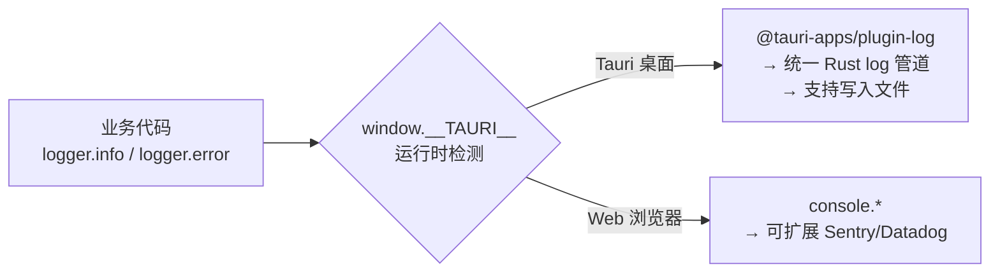

# AGENTS.md（给 AI 代码助手的项目协作指南）

本文件用于约束后续自动化/AI 代理在本仓库中的工作方式，确保实现与 `docs/PRD.md` 一致、可维护、可扩展。

## 项目定位
- **产品**：Projex — 个人项目管理工具（Mac 本地 + S3 多设备同步）
- **核心能力**：项目状态机 + 状态时间线（不可变事件日志）、成员视图（做过/当前）、Partner（1:N，项目必须有且创建后不可变更）、Country、S3 同步
- **权威需求来源**：`docs/PRD.md`（任何行为/字段/约束变更必须先改 PRD）

## 技术栈（拍板）
- **Desktop**：Tauri（Rust）
- **Frontend**：React + TypeScript
- **Build**：Vite
- **UI**：Mantine
- **RichText**：Tiptap + @mantine/tiptap（富文本编辑器）
- **Validation**：zod（前端 DTO/表单输入预校验）
- **i18n**：i18next + react-i18next（English / 中文）
- **State**：zustand（已接入）
- **DB**：SQLite（本地文件）
- **Rust DB**：rusqlite（同步 API，事务清晰）
- **Rust**：serde/serde_json、thiserror、uuid、chrono
- **Sync**：aws-sdk-s3、aws-config、sha2、flate2（S3 多设备同步）
- **Logging**：tauri-plugin-log（Rust 侧）+ `@tauri-apps/plugin-log`（前端 JS 绑定）+ 自研 logger 抽象层

## 总体架构（Clean Architecture）
```mermaid
flowchart TB
  UI[React/Vite + Mantine + Zustand] -->|invoke| CMD[Tauri Commands (Rust)]
  CMD --> APP[Application UseCases (Tx)]
  APP --> DOMAIN[Domain Rules<br/>StatusMachine + Invariants]
  APP --> INFRA[SQLite Repos + Migrations + Export/Import]
  APP --> SYNC[S3 Sync<br/>Delta + Snapshot + VectorClock]
```

## 目录结构

```text
project-management/
  docs/
    PRD.md                   # 权威需求文档
    MILESTONES.md            # 里程碑跟踪
    SYNC_S3_DESIGN.md        # S3 同步架构设计
    SYNC_EXPLAINED.md        # 同步机制详解
  src/                       # Vite React frontend
    api/                     # typed invoke wrappers (projects/partners/people/export/sync/assignments)
    components/              # 共享组件 (ConfirmModal, EmptyState, SyncStatusBar)
    constants/               # 常量 (countries, PROJECT_STATUSES)
    pages/                   # 页面组件 (Layout, ProjectsList, ProjectDetail, ProjectForm, ...)
    stores/                  # zustand stores (usePartnerStore, usePersonStore, useTagStore)
    sync/                    # 前端同步管理 (SyncManager)
    utils/                   # 工具函数 (errorToast, statusColor, roleLabel, logger)
    i18n.ts                  # i18next 初始化（默认 en，fallback en）
    locales/                 # 翻译文件 (en.json, zh.json)
    theme.ts                 # Mantine 主题配置
  src-tauri/                 # Rust backend
    migrations/              # SQL 迁移 (0001_init, 0002_add_person_email_role, 0003_add_sync_support, 0004_add_project_comments)
    tests/                   # 集成测试 (13 个文件, 241 个测试用例)
    src/
      app/                   # use cases + transactions (comment, data_transfer, project, person, partner, assignment)
      commands/              # Tauri command handlers (DTO boundary, 含 sync/comment 命令)
      domain/                # entities + status machine + invariants
      infra/                 # sqlite impl + migrations
      sync/                  # S3 同步 (delta_sync, snapshot, vector_clock, s3_client)
      error.rs               # AppError 统一错误模型
      lib.rs / main.rs
```

## 关键业务不变量（必须在 Rust 侧强制）
### Partner 约束
- 每个项目 **必须且只能关联 1 个** `partnerId`
- **项目创建后禁止变更 partnerId**
  - `project_update` 禁止携带 `partnerId` 字段：若出现则返回错误码 `PARTNER_IMMUTABLE`

### Owner 约束
- `ownerPersonId` 必须是该项目的**当前成员**
  - 设置/更换 owner 时：若不存在 active assignment（`endAt IS NULL`），需在同一事务内自动创建

### 状态机与时间线（不可变）
- 状态变更只能按 `docs/PRD.md` 的状态机跃迁
- 每次状态变更必须 **同一事务**完成：
  - insert `status_history`
  - update `projects.current_status`（以及 `updated_at`/`archived_at`）
- `status_history` 为不可变事件日志：禁止编辑/删除（纠错通过追加说明或追加新事件）
- 特殊跃迁必须 `note`（见 PRD）

### Assignment 约束
- 同一 `(projectId, personId)` 不允许存在两条 active assignment（`endAt IS NULL`）
- 结束参与时若无 active assignment，返回 `ASSIGNMENT_NOT_ACTIVE`

## 命令层 API 契约（实现必须对齐）
- 命令、DTO、错误码定义以 `docs/PRD.md` 的 **13.9 节**为准
- **错误码稳定性**：前端仅依赖 `code` 分支逻辑；`message/details` 用于展示与调试
- 建议支持 `ifMatchUpdatedAt`（乐观锁）以避免 UI 并发覆盖（即便是单机也可能多窗口/多操作）

## SQLite 迁移策略（必须）
- 在 Rust 侧启动时执行 migrations（建议 `BEGIN IMMEDIATE`）
- 使用 `schema_migrations(version, applied_at)` 记录已应用版本
- 迁移失败必须回滚并阻止继续运行（避免半迁移损坏）
- 当前迁移文件：`0001_init.sql`、`0002_add_person_email_role.sql`、`0003_add_sync_support.sql`、`0004_add_project_comments.sql`

## 开发运行（约定命令）
- **安装依赖**：
  - `npm install`
- **本地开发（推荐）**：
  - `npm run dev`（前端）
  - `cargo tauri dev`（带桌面壳）
- **构建**：
  - `cargo tauri build`
- **后端测试**：
  - `cd src-tauri && cargo test`（241 个测试用例）
- **Lint 检查**：
  - **Rust（Clippy）**：`cd src-tauri && cargo clippy --all-targets --all-features`
    - 必须零 warning 通过（CI 会阻断）
    - 常见 lint 类别：`unused_imports`、`manual_flatten`、`type_complexity`、`should_implement_trait`、`deprecated`
    - 修复后务必 `cargo test` 确认无回归
  - **前端（ESLint）**：`npm run lint`
    - 必须零 error 通过
  - **提交前必须**：同时通过 Clippy + ESLint + 全量测试

## 代码风格与工程规范
- **命名**：
  - Rust：`snake_case`（函数/模块），`PascalCase`（类型），错误类型 `*Error`
  - TS：变量/函数 `camelCase`，类型/组件 `PascalCase`
- **注释语言**：
  - 标准库/常规代码注释：English
  - 复杂业务规则/不变量说明：中文（解释"为什么"）
- **边界分层**：
  - UI 不直接拼 SQL
  - Commands 只做 DTO 映射与权限/参数最小校验（无账号体系时主要是输入校验）
  - UseCase 负责事务与业务规则编排
  - Domain 只放纯规则（状态机/不变量判断），不依赖 IO

## Git Commit 规范

### 语言
- Commit message **必须使用英文**（包括标题和正文）

### 格式（Conventional Commits）
```
<type>(<scope>): <subject>

<body>

<footer>
```

#### 标题行 `<type>(<scope>): <subject>`
- **必填**，不超过 72 个字符
- `<type>` 必须为以下之一：

| type | 含义 | 示例 |
|------|------|------|
| `feat` | 新功能 | `feat(project): add tag-based filtering` |
| `fix` | Bug 修复 | `fix(assignment): prevent duplicate active assignments` |
| `docs` | 文档变更 | `docs: update PRD with sync commands` |
| `chore` | 构建/工具/依赖 | `chore: upgrade Mantine to v7.15` |
| `refactor` | 重构（不改行为） | `refactor(infra): extract migration runner` |
| `style` | 代码格式/UI 样式 | `style: unify gradient button colors` |
| `test` | 测试 | `test(domain): add status machine edge cases` |
| `perf` | 性能优化 | `perf(query): add index on projects.current_status` |
| `ci` | CI/CD | `ci: add cargo test to GitHub Actions` |

- `<scope>` 可选，使用模块名：`project`, `person`, `partner`, `assignment`, `sync`, `ui`, `infra`, `domain`, `export`
- `<subject>` 使用祈使句、小写开头、不加句号
  - Good: `add partner immutability check`
  - Bad: `Added partner immutability check.`

#### 正文 `<body>`
- 可选，用空行与标题分隔
- 说明 **What & Why**（不是 How）
- 每行不超过 100 字符
- 多项变更使用 `- ` 列表

#### 页脚 `<footer>`
- 可选
- `BREAKING CHANGE: <description>` — 破坏性变更

### 示例

**简单 commit**：
```
fix(project): return error when partner_id is modified after creation
```

**带正文的 commit**：
```
feat(sync): implement delta sync with S3

- Add sync_metadata table with SQLite triggers for change tracking
- Upload compressed deltas to S3 with vector clock metadata
- Support both AWS S3 and Cloudflare R2 endpoints

Co-authored-by: Cursor <cursoragent@cursor.com>
```

**破坏性变更**：
```
refactor(commands)!: rename export_json to export_json_string

BREAKING CHANGE: frontend callers must update invoke command name
from "export_json" to "export_json_string"
```

### 禁止事项
- 禁止中文 commit message
- 禁止无意义的 message（如 `fix`, `update`, `wip`）
- 禁止 commit 包含密钥文件（`.env`, `credentials.json`）
- 禁止单个 commit 混合不相关变更（一个 commit 只做一件事）

## 变更规则（重要）
- 任何改变字段、状态机、错误码、命令契约，都必须同步更新 `docs/PRD.md`
- 任何新增表/字段，都必须提供 migration，并更新 PRD 的数据模型章节
- 如需添加"项目非状态字段的审计日志"（例如以后允许更换 Partner），必须先在 PRD 的未来扩展/范围中明确

## S3 同步模块

### 架构
- **Delta Sync**：基于 SQLite 触发器（`sync_metadata` 表）自动捕获数据变更，上传压缩 Delta 到 S3
- **Vector Clock**：每个设备维护独立向量时钟，用于因果排序与冲突检测（LWW 策略）
- **Snapshot**：全量快照备份/恢复，含 gzip 压缩与 SHA-256 checksum 校验
- **S3 Client**：兼容 AWS S3 / Cloudflare R2 / MinIO，支持自定义 endpoint

### 关键文件
- `src-tauri/src/sync/` — Rust 同步核心（delta_sync.rs, snapshot.rs, vector_clock.rs, s3_client.rs）
- `src-tauri/migrations/0003_add_sync_support.sql` — 同步相关表与触发器
- `src/sync/SyncManager.ts` — 前端同步状态管理（单例模式）
- `src/components/SyncStatusBar.tsx` — 同步状态展示组件
- `docs/SYNC_S3_DESIGN.md` — 详细设计文档
- `docs/SYNC_EXPLAINED.md` — 同步机制中文说明

## 数据导入/导出
- **导出**：`export_json_string` — 全量导出为 JSON（含 schemaVersion = 2）
- **导入**：`import_json_string` — 幂等导入（`INSERT OR IGNORE`），按 FK 依赖顺序写入，支持 schema version 1 和 2
- **Schema 版本**：version 1（不含 comments）、version 2（含 comments）
- **关键文件**：`src-tauri/src/app/data_transfer.rs`、`src-tauri/src/commands/data_transfer.rs`
- **前端**：Settings 页面提供导出/导入按钮

## Zustand 状态管理
- `usePartnerStore` — 合作方下拉选项缓存
- `usePersonStore` — 成员下拉选项缓存
- `useTagStore` — 全局标签缓存（从项目中收集）
- **约定**：CRUD 操作后调用对应 store 的 `invalidate()` 使缓存失效，下次使用时自动重新获取

## 国际化（i18n）

### 架构
- **框架**：`i18next` + `react-i18next`
- **初始化**：`src/i18n.ts`（`import './i18n'` 在 `main.tsx` 最前面加载）
- **默认语言**：English（`lng: 'en'`）
- **翻译文件**：`src/locales/en.json`、`src/locales/zh.json`（约 250 个 key）

### Key 命名规范
- 格式：`{module}.{page}.{element}`
- 示例：`project.list.title`、`project.form.namePlaceholder`、`common.save`、`sync.syncing`
- 通用 key 放在 `common.*` 命名空间（如 `common.save`、`common.edit`、`common.loading`）
- 状态翻译：`status.BACKLOG`、`status.IN_PROGRESS` 等
- 角色翻译：`role.tester`、`role.backend_developer` 等

### 使用模式
```typescript
// 页面组件中
import { useTranslation } from 'react-i18next';

export function MyPage() {
  const { t, i18n } = useTranslation();
  return <Title>{t('project.list.title')}</Title>;
}
```

```typescript
// 非组件中（如 utils）
import i18n from '../i18n';
i18n.t('role.tester');
```

### 国际化覆盖范围
- 所有 UI 文字（标签、按钮、提示、表头、占位符、空状态）
- 项目状态（BACKLOG → Backlog / 待办）：通过 `getStatusLabel(status, t)` 翻译
- 国家名称：通过 `getCountries(lng)` 动态获取（依赖 `i18n-iso-countries`，注册 en + zh 两套 locale）
- 角色标签：`PERSON_ROLES` 的 `label` 存储 i18n key，渲染时通过 `t()` 解析
- 语言切换：Settings 页面 `SegmentedControl`，调用 `i18n.changeLanguage(lng)` 即时生效

### 新增字符串约定
- 任何新增 UI 字符串，**必须**同时在 `en.json` 和 `zh.json` 中添加对应 key
- 禁止在组件中硬编码中文或英文文本

## 前端日志规范（Logger）

### 架构
项目使用统一日志抽象层（`src/utils/logger.ts`），屏蔽平台差异：



### 核心规则
- **禁止**在业务代码中直接使用 `console.log/warn/error/debug`
- **必须**使用 `import { logger } from '../utils/logger'` 替代
- `logger.ts` 内部的 `console.*` 是唯一允许的底层调用（作为 fallback 实现）

### 使用方式
```typescript
import { logger } from '../utils/logger';

// 信息日志
logger.info('Sync completed:', result);

// 错误日志
logger.error('Sync failed:', error);

// 调试日志（开发时使用）
logger.debug('Current state:', state);

// 警告日志
logger.warn('Deprecated API called');
```

### 平台行为差异

| 特性 | Tauri 桌面 | Web 浏览器 |
|------|-----------|-----------|
| 输出目标 | tauri-plugin-log（与 Rust log 统一） | console.* |
| 日志级别过滤 | 支持（Rust 侧配置） | 浏览器 DevTools 过滤 |
| 写入文件 | 支持 | 不支持（后期可接入远程日志） |
| Tauri 依赖 | 动态 import，已加载 | 不引入，零开销 |

### 设计要点
- **运行时检测**：通过 `window.__TAURI__` 判断平台，无需编译时环境变量
- **动态 import**：`import('@tauri-apps/plugin-log')` 确保 Web 打包不引入 Tauri 依赖
- **Promise 缓存**：模块只加载一次，后续调用直接复用
- **优雅降级**：plugin 加载失败自动 fallback 到 console，不阻断业务

### 关键文件
- `src/utils/logger.ts` — 前端日志抽象层（单例 `logger` 导出）
- `src-tauri/src/lib.rs` — Rust 侧 `tauri_plugin_log` 注册（当前仅 debug 模式启用）
- `@tauri-apps/plugin-log` — npm 包（前端 JS 绑定）
- `tauri-plugin-log` — Cargo 依赖（Rust 侧）

### 扩展指南（未来 Web 版）
当项目推出 Web 版本时，只需在 `logger.ts` 的 `consoleLogger` 分支中接入远程日志服务：
```typescript
// 示例：接入 Sentry
const webLogger: Logger = {
  error: (...args) => {
    console.error('[ERROR]', ...args);
    Sentry.captureMessage(formatArgs(args), 'error');
  },
  // ...
};
```
无需修改任何业务代码。

---

## 富文本评论（Comments）

### 架构
- **数据库**：`project_comments` 表（`0004_add_project_comments.sql`）
- **存储格式**：Tiptap JSON（`content` 字段存储富文本结构化数据）
- **功能**：创建、编辑、删除、置顶、关联操作人
- **同步**：自动纳入 S3 同步（INSERT/UPDATE/DELETE 触发器）

### 数据模型
```sql
CREATE TABLE project_comments (
    id TEXT PRIMARY KEY,
    project_id TEXT NOT NULL,
    person_id TEXT,              -- 可选：关联操作人
    content TEXT NOT NULL,       -- Tiptap JSON document
    is_pinned INTEGER NOT NULL DEFAULT 0,
    created_at TEXT NOT NULL,
    updated_at TEXT NOT NULL,
    _version INTEGER DEFAULT 1,  -- 同步版本号
    FOREIGN KEY(project_id) REFERENCES projects(id),
    FOREIGN KEY(person_id) REFERENCES persons(id)
);
```

### 后端 API
- `comment_create(pool, CommentCreateReq)` → `CommentDto`
- `comment_update(pool, CommentUpdateReq)` → `CommentDto`
- `comment_delete(pool, id)` → `()`
- `comment_list_by_project(pool, project_id)` → `Vec<CommentDto>`（置顶优先 + 时间倒序）

### Tauri Commands
- `cmd_comment_create` / `cmd_comment_update` / `cmd_comment_delete` / `cmd_comment_list`

### 前端组件
- **RichTextEditor** (`src/components/RichTextEditor.tsx`) — Tiptap 富文本编辑器封装
  - 扩展：StarterKit、Link、Image（Base64）、TaskList、Table
  - 工具栏：Bold/Italic、标题、列表、任务清单、表格、图片插入
- **ProjectComments** (`src/components/ProjectComments.tsx`) — 项目评论区组件
  - 新增评论：富文本编辑器 + 可选关联操作人
  - 评论列表：置顶优先、时间倒序、展示编辑时间
  - 操作：编辑（inline）、删除（确认）、置顶/取消置顶
- **集成位置**：`ProjectDetail.tsx` 状态时间线之后

### i18n
- `comment.*` 系列 key（约 20 个）：`comment.title`、`comment.add`、`comment.pin`、`comment.placeholder` 等

---

## UI 设计系统（现代化规范）

### 主题配置
项目采用 **毛玻璃/渐变风格**（Arc / Raycast 参考），配置文件位于 `src/theme.ts`。

#### 核心配置
- **主色调**: Indigo (#6366f1) / Violet (#8b5cf6) 渐变系
- **圆角**: 统一使用 `md` (8px) 和 `lg` (12px)
- **阴影**: 柔和阴影体系，透明度范围 0.05-0.12
  ```typescript
  shadows: {
    xs: '0 1px 3px rgba(0, 0, 0, 0.05)',
    sm: '0 2px 8px rgba(0, 0, 0, 0.06)',
    md: '0 4px 12px rgba(0, 0, 0, 0.08)',
    lg: '0 8px 24px rgba(0, 0, 0, 0.10)',
    xl: '0 16px 48px rgba(0, 0, 0, 0.12)',
  }
  ```
- **字体**: Inter + 系统字体栈
  ```typescript
  fontFamily: 'Inter, -apple-system, BlinkMacSystemFont, "Segoe UI", Roboto, "Helvetica Neue", Arial, sans-serif'
  ```

#### 毛玻璃效果
```css
/* 导航栏/顶栏 */
backgroundColor: 'rgba(255, 255, 255, 0.7)',
backdropFilter: 'blur(12px)',
borderBottom: '1px solid rgba(0, 0, 0, 0.06)'
```

#### 渐变背景
- **页面背景** (`src/index.css`):
  ```css
  background: linear-gradient(135deg, #f8f9ff 0%, #f0f2ff 50%, #faf8ff 100%);
  ```
- **英雄卡片** (详情页顶部):
  ```typescript
  background: 'linear-gradient(135deg, #6366f1 0%, #8b5cf6 100%)'
  ```

#### 状态色彩映射
配置位置: `src/utils/statusColor.ts`
```typescript
PROJECT_STATUS_COLORS = {
  BACKLOG: 'gray',
  IN_PROGRESS: 'blue',
  ON_HOLD: 'yellow',
  COMPLETED: 'green',
  CANCELLED: 'red',
  ARCHIVED: 'dark',
}
```
状态翻译使用 `getStatusLabel(status, t)`，key 格式为 `status.{STATUS_VALUE}`（如 `status.BACKLOG`）。

### 组件设计模式

#### 列表页规范
文件示例: `ProjectsList.tsx`, `PeopleList.tsx`, `PartnersList.tsx`

**必须包含**:
- 标题使用 `Title order={3}`
- 主操作按钮使用渐变样式:
  ```typescript
  <Button
    variant="gradient"
    gradient={{ from: 'indigo', to: 'violet' }}
    leftSection={<IconPlus size={18} />}
  >
    {t('xxx.list.create')}
  </Button>
  ```
- 筛选区包裹在 `Paper` 卡片中（带阴影）
- 表格使用 `Table.ScrollContainer` + `striped="even"` + `highlightOnHover`
- 状态徽章使用 `getProjectStatusColor()` 统一色彩映射

#### 详情页规范
文件示例: `ProjectDetail.tsx`, `PersonDetail.tsx`, `PartnerDetail.tsx`

**必须包含**:
- **英雄卡片**: 顶部渐变背景展示核心信息
  ```typescript
  <Paper style={{
    background: 'linear-gradient(135deg, #6366f1 0%, #8b5cf6 100%)',
    color: 'white',
  }}>
    <Title order={2}>{name}</Title>
    <Badge variant="filled" style={{ backgroundColor: 'rgba(255,255,255,0.25)' }}>
      {status}
    </Badge>
  </Paper>
  ```
- 信息卡片使用 `Paper`（自动带阴影，不使用 `withBorder`）
- 返回按钮: `<Button variant="subtle" leftSection={<IconArrowLeft size={16} />}>`
- 编辑按钮: `<Button variant="light" leftSection={<IconEdit size={16} />}>`
- 表格必须包裹在 `Table.ScrollContainer` 中

#### 表单页规范
文件示例: `ProjectForm.tsx`, `PersonForm.tsx`, `PartnerForm.tsx`

**必须包含**:
- 整个表单包裹在 `Paper` 卡片中
- 表单标题 `Title order={3}`
- 提交按钮使用渐变样式:
  ```typescript
  <Button
    variant="gradient"
    gradient={{ from: 'indigo', to: 'violet' }}
    leftSection={<IconDeviceFloppy size={18} />}
  >
    {isEdit ? t('common.save') : t('common.create')}
  </Button>
  ```
- 返回按钮使用 `variant="subtle"`
- 双列响应式布局: `<SimpleGrid cols={{ base: 1, sm: 2 }}>`

### TypeScript 规范

#### 类型导入（强制）
项目启用了 `verbatimModuleSyntax`，**必须**使用 `type` 关键字导入纯类型：

```typescript
// ✅ 正确
import { createTheme, type MantineColorsTuple } from '@mantine/core';
import type { MantineColor } from '@mantine/core';

// ❌ 错误（会导致白屏）
import { MantineColorsTuple } from '@mantine/core';
import { MantineColor } from '@mantine/core';
```

**原因**: 避免运行时导入纯类型，减小打包体积，防止编译失败。

### 图标使用规范

#### 图标库
使用 `@tabler/icons-react`（已安装）

#### 常用图标映射
| 场景 | 图标 | 尺寸 |
|------|------|------|
| 项目 | `IconFolder` | 20 (导航), 18 (按钮) |
| 成员 | `IconUsers` | 20 (导航), 18 (按钮) |
| 合作方 | `IconBuildingCommunity` | 20 (导航), 18 (按钮) |
| 设置 | `IconSettings` | 20 (导航), 18 (按钮) |
| 返回 | `IconArrowLeft` | 16 |
| 编辑 | `IconEdit` | 16 |
| 添加 | `IconPlus` | 18 |
| 保存 | `IconDeviceFloppy` | 18 |
| 品牌/应用 | `IconBriefcase` | 24 |

#### 使用方式
```typescript
import { IconFolder } from '@tabler/icons-react';

// 按钮中使用
<Button leftSection={<IconFolder size={18} />}>
  按钮文字
</Button>

// 导航中使用
<NavLink
  leftSection={<IconFolder size={20} stroke={1.5} />}
  label="项目"
/>
```

### 响应式布局规范

#### Mantine 断点
- `base`: 默认（移动端，0px+）
- `sm`: 768px+
- `md`: 992px+
- `lg`: 1200px+

#### 常用模式
```typescript
// AppShell 导航栏
navbar={{ width: { base: 200, md: 220 }, breakpoint: 'sm' }}
padding={{ base: 'xs', sm: 'md' }}

// 表单双列布局
<SimpleGrid cols={{ base: 1, sm: 2 }} spacing="md">
  <TextInput label="字段1" />
  <TextInput label="字段2" />
</SimpleGrid>

// Flex 自动换行
<Flex wrap="wrap" gap="xs" justify="space-between">
  {/* 按钮或筛选项 */}
</Flex>

// 表格水平滚动（必须）
<Table.ScrollContainer minWidth={400}>
  <Table>
    {/* 表格内容 */}
  </Table>
</Table.ScrollContainer>
```

#### Tauri 窗口最小尺寸
`src-tauri/tauri.conf.json`:
```json
{
  "minWidth": 800,
  "minHeight": 500
}
```
**原因**: 保证侧栏（200px）+ 主内容区（~600px）始终可见，且大于 Mantine `sm` 断点。

### 文件组织规范

#### 主题相关
- `src/theme.ts` - Mantine 主题配置（`createTheme`）
- `src/index.css` - 全局样式（背景渐变、滚动条美化）

#### 工具函数
- `src/utils/statusColor.ts` - 状态色彩映射 (`getProjectStatusColor`) + 状态翻译 (`getStatusLabel`)
- `src/utils/errorToast.ts` - 错误/成功提示封装
- `src/utils/roleLabel.ts` - 角色 i18n 翻译 (`getRoleLabel`)
- `src/utils/logger.ts` - 统一日志抽象层 (`logger.info/warn/error/debug`)，详见「前端日志规范」章节

#### 常量
- `src/constants/countries.ts` - `getCountries(lng)` 动态国家列表、`PERSON_ROLES`（label 为 i18n key）、`PROJECT_STATUSES`

### 常见问题解决方案

#### 应用白屏
**症状**: Tauri 窗口打开后显示白屏，开发者工具可能显示编译错误

**原因**: TypeScript 类型导入错误导致编译失败

**解决步骤**:
1. 检查终端输出或运行 `npm run build` 查看编译错误
2. 搜索 `TS1484` 错误（`must be imported using a type-only import`）
3. 修复类型导入：添加 `type` 关键字
4. Vite 会自动热更新（HMR）

**示例修复**:
```typescript
// 修复前
import { MantineColorsTuple } from '@mantine/core';

// 修复后
import { type MantineColorsTuple } from '@mantine/core';
// 或
import type { MantineColorsTuple } from '@mantine/core';
```

#### 端口占用（5173 被占用）
**解决**:
```bash
lsof -ti:5173 | xargs kill -9
npm run tauri dev
```

#### 样式不生效
**检查清单**:
1. CSS 导入顺序是否正确（`main.tsx`）:
   ```typescript
   import '@mantine/core/styles.css';
   import '@mantine/dates/styles.css';
   import '@mantine/notifications/styles.css';
   import './index.css'; // 自定义样式放最后
   ```
2. 主题是否正确传入 `MantineProvider`:
   ```typescript
   import { theme } from './theme';
   <MantineProvider theme={theme}>
   ```
3. 组件是否使用了正确的 Mantine props（检查 v7 文档）

#### 滚动条问题
**症状**: 页面或表格无法滚动，或出现双滚动条

**解决**:
- `body` 必须设置 `overflow: hidden`（由 AppShell 内部滚动）
- `AppShell.Main` 设置 `style={{ overflow: 'auto' }}`
- 表格必须包裹在 `Table.ScrollContainer` 中

### UI 改造流程（标准步骤）

#### 1. 规划阶段
- 确定设计风格（简洁/毛玻璃/企业级）
- 列出需要改造的页面和组件
- 明确优先级（建议顺序：Layout → 列表 → 详情 → 表单）

#### 2. 主题配置
- 创建 `src/theme.ts`
- 配置主色、圆角、阴影、字体
- 设置组件默认属性（`defaultProps` + `styles`）

#### 3. 全局样式
- 更新 `src/index.css`
- 设置背景渐变
- 美化滚动条（WebKit）

#### 4. 安装依赖
```bash
npm install @tabler/icons-react
```

#### 5. 组件改造顺序
1. **Layout** (`Layout.tsx`): 导航栏/顶栏毛玻璃效果 + 图标
2. **列表页**: 筛选卡片 + 渐变按钮 + 表格样式
3. **详情页**: 英雄卡片 + 信息卡片 + 响应式
4. **表单页**: 卡片容器 + 渐变提交按钮

#### 6. 统一管理
- 创建 `utils/statusColor.ts` 统一色彩映射
- 确保所有图标引用一致
- 检查响应式断点使用

#### 7. 测试验证
- 编译检查: `npm run build`（必须无错误）
- Lint 检查: 使用 `ReadLints` 工具
- 不同窗口尺寸测试（拖拽缩小到最小值）
- 检查所有页面的导航和交互

#### 8. 调整窗口尺寸
根据实际布局需求调整 `src-tauri/tauri.conf.json` 中的 `minWidth` 和 `minHeight`，确保内容不会消失。
