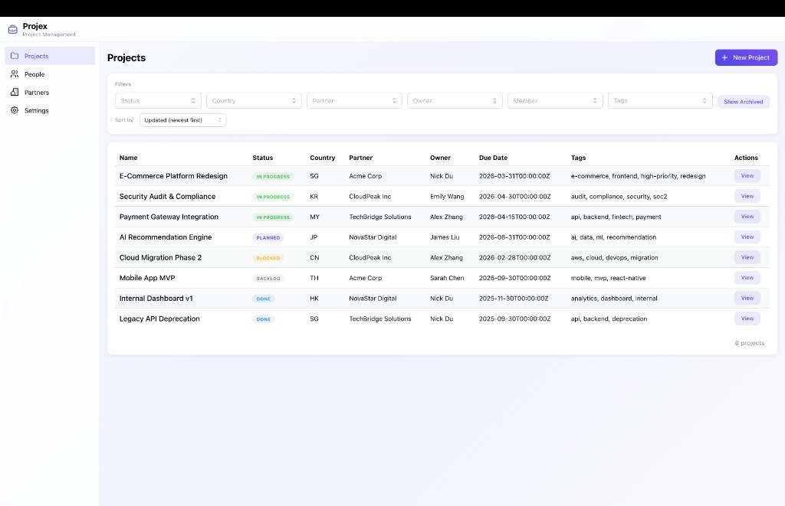
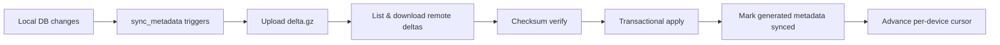
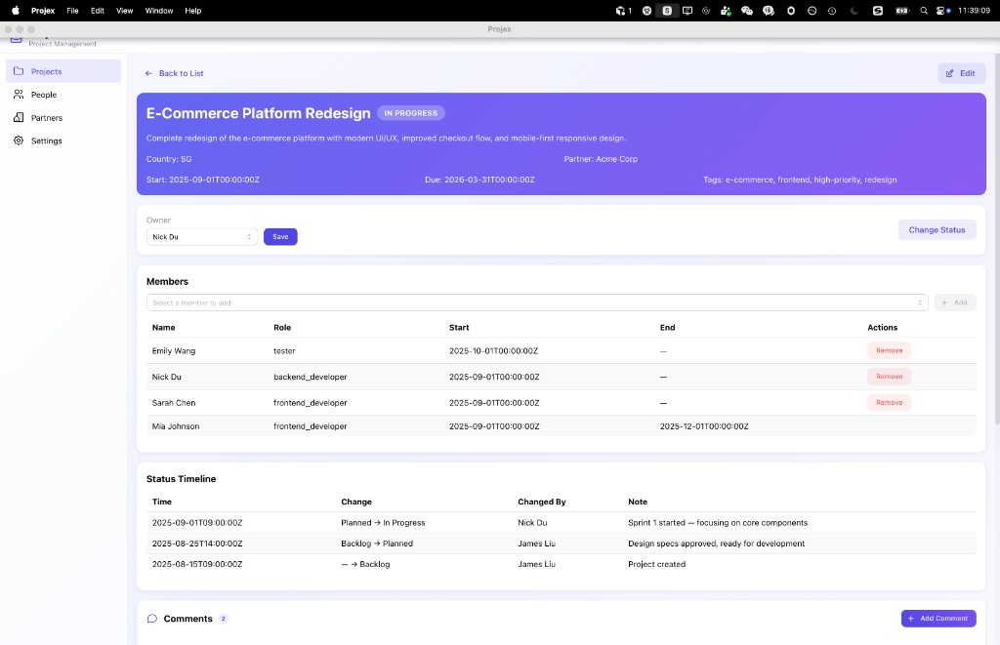
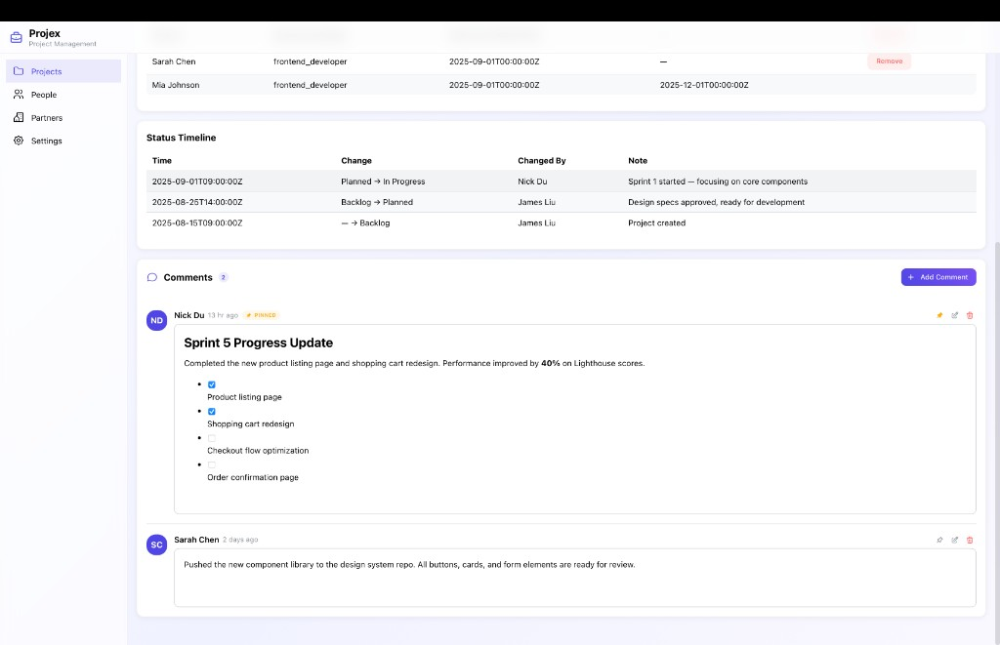
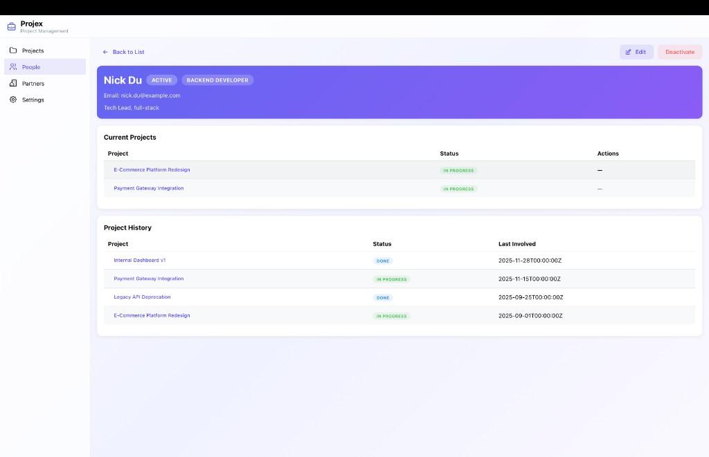
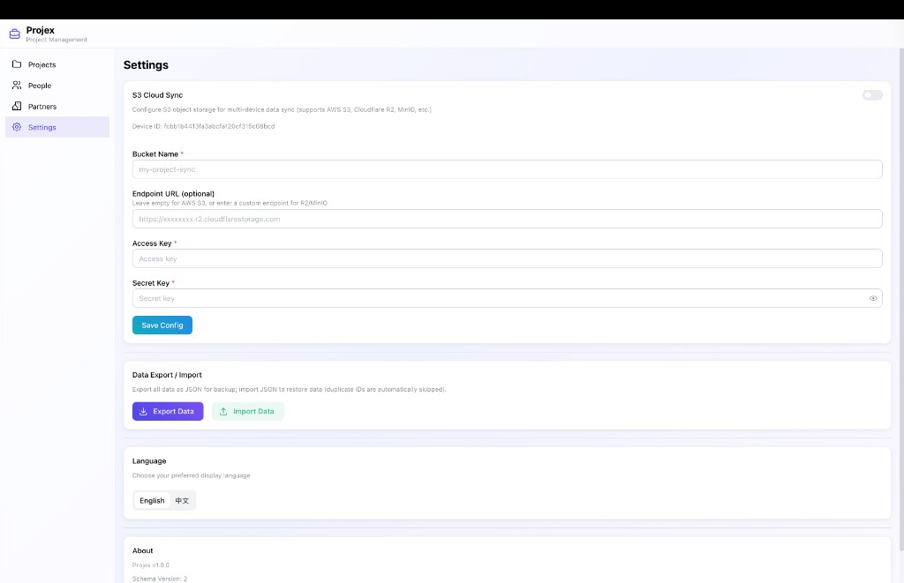

<p align="center">
  <h1 align="center">Projex</h1>
  <p align="center">
    A modern, local-first project management desktop app.<br/>
    Built with <strong>Tauri</strong> + <strong>React</strong> + <strong>Rust</strong> — your data stays on your machine.
  </p>
  <p align="center">
    <a href="./README_CN.md">中文文档</a>
  </p>
</p>

<p align="center">
  <a href="https://github.com/nickdu2009/projex/releases"></a>
  
  
  
  
  
  
</p>

---

<p align="center">
  
</p>

## Why Projex?

Most project management tools live in the cloud. **Projex** takes a different approach:

- **Local-first** — All data stored in SQLite on your machine. No accounts, no subscriptions.
- **Multi-device sync** — Optional S3 sync (AWS, Cloudflare R2, MinIO) when you need it.
- **Privacy by default** — Your project data never leaves your machine unless you choose to sync.
- **Native performance** — Rust backend with Tauri, not another Electron app.

## Features

### Project Lifecycle Management
- Full status machine: `BACKLOG` → `PLANNED` → `IN_PROGRESS` → `BLOCKED` → `DONE` → `ARCHIVED`
- **Immutable status timeline** — every transition is an append-only event log
- Multi-dimension filtering: status, country, partner, owner, member, tags
- Flexible sorting: updated time, priority, due date
- Server-side pagination

### Rich Text Comments
- Tiptap-powered editor: headings, lists, task lists, tables, images, code blocks
- **Slash commands** (`/`) for quick formatting
- **@mention** to reference team members
- Pin important comments to top

### People & Partners
- Manage team members with roles (tester, PM, backend dev, frontend dev)
- Track member participation: current & historical project assignments
- Partner profiles with immutable project binding

### Data Sovereignty
- **SQLite** — fully offline, zero cloud dependency
- **JSON export/import** — full backup, idempotent restore
- **S3 sync** — delta-based sync with checksum verification, per-device cursor, and anti-reupload protection
- **Snapshot** — gzip-compressed full backups with SHA-256 checksum

### Application Logs Viewer
- **In-app log viewer** — view frontend & backend logs without external tools
- **Adjustable log level** — ERROR/WARN/INFO/DEBUG (requires restart)
- **Smart redaction** — auto-mask sensitive data (S3 credentials, tokens)
- **Efficient browsing** — paginated loading (256KB per page), real-time search
- **Convenient operations** — copy to clipboard, download, clear logs
- **Auto rotation** — max 10MB per file, keep latest 5 files
- See [docs/LOGS_VIEWER.md](./docs/LOGS_VIEWER.md) for details

### Sync Status (2026-02)



| Capability | Status | Notes |
|---|---|---|
| Local delta collect/upload | ✅ | In production |
| Remote delta download/apply | ✅ | In `cmd_sync_full` |
| `project_tags` / `project_comments` sync | ✅ | Includes composite-key delete for tags |
| Anti-reupload (ping-pong suppression) | ✅ | `mark_remote_applied_operations_synced` |
| Minimal LWW guard | ✅ | Skip when `remote_version < local_version` |
| Optional E2E encryption | 🚧 | Planned in M7 |
| Snapshot rotation/cleanup | 🚧 | Planned in M7 |

### Modern UI/UX
- Frosted glass effect + gradient design (inspired by Arc / Raycast)
- i18n: English & Chinese, runtime switchable
- Responsive layout, empty state guidance, confirmation dialogs

## Tech Stack

| Layer | Technology |
|-------|-----------|
| **Desktop** | [Tauri v2](https://tauri.app/) |
| **Frontend** | React 19 + TypeScript 5 |
| **Build** | Vite 7 |
| **UI** | [Mantine 7](https://mantine.dev/) |
| **Rich Text** | [Tiptap](https://tiptap.dev/) + @mantine/tiptap |
| **State** | Zustand |
| **i18n** | i18next + react-i18next |
| **Backend** | Rust |
| **Database** | SQLite ([rusqlite](https://github.com/rusqlite/rusqlite)) |
| **Sync** | aws-sdk-s3 + Vector Clock |

### Architecture

```
Clean Architecture (Domain-Driven Design)

┌─────────────────────────────────────┐
│  React + Mantine + Zustand  (UI)    │
├─────────────────────────────────────┤
│  Tauri Commands         (Interface) │
├─────────────────────────────────────┤
│  Application UseCases   (Business)  │
├─────────────────────────────────────┤
│  Domain Rules           (Core)      │
│  Status Machine + Invariants        │
├─────────────────────────────────────┤
│  SQLite + S3 Sync       (Infra)     │
└─────────────────────────────────────┘
```

## Getting Started

### Prerequisites

- **Node.js** 18+
- **Rust** 1.77.2+
- **macOS** 12+ or **Windows** 10+

### Development

```bash
# Install dependencies
npm install

# Run in development mode (hot-reload)
npm run tauri dev

# Production build
npm run tauri build

# Run backend tests (250 test cases)
cd src-tauri && cargo test
```

The database is auto-created on first launch with all migrations applied.

### Local MinIO (Dev Sync)

```bash
cp .env.minio.example .env.minio
docker compose --env-file .env.minio -f docker-compose.minio.yml up -d
```

See [docs/SYNC_ENV_PROFILES.md](./docs/SYNC_ENV_PROFILES.md) for profile details and MinIO test setup.

### First Use

1. **Create a Partner** — Partners are organizations you work with
2. **Create People** — Team members with roles
3. **Create a Project** — Link it to a partner and assign an owner
4. **Track Progress** — Transition status, add comments, manage members
5. **Export/Sync** — Settings → Export JSON or configure S3 sync

## Project Structure

```
projex/
├── docs/
│   ├── PRD.md                 # Product Requirements Document
│   ├── MILESTONES.md          # Milestone tracking
│   ├── SYNC_S3_DESIGN.md      # S3 sync architecture
│   ├── SYNC_EXPLAINED.md      # Sync mechanism explained
│   ├── SYNC_ENV_PROFILES.md   # Dev MinIO / Prod S3-R2 profiles
│   └── LOGS_VIEWER.md         # Logs viewer feature guide
├── src/                        # Frontend (React + TypeScript)
│   ├── api/                   # Typed Tauri invoke wrappers (logs.ts, sync.ts, etc.)
│   ├── components/            # Shared components
│   ├── pages/                 # Page components (Logs, Settings, etc.)
│   ├── stores/                # Zustand stores
│   ├── sync/                  # Frontend sync manager
│   ├── locales/               # i18n translations (en/zh)
│   └── theme.ts               # Mantine theme config
├── src-tauri/                  # Backend (Rust)
│   ├── migrations/            # SQL migrations (5 files)
│   ├── tests/                 # Integration tests (13 files, 250 cases)
│   └── src/
│       ├── app/               # Use cases (CRUD, import/export)
│       ├── commands/          # Tauri command handlers (logs.rs, sync.rs, etc.)
│       ├── domain/            # Domain rules (status machine)
│       ├── infra/             # SQLite repositories
│       └── sync/              # S3 sync (delta, snapshot, vector clock)
└── AGENTS.md                   # AI agent collaboration guide
```

## Configuration

| Item | Value |
|------|-------|
| Database | `~/Library/Application Support/com.nickdu.projex/app.db` |
| Log Files | `~/Library/Application Support/com.nickdu.projex/logs/` |
| Default Window | 1200 x 800 |
| Min Window | 800 x 500 |
| Data Schema | v2 (with comments support) |
| Log Level | Debug: Info, Release: Warn (user-adjustable) |

## Screenshots

| Project List | Project Detail |
|:---:|:---:|
|  |  |

| Rich Text Comments | Person Detail |
|:---:|:---:|
|  |  |

| Settings & Sync |
|:---:|
|  |

## Roadmap

- [x] Project lifecycle with status machine
- [x] People & Partner management
- [x] JSON export / import
- [x] S3 multi-device sync (delta + snapshot)
- [x] Remote delta apply + anti-reupload closed loop
- [x] i18n (English + Chinese)
- [x] Rich text comments with Tiptap
- [x] In-app logs viewer with redaction
- [ ] M7-P1: Optional E2E encryption for sync payloads
- [ ] M7-P2: Snapshot selection sorting + stronger delta key uniqueness
- [ ] M7-P3: Sync observability (phase metrics + structured logs)
- [ ] M7-P4: Large-bucket scan/performance optimization
- [ ] Code splitting for smaller bundle size
- [ ] Linux support
- [ ] Dashboard & analytics view
- [ ] Keyboard shortcuts

## Contributing

Contributions are welcome! Please read the [AGENTS.md](./AGENTS.md) for development conventions and architecture guidelines.

```bash
# Lint check (must pass before commit)
cd src-tauri && cargo clippy --all-targets --all-features  # Rust
npm run lint                                                 # Frontend

# Run all tests
cd src-tauri && cargo test
```

## License

[MIT](./LICENSE)

---

<p align="center">
  Made with Tauri + React + Rust
</p>
