# Projex

一款现代化的本地项目管理工具，基于 Tauri + React 构建，支持 S3 多设备同步。


## 核心特性

### 项目管理
- 完整的项目生命周期管理：BACKLOG → PLANNED → IN_PROGRESS → BLOCKED → DONE → ARCHIVED
- 不可变状态时间线（事件日志）
- 多维度筛选：状态、国家、合作方、负责人、参与成员、标签
- 灵活排序：更新时间、优先级、截止日期
- 分页列表（服务端分页）

### 成员管理
- 成员信息：姓名、邮箱、角色、备注
- 预设角色：测试、产品经理、后端开发、前端开发
- 项目视图：当前参与项目、历史项目

### 合作方管理
- 合作方档案：名称、备注、关联项目
- 不可变约束：项目创建后 Partner 不可更改

### 数据管理
- 本地 SQLite 数据库，数据完全私有
- JSON 导出 / 导入（幂等，重复 ID 自动跳过）
- S3 多设备同步（兼容 AWS S3 / Cloudflare R2 / MinIO，含 checksum 校验、每设备游标、防回流）
- 全量快照备份与恢复

### 应用日志查看
- **应用内日志查看器** — 无需外部工具即可查看前后端日志
- **可调日志级别** — ERROR/WARN/INFO/DEBUG（需重启生效）
- **智能脱敏** — 自动遮罩敏感数据（S3 凭据、令牌等）
- **高效浏览** — 分页加载（每页 256KB）、实时搜索
- **便捷操作** — 复制到剪贴板、下载、清空日志
- **自动轮转** — 单文件最大 10MB，保留最近 5 个文件
- 详见 [docs/LOGS_VIEWER.md](./docs/LOGS_VIEWER.md)

### 同步现状（2026-02）

```mermaid
flowchart LR
  A[本地业务写入] --> B[sync_metadata 触发器记录]
  B --> C[上传 delta.gz]
  C --> D[扫描并下载远端 deltas]
  D --> E[checksum 校验]
  E --> F[事务应用]
  F --> G[防回流标记]
  G --> H[推进每设备游标]
```



| 能力 | 状态 | 说明 |
|---|---|---|
| 本地 Delta 采集/上传 | ✅ | 已完成 |
| 远端 Delta 下载/应用 | ✅ | 已在 `cmd_sync_full` 落地 |
| `project_tags` / `project_comments` 同步 | ✅ | 含标签复合键删除 |
| 防回流（ping-pong 抑制） | ✅ | `mark_remote_applied_operations_synced` |
| 最小 LWW 保护 | ✅ | `remote_version < local_version` 时跳过 |
| E2E 加密（可选） | 🚧 | M7 规划中 |
| 快照轮转清理 | 🚧 | M7 规划中 |

### UI/UX
- 毛玻璃效果、渐变按钮、英雄卡片
- Zustand 全局状态管理
- 响应式布局，适配不同窗口大小
- 空状态引导、关键操作二次确认

## 技术栈

| 层级 | 技术 |
|------|------|
| **桌面框架** | Tauri v2 |
| **前端** | React 19 + TypeScript |
| **构建工具** | Vite 7 |
| **UI 组件库** | Mantine 7 |
| **状态管理** | Zustand |
| **后端** | Rust |
| **数据库** | SQLite (rusqlite) |
| **同步** | aws-sdk-s3 + Vector Clock |

## 前置要求

- **Node.js** 18+
- **Rust** 1.77.2+
- **macOS** 12+

## 快速开始

```bash
# 安装依赖
npm install

# 开发模式
npm run tauri dev

# 生产构建
npm run tauri build

# 运行后端测试（250 个测试用例）
cd src-tauri && cargo test
```

首次运行会自动创建数据目录和数据库，并执行迁移。

### MinIO 本地开发同步

```bash
cp .env.minio.example .env.minio
docker compose --env-file .env.minio -f docker-compose.minio.yml up -d
```

完整环境与测试配置见 [docs/SYNC_ENV_PROFILES.md](./docs/SYNC_ENV_PROFILES.md)。

## 项目结构

```
projex/
├── docs/
│   ├── PRD.md                # 产品需求文档
│   ├── MILESTONES.md         # 里程碑跟踪
│   ├── SYNC_S3_DESIGN.md     # S3 同步架构设计
│   ├── SYNC_EXPLAINED.md     # 同步机制说明
│   └── SYNC_ENV_PROFILES.md  # MinIO/S3/R2 环境配置
├── src/                       # 前端
│   ├── api/                  # Tauri invoke 封装
│   ├── components/           # 共享组件 (ConfirmModal, EmptyState, SyncStatusBar)
│   ├── stores/               # Zustand stores
│   ├── sync/                 # 前端同步管理
│   ├── pages/                # 页面组件
│   └── theme.ts              # Mantine 主题
├── src-tauri/                 # 后端 (Rust)
│   ├── migrations/           # SQL 迁移 (5 个)
│   ├── tests/                # 集成测试 (13 个文件, 250 个用例)
│   └── src/
│       ├── app/              # 业务逻辑 (CRUD, 导入导出)
│       ├── commands/         # Tauri 命令层
│       ├── domain/           # 领域 (状态机)
│       ├── infra/            # 基础设施 (DB)
│       └── sync/             # S3 同步 (Delta, Snapshot, VectorClock)
├── AGENTS.md                  # AI Agent 协作规范
└── README.md
```

## 使用指南

1. **创建合作方** → "合作方" → "新建合作方"
2. **创建成员** → "成员" → "新建成员"
3. **创建项目** → "项目" → "新建项目"（需先创建合作方和成员）
4. **管理项目** → 项目详情页变更状态、添加/移除成员
5. **导出/导入数据** → "设置" → "导出数据" / "导入数据"
6. **配置 S3 同步** → "设置" → S3 配置 → 保存 → 立即同步

## 配置说明

| 项目 | 值 |
|------|---|
| 数据库位置 | `~/Library/Application Support/com.nickdu.projex/app.db` |
| 默认窗口 | 1200 x 800 |
| 最小窗口 | 800 x 500 |
| Schema 版本 | 2 |

## 路线图

- [x] 项目状态机与时间线
- [x] 成员与合作方管理
- [x] JSON 导出 / 导入
- [x] S3 多设备同步（Delta + Snapshot）
- [x] 远端 Delta 应用与防回流闭环
- [x] 中英文国际化
- [x] 富文本评论（Tiptap）
- [x] 应用内日志查看与脱敏
- [ ] M7-P1：同步可选端到端加密（E2E）
- [ ] M7-P2：快照选择排序 + Delta key 唯一性增强
- [ ] M7-P3：同步可观测性（阶段指标 + 结构化日志）
- [ ] M7-P4：大对象桶扫描与同步性能优化
- [ ] Linux 支持
- [ ] 仪表盘与分析视图
- [ ] 键盘快捷键

## 许可证

MIT License
