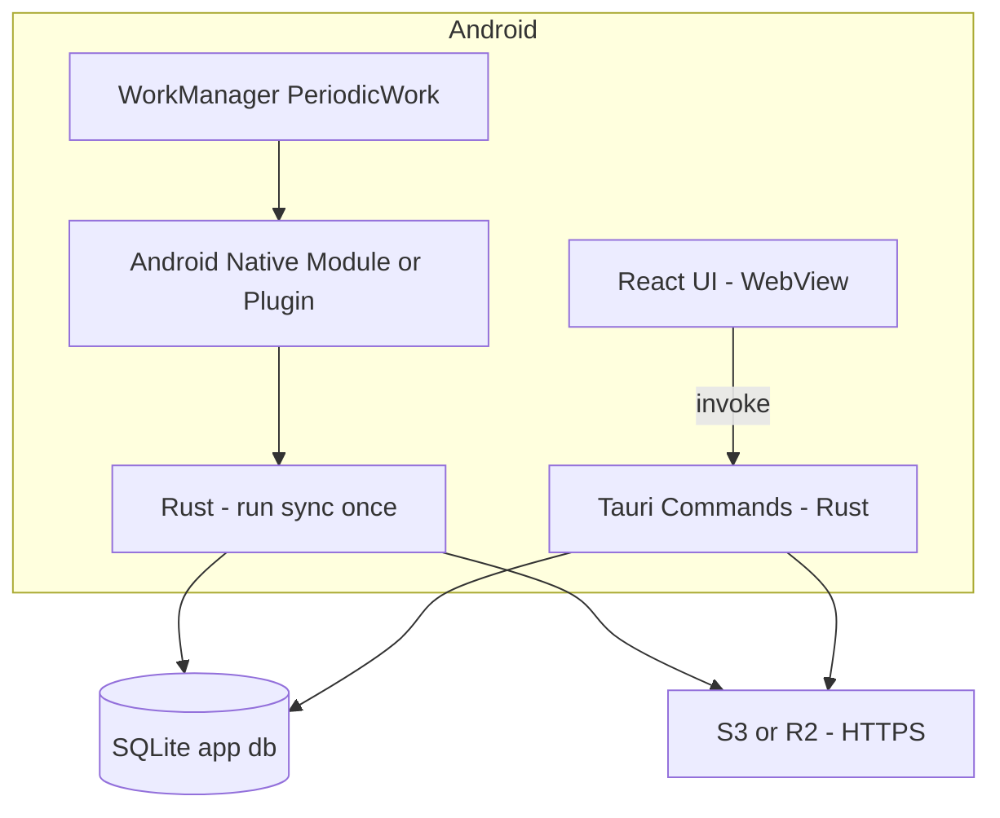

# Android 支持技术设计（后台自动同步 MVP）

> 文档状态（2026-02）
>
> - 本文档定义 **Projex Android 端**的最小可行落地（MVP）技术方案，重点是 **后台自动同步（≥15 分钟）**。
> - 同步命令/API 契约与错误码以 `docs/PRD.md` 为准（尤其是 13.9）。
> - 同步核心实现以 `src-tauri/src/commands/sync.rs`、`src-tauri/src/sync/*` 为准。
> - 本文档只描述 Android 端新增/差异化设计，不重复展开既有 S3 同步机制细节；详见：
>   - `docs/SYNC_S3_DESIGN.md`
>   - `docs/SYNC_EXPLAINED.md`

---

## 1. 目标与范围

### 1.1 目标（In Scope）

- Android App 支持本地 SQLite + 全量功能 UI（与桌面一致的核心业务能力）。
- 支持 **后台自动同步**：使用 Android 系统级调度，最小间隔 **15 分钟**。
- 同步执行复用现有 Rust 管道（`cmd_sync_full` 真实路径），避免在 Kotlin 复制 S3/SQLite 逻辑。
- 安全基线：
  - **仅允许 HTTPS endpoint**（Android 禁用 HTTP）。
  - S3 凭据（Access Key / Secret Key）在 Android 上 **使用 Keystore 安全存储**（不明文落 SQLite）。
- 可靠性基线：
  - 后台任务与前台手动同步 **互斥**，避免同时写库。
  - 发生冲突（锁被占用）时 **跳过本次**，等待下一周期。

### 1.2 非目标（Out of Scope / 明确不做）

- 不做前台服务（Foreground Service）；不承诺 15 分钟以内或“准点”同步。
- 不做 OneTimeWork（事件触发的“立刻同步”）；仅做 PeriodicWork 的兜底定时。
- 不支持 Android 生产环境 `http://` endpoint（MinIO 明文访问仅限桌面/开发环境）。
- 不新增账号体系/推送/服务器端协同（保持现有“本地 + S3”架构）。

---

## 2. 已拍板决策（MVP）

| 主题 | 决策 | 说明 |
|---|---|---|
| 调度方式 | 仅 PeriodicWork（≥15min） | Android WorkManager 周期任务做后台兜底 |
| 频率下限 | 15 分钟 | WorkManager 周期任务平台限制 |
| 网络策略 | `NetworkType.CONNECTED` | 默认允许蜂窝（metered） |
| HTTP endpoint | 禁用 | Android 仅允许 HTTPS（或 endpoint 为空走默认 AWS） |
| 凭据存储 | Keystore | Access/Secret 不明文落 SQLite |
| 并发策略 | 互斥；锁占用则跳过 | 避免排队堆积与写库冲突 |
| 重启恢复 | 需要 | 设备重启后保持周期同步 |
| 前台服务 | 不做 | 省电/合规优先 |

---

## 3. 总体架构（Android 差异化部分）

### 3.1 组件关系

### 3.2 关键原则

- **后台调度在 Android 原生层**：不要依赖 Rust 的 `tokio::spawn + sleep()` 定时循环（后台不可靠）。
- **同步逻辑在 Rust**：后台任务只负责“唤醒并触发一次 sync”，不在 Kotlin 复制同步算法。
- **同一份状态源**：同步结果/错误落在 `sync_config(last_sync/last_sync_error)`，前端复用 `cmd_sync_get_status` 展示。

---

## 4. WorkManager 调度规范（PeriodicWork）

### 4.1 Worker 的行为定义

- **输入**：
  - `profile_name`（MVP 默认 `default`；若未来支持多 profile，Worker 以 profile 维度区分任务名与数据目录）
- **执行步骤**：
  - 读取 `sync_enabled`：
    - 若关闭：直接成功返回（或由调度层取消任务，见 4.3）。
  - 检查互斥锁（见第 6 章）：
    - 若锁被占用：返回成功（标记 skipped），等待下次周期。
  - 获取 S3 凭据（Keystore，见第 7 章）。
  - 调用 Rust “sync run once” 入口执行一次完整同步：
    - 等价于桌面端 `cmd_sync_full` 的主流程（`sync_full_impl()`）。
  - 将执行结果写入 `sync_config`（Rust 已实现）：
    - 成功：更新 `last_sync`，清理 `last_sync_error`
    - 失败：写入 `last_sync_error`（保留最近一次错误）

### 4.2 调度参数

- **最小周期**：15 分钟（不得低于平台限制）。
- **网络约束**：`CONNECTED`（默认允许蜂窝）。
- **退避与重试**：
  - MVP：由 WorkManager 默认策略处理（不在 Rust 额外做复杂重试编排）。
  - Rust 只负责写 `last_sync_error`，便于 UI 展示与排障。

### 4.3 任务唯一命名与更新策略

为避免重复调度与任务堆叠，使用 “unique periodic work”。

- **唯一任务名**：
  - `projex.sync.periodic::<profile_name>`
  - MVP 固定：`projex.sync.periodic::default`
- **更新策略**：
  - 开启同步：`enqueueUniquePeriodicWork(..., ExistingPeriodicWorkPolicy.UPDATE, ...)`
  - 关闭同步：`cancelUniqueWork(name)`
  - 修改间隔：重新 `enqueueUniquePeriodicWork`（UPDATE 覆盖旧配置）

### 4.4 重启恢复（Boot）

Android 设备重启后 WorkManager 通常会恢复任务，但不同 ROM/策略可能不一致。

- MVP 要求：**确保重启后仍保持周期同步**
- 实现建议：
  - 监听 `BOOT_COMPLETED`，在接收到事件后读取本地配置并重新 schedule（只在 `sync_enabled=1` 时）
  - 该逻辑应保证幂等（重复 schedule 不产生多份任务）

---

## 5. Rust 侧执行入口（“跑一次同步”）

### 5.1 现有可复用的同步核心

当前同步完整管道已在 Rust 中实现（桌面通过 command 触发）：

- 入口命令：`cmd_sync_full`
- 核心函数：`sync_full_impl(pool_ref)`（见 `src-tauri/src/commands/sync.rs`）

MVP 要求 Android Worker 触发时复用同一套管道，保证：
- Delta 上传/下载/校验/应用、防回流、游标推进逻辑一致
- 错误码与 `last_sync_error` 行为一致

### 5.2 Android Worker 调用 Rust 的接口契约（建议）

为降低对 Tauri runtime 生命周期的耦合，建议提供一个 **可被 Android 原生层调用的 Rust 一次性入口**：

- **函数语义**：`run_sync_once(profile_name) -> Result<SyncRunResp, SyncRunError>`
- **输入**：
  - `profile_name`：默认 `default`
  - `credentials`：从 Keystore 读取（Access Key / Secret Key），可作为参数传入或通过 Rust->native 回调获取
- **输出（最小）**：
  - `status`: `ok | skipped | failed`
  - `message`: 用于日志/调试（UI 仍以 `cmd_sync_get_status` 为准）

> 说明：本文档只定义契约与行为；具体采用 JNI/FFI 还是 Tauri plugin 的 mobile API，属于工程实现选择。

---

## 6. 并发与互斥（后台 vs 前台）

### 6.1 为什么需要跨入口互斥

你们已在 Rust `SyncRuntime` 内实现进程内互斥锁（防止“定时 sync”与“手动 sync”同时跑）。但 Android Worker 的触发时机与生命周期更复杂，必须有一层 **跨入口（最终裁决）的锁**，保证不会出现：

- Worker 与前台同时写同一个 SQLite
- Worker 与前台同时上传/下载 delta 导致状态错乱

### 6.2 MVP 互斥规则

- **最终互斥**：以 profile data_dir 下的 **文件锁**为准（复用 `app.lock` 思路）。
- **冲突处理**：拿不到锁则本次 Worker **直接跳过（skipped）**，等待下一周期。

这样可以把最坏情况收敛为“同步延迟一个周期”，避免任务堆积与耗电。

---

## 7. 安全设计（Android）

### 7.1 HTTPS-only（禁用 HTTP）

MVP 强制：
- endpoint 为空：允许（走 AWS 默认端点链路）
- endpoint 非空：必须是 `https://...`
- 发现 `http://...`：应在 **前端表单校验**与 **后端校验**双重拒绝（返回稳定错误码，避免 silent failure）

同时：
- Android 侧禁用 cleartext 流量（不提供 Network Security Config 放行）。

### 7.2 Keystore 凭据存储

Android 端 S3 凭据（Access Key / Secret Key）必须：
- 存在 Keystore 支持的安全存储（加密落盘）
- 不以明文写入 SQLite 的 `sync_config`

与现有实现的对齐点：
- 当前 `cmd_sync_get_config` / `cmd_sync_update_config` 以 SQLite `sync_config` 作为持久层。
- Android MVP 需要引入“凭据提供者”抽象：
  - Desktop/macOS：沿用 SQLite
  - Android：从 Keystore 读写

建议在技术实现中明确：
- 迁移策略（如果历史版本 Android 曾写过明文；MVP 可声明“Android 首版即 Keystore，无迁移包袱”）
- UI 展示策略：继续显示 `has_secret_key` + `secret_key_masked`，但实际来源为 Keystore

---

## 8. Android 权限清单（MVP）

必需：
- `INTERNET`（S3 同步）

建议：
- `RECEIVE_BOOT_COMPLETED`（重启恢复 schedule）

不需要（MVP）：
- `FOREGROUND_SERVICE*`（不做前台服务）
- `POST_NOTIFICATIONS`（除非产品要把后台失败做系统通知；MVP 不做）

---

## 9. 可观测性与排障

### 9.1 日志

MVP 要求后台同步能产生日志，便于：
- 追踪 Worker 是否触发
- 追踪一次 sync 的开始/结束/耗时/错误码

建议与现有日志体系对齐（`tauri-plugin-log` + logs dir）。

### 9.2 UI 状态

前端继续以 `cmd_sync_get_status` 展示：
- `is_syncing`
- `pending_changes`
- `last_sync`
- `last_error`

后台 Worker 执行后，`last_sync/last_error` 必须更新，从而 UI 可见。

---

## 10. 测试与验收（Android MVP）

### 10.1 必测场景（手工验收清单）

- 开启同步后，后台每 ≥15 分钟至少触发一次同步（允许系统延迟，但不能长期不触发）。
- 蜂窝网络下可同步（默认允许蜂窝）。
- 断网时 Worker 不应频繁自旋；恢复网络后下一周期可继续同步。
- 前台手动同步与后台触发冲突：
  - 后台拿不到锁 → 跳过本次，不破坏前台同步
- 设备重启后仍保持周期同步（重启恢复）。
- endpoint 配置为 `http://...`：
  - 必须被拒绝（明确错误提示），不得悄悄失败。
- S3 凭据错误/桶权限不足：
  - `last_sync_error` 有可读错误（优先包含 S3 code/message）
  - 修复凭据后下一周期可恢复成功，且错误会被清除。

### 10.2 回归保障（复用既有 Rust 测试）

同步核心逻辑不应在 Android 分叉，依赖现有 Rust 集成测试覆盖：
- `src-tauri/tests/test_sync_e2e_minio.rs`
- `src-tauri/tests/test_s3_minio.rs`

Android 侧主要新增：
- WorkManager 调度行为测试（可选：instrumentation test；MVP 可先手工验证）

---

## 11. 实施计划（建议拆分）

### 11.1 阶段 1：Android 工程与基础运行

- 初始化 Tauri Android 工程（生成 `gen/android`）。
- 确认 SQLite 可读写、基础命令可 invoke。

### 11.2 阶段 2：PeriodicWork 打通一次 sync

- PeriodicWork 触发一次“run sync once”。
- 写入 `last_sync/last_sync_error` 并在 UI 可见。
- 加互斥锁，确保后台/前台不并发。

### 11.3 阶段 3：安全加固（HTTPS-only + Keystore）

- endpoint 校验与 cleartext 禁用。
- 凭据存储迁移为 Keystore（Android 端）。

---

## 12. 风险与已知限制（MVP）

- WorkManager 不保证准点执行；Doze/省电模式会延迟。
- 仅 PeriodicWork：用户修改后可能最多等待接近 15 分钟才同步出去。
- HTTPS-only：Android 不支持生产环境 MinIO 明文访问（桌面仍可用于开发/自托管场景）。

