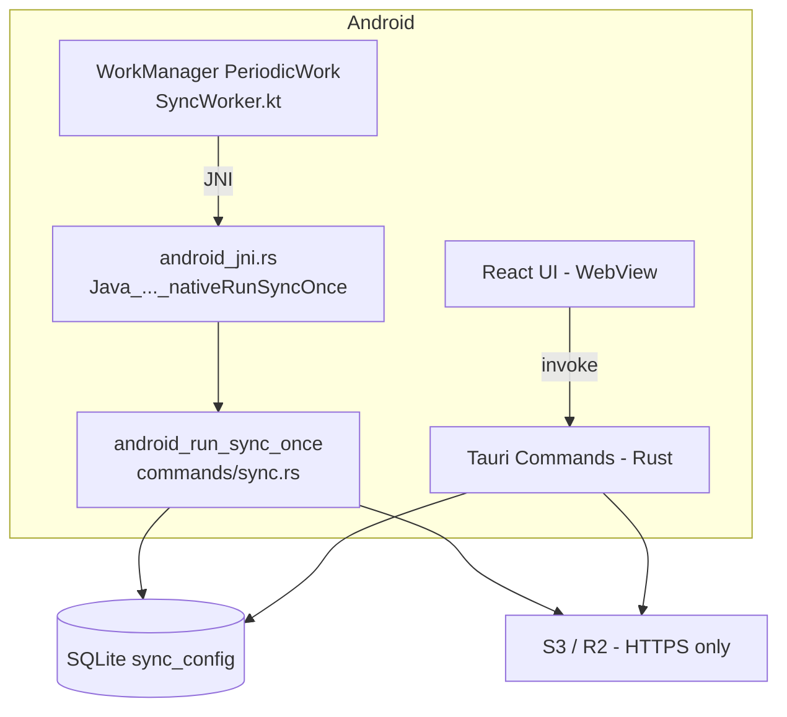

# Android 支持技术设计（后台自动同步 + 移动端 UI 适配）

> 文档状态（2026-02，已实现）
>
> - 本文档定义 **Projex Android 端**的最小可行落地（MVP）技术方案，涵盖 **后台自动同步（≥15 分钟）** 与 **移动端 UI 适配**。
> - 同步命令/API 契约与错误码以 `docs/PRD.md` 为准（尤其是 13.9）。
> - 同步核心实现以 `src-tauri/src/commands/sync.rs`、`src-tauri/src/sync/*` 为准。
> - 本文档只描述 Android 端新增/差异化设计，不重复展开既有 S3 同步机制细节；详见：
>   - `docs/SYNC_S3_DESIGN.md`
>   - `docs/SYNC_EXPLAINED.md`
>
> **实现状态**：后台同步（WorkManager + JNI）、HTTPS 校验、移动端 UI 适配均已完成并合入 `feat/android-workmanager-sync` 分支。

---

## 1. 目标与范围

### 1.1 目标（In Scope）

- Android App 支持本地 SQLite + 全量功能 UI（与桌面一致的核心业务能力）。
- 支持 **后台自动同步**：使用 Android 系统级调度，最小间隔 **15 分钟**。
- 同步执行复用现有 Rust 管道（`cmd_sync_full` 真实路径），避免在 Kotlin 复制 S3/SQLite 逻辑。
- **移动端 UI 适配**：所有页面响应式布局，小屏幕下 card-first 展示，导航抽屉化。
- 安全基线：
  - **仅允许 HTTPS endpoint**（Android 禁用 HTTP），前端与 Rust 双重校验。
  - S3 凭据存储与桌面一致，使用 SQLite `sync_config` 表。
- 可靠性基线：
  - 后台任务与前台手动同步 **互斥**（文件锁），避免同时写库。
  - 发生冲突（锁被占用）时 **跳过本次**，等待下一周期。

### 1.2 非目标（Out of Scope / 明确不做）

- 不做前台服务（Foreground Service）；不承诺 15 分钟以内或"准点"同步。
- 不做 OneTimeWork（事件触发的"立刻同步"）；仅做 PeriodicWork 的兜底定时。
- 不支持 Android 生产环境 `http://` endpoint（MinIO 明文访问仅限桌面/开发环境）。
- 不新增账号体系/推送/服务器端协同（保持现有"本地 + S3"架构）。

---

## 2. 已拍板决策（MVP）

| 主题 | 决策 | 说明 |
|---|---|---|
| 调度方式 | 仅 PeriodicWork（≥15min） | Android WorkManager 周期任务做后台兜底 |
| 频率下限 | 15 分钟 | WorkManager 周期任务平台限制 |
| 网络策略 | `NetworkType.CONNECTED` | 默认允许蜂窝（metered） |
| HTTP endpoint | 禁用 | Android 仅允许 HTTPS（或 endpoint 为空走默认 AWS） |
| 凭据存储 | **SQLite**（与桌面一致） | Access/Secret 存储在 `sync_config` 表；Keystore 方案评估后因复杂度高放弃 |
| JNI 桥接 | `android_jni.rs` | Kotlin Worker 通过 JNI 调用 Rust `android_run_sync_once` |
| 并发策略 | 互斥；锁占用则跳过 | `sync.lock` 文件锁，避免排队堆积与写库冲突 |
| 重启恢复 | `BootReceiver` | 设备重启后 `BOOT_COMPLETED` 广播重新 schedule |
| 前台服务 | 不做 | 省电/合规优先 |
| UI 适配 | card-first + 抽屉导航 | 小屏幕列表改卡片，筛选改底部抽屉，导航改 Drawer |

---

## 3. 总体架构（Android 差异化部分）

### 3.1 组件关系



### 3.2 关键原则

- **后台调度在 Android 原生层**：不依赖 Rust 的 `tokio::spawn + sleep()` 定时循环（后台不可靠）。
- **同步逻辑在 Rust**：后台任务只负责"唤醒并触发一次 sync"，不在 Kotlin 复制同步算法。
- **同一份状态源**：同步结果/错误落在 `sync_config(last_sync/last_sync_error)`，前端复用 `cmd_sync_get_status` 展示。
- **凭据统一在 Rust 读取**：JNI 入口不接收凭据参数，由 `android_run_sync_once` 直接从 SQLite 读取，与桌面路径一致。

---

## 4. WorkManager 调度规范（PeriodicWork）

### 4.1 Worker 的行为定义（已实现）

`SyncWorker.kt`（`CoroutineWorker`）执行步骤：

1. 调用 JNI `nativeRunSyncOnce()`（无参数，凭据由 Rust 从 SQLite 读取）。
2. 解析返回的 JSON 字符串：`{"status":"ok|skipped|failed","message":"..."}`。
3. 根据 status 记录日志，返回 `Result.success()`（所有情况均不返回 RETRY，避免任务堆积）。

Rust 侧 `android_run_sync_once` 内部步骤：
1. 读取 `sync_enabled`：若关闭，返回 `{"status":"skipped","message":"sync disabled"}`。
2. 校验 endpoint HTTPS（若非空且非 `https://` 开头，返回错误）。
3. 尝试获取 `sync.lock` 文件锁：若被占用，返回 `{"status":"skipped","message":"lock busy"}`。
4. 执行完整同步管道（`sync_full_pipeline`）。
5. 更新 `last_sync` / `last_sync_error`，释放锁。

### 4.2 调度参数

- **最小周期**：15 分钟（`PeriodicWorkRequest.MIN_PERIODIC_INTERVAL_MILLIS`）。
- **网络约束**：`NetworkType.CONNECTED`（默认允许蜂窝）。
- **退避策略**：WorkManager 默认（指数退避），Worker 始终返回 `SUCCESS` 避免触发退避。

### 4.3 任务唯一命名与更新策略

- **唯一任务名**：`projex.sync.periodic::default`
- **开启同步**：`enqueueUniquePeriodicWork(..., ExistingPeriodicWorkPolicy.UPDATE, ...)`
- **关闭同步**：`cancelUniqueWork(name)`（当前实现：始终 schedule，由 Rust 侧 `sync_enabled` 判断跳过）

### 4.4 重启恢复（BootReceiver）

`BootReceiver.kt` 监听 `BOOT_COMPLETED` 和 `MY_PACKAGE_REPLACED`，无条件调用 `SyncScheduler.schedule(context)`（幂等，WorkManager 的 `UPDATE` 策略保证不重复）。

---

## 5. Rust 侧执行入口

### 5.1 JNI 桥接（`android_jni.rs`）

```rust
// 暴露给 Kotlin 的 JNI 函数
#[no_mangle]
pub extern "C" fn Java_com_nickdu_projex_SyncWorker_nativeRunSyncOnce(
    env: JNIEnv,
    _class: JClass,
) -> jstring {
    // 从全局 DbPool 获取连接，调用 android_run_sync_once
    // 返回 JSON 字符串：{"status":"ok|skipped|failed","message":"..."}
}
```

- `DbPool` 在 `lib.rs` 的 `mobile_entry_point` 中初始化后，通过 `register_pool` 注册到全局 `OnceLock`。
- JNI 函数无需接收凭据参数，直接从 SQLite 读取。

### 5.2 同步入口（`commands/sync.rs`）

```rust
// Android 专用同步入口（#[cfg(target_os = "android")]）
pub async fn android_run_sync_once(pool_ref: &DbPool) -> Result<SyncRunResp, AppError> {
    // 1. 检查 sync_enabled
    // 2. 校验 endpoint HTTPS
    // 3. 获取 sync.lock 文件锁
    // 4. 调用 sync_full_pipeline(pool_ref, credentials)
    // 5. 更新 last_sync / last_sync_error
}
```

---

## 6. 并发与互斥（后台 vs 前台）

### 6.1 文件锁机制

- 锁文件路径：`<app_data_dir>/sync.lock`
- 使用 `fs2::FileExt::try_lock_exclusive()`：非阻塞尝试，失败立即返回 `skipped`。
- 前台 `cmd_sync_full` 持有锁期间，后台 Worker 触发时直接跳过，等待下一周期。
- 最坏情况：同步延迟一个周期（15 分钟），不会造成数据损坏。

---

## 7. 安全设计（Android）

### 7.1 HTTPS-only（双重校验）

**前端校验**（`Settings.tsx`）：
```typescript
if (endpoint && !endpoint.toLowerCase().startsWith('https://')) {
  showError(t('settings.sync.endpointHttpsRequired'));
  return;
}
```

**Rust 校验**（`cmd_sync_update_config` + `android_run_sync_once`）：
```rust
#[cfg(target_os = "android")]
validate_endpoint_https(&Some(endpoint.clone()))?;
// 错误码：ENDPOINT_NOT_HTTPS
```

- endpoint 为空：允许（走 AWS 默认端点链路）。
- endpoint 非空：必须是 `https://...`，否则返回错误码 `ENDPOINT_NOT_HTTPS`。

### 7.2 凭据存储（SQLite，与桌面一致）

Android 端 S3 凭据（Access Key / Secret Key）存储策略：
- 与桌面端完全一致，使用 SQLite `sync_config` 表持久化。
- `cmd_sync_get_config` / `cmd_sync_update_config` 在 Android 上行为与桌面相同，无需额外抽象层。
- UI 展示：`has_secret_key` + `secret_key_masked`（`***`），实际值不暴露给前端。

> **背景**：MVP 评估阶段曾考虑 Android Keystore 方案，但因引入额外的 Kotlin/JNI 复杂度且 MVP 阶段收益有限，最终决定与桌面对齐，统一使用 SQLite 存储。未来如有更高安全要求可再引入 Keystore 抽象层。

---

## 8. 移动端 UI 适配

### 8.1 设计原则

- **card-first**：小屏幕（< 768px）下，列表页用 `Card` 替代 `Table`，信息更易阅读。
- **抽屉导航**：侧边栏改为 `Drawer` + `Burger` 按钮，节省屏幕空间。
- **底部抽屉筛选**：列表页筛选面板改为 `MobileBottomSheet`（从底部弹出）。
- **全宽按钮**：表单提交、操作按钮在移动端自动 `fullWidth`。
- **响应式布局**：`useIsMobile()` hook（`useMediaQuery('(max-width: 768px)')`）驱动条件渲染。

### 8.2 新增基础设施

| 文件 | 说明 |
|------|------|
| `src/utils/useIsMobile.ts` | `useIsMobile()` hook，基于 `useMediaQuery` |
| `src/utils/responsive.ts` | 响应式常量（断点、padding、grid cols） |
| `src/components/MobilePageHeader.tsx` | 统一页面头部（返回按钮 + 标题 + 操作区） |
| `src/components/MobileBottomSheet.tsx` | 底部抽屉，用于筛选面板和操作菜单 |

### 8.3 已适配页面

| 页面/组件 | 适配内容 |
|-----------|----------|
| `Layout.tsx` | 侧边栏改 Drawer，顶部加 Burger 按钮 |
| `ProjectsList.tsx` | 卡片视图 + 底部抽屉筛选 + 分页换行 |
| `PeopleList.tsx` | 卡片视图 |
| `PartnersList.tsx` | 卡片视图 |
| `ProjectDetail.tsx` | 成员/时间线改卡片，按钮换行，Modal 全屏 |
| `PersonDetail.tsx` | 项目列表改卡片，按钮换行 |
| `PartnerDetail.tsx` | 项目列表改卡片，按钮换行 |
| `ProjectForm.tsx` | 全宽布局，提交按钮全宽 |
| `PersonForm.tsx` | 全宽布局，提交按钮全宽 |
| `PartnerForm.tsx` | 全宽布局，提交按钮全宽 |
| `Settings.tsx` | 按钮组换行，全宽按钮 |
| `Logs.tsx` | ScrollArea 高度响应式，按钮换行 |
| `ConfirmModal.tsx` | 移动端全屏 Modal，按钮全宽 |
| `RichTextEditor.tsx` | 工具栏换行，移动端简化工具栏 |
| `SyncStatusBar.tsx` | 防文字溢出，padding 响应式 |

---

## 9. Android 权限清单（已配置）

必需：
- `INTERNET`（S3 同步，Tauri 默认已声明）

已配置：
- `RECEIVE_BOOT_COMPLETED`（重启恢复 schedule）

不需要（MVP）：
- `FOREGROUND_SERVICE*`（不做前台服务）
- `POST_NOTIFICATIONS`（MVP 不做系统通知）

---

## 10. 可观测性与排障

### 10.1 日志

后台 Worker 执行日志通过 Android Logcat 输出（tag: `ProjexSyncWorker`）：
```
I ProjexSyncWorker: SyncWorker started
I ProjexSyncWorker: nativeRunSyncOnce result: {"status":"skipped","message":"sync disabled"}
```

Rust 侧错误通过 `last_sync_error` 写入 SQLite，前端 `SyncStatusBar` 可见。

### 10.2 UI 状态

前端继续以 `cmd_sync_get_status` 展示：
- `is_syncing`
- `pending_changes`
- `last_sync`
- `last_error`

后台 Worker 执行后，`last_sync/last_error` 必须更新，从而 UI 可见。

---

## 11. 测试与验收（Android MVP）

### 11.1 必测场景（手工验收清单）

- [ ] 开启同步后，后台每 ≥15 分钟至少触发一次同步（允许系统延迟）。
- [ ] 蜂窝网络下可同步（默认允许蜂窝）。
- [ ] 断网时 Worker 不触发（`NetworkType.CONNECTED` 约束）；恢复网络后下一周期可继续。
- [ ] 前台手动同步与后台触发冲突：后台拿不到锁 → 跳过本次，不破坏前台同步。
- [ ] 设备重启后仍保持周期同步（`BootReceiver` 重新 schedule）。
- [ ] endpoint 配置为 `http://...`：前端和 Rust 均拒绝，有明确错误提示。
- [ ] S3 凭据错误/桶权限不足：`last_sync_error` 有可读错误；修复后下一周期恢复。
- [ ] 移动端 UI：列表页显示卡片视图，筛选从底部弹出，导航通过 Burger 打开。

### 11.2 回归保障（复用既有 Rust 测试）

同步核心逻辑不在 Android 分叉，依赖现有 Rust 集成测试覆盖：
- `src-tauri/tests/test_sync_e2e_minio.rs`
- `src-tauri/tests/test_s3_minio.rs`

---

## 12. 关键文件索引

| 文件 | 说明 |
|------|------|
| `src-tauri/src/android_jni.rs` | JNI 桥接，暴露 `nativeRunSyncOnce` 给 Kotlin |
| `src-tauri/src/commands/sync.rs` | `android_run_sync_once`、`validate_endpoint_https` |
| `src-tauri/src/lib.rs` | `mobile_entry_point`，初始化 DbPool 并注册到 JNI |
| `src-tauri/gen/android/app/src/main/java/com/nickdu/projex/SyncWorker.kt` | WorkManager Worker |
| `src-tauri/gen/android/app/src/main/java/com/nickdu/projex/SyncScheduler.kt` | 调度封装 |
| `src-tauri/gen/android/app/src/main/java/com/nickdu/projex/BootReceiver.kt` | 重启恢复 |
| `src-tauri/gen/android/app/src/main/java/com/nickdu/projex/MainActivity.kt` | 主 Activity，启动时 schedule |
| `src-tauri/gen/android/app/src/main/AndroidManifest.xml` | 权限 + BootReceiver 声明 |
| `src/utils/useIsMobile.ts` | 移动端检测 hook |
| `src/utils/responsive.ts` | 响应式常量 |
| `src/components/MobilePageHeader.tsx` | 移动端页面头部组件 |
| `src/components/MobileBottomSheet.tsx` | 底部抽屉组件 |
| `docs/ANDROID_DEV_SETUP.md` | Android 开发环境搭建指南 |

---

## 13. 风险与已知限制（MVP）

- WorkManager 不保证准点执行；Doze/省电模式会延迟，最坏情况可能超过 15 分钟。
- 仅 PeriodicWork：用户修改数据后可能最多等待接近 15 分钟才同步出去。
- HTTPS-only：Android 不支持生产环境 MinIO 明文访问（桌面仍可用于开发/自托管场景）。
- SQLite 凭据存储：凭据以明文存储在 SQLite，依赖 Android 应用沙箱保护；如需更高安全级别，未来可引入 Keystore 加密层。
