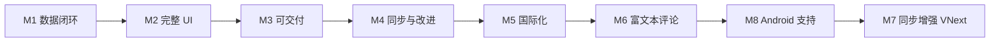
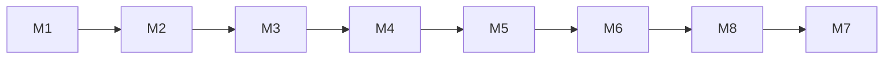

# 里程碑与详细需求

本文档定义各里程碑及每个里程碑的详细需求内容。与 `PRD.md` 一致，需求变更以 PRD 为准。

---

## 总览

| 里程碑 | 目标 | 状态 |
|--------|------|------|
| **M1** | 数据闭环：迁移 + 核心命令 + 最简验证 UI | ✅ 已完成 |
| **M2** | 完整 UI：页面、筛选、规则校验、成员/Partner 视图 | ✅ 已完成 |
| **M3** | 可交付：导出、打包、错误与空状态体验 | ✅ 已完成 |
| **M4** | 同步与改进：S3 多设备同步闭环 + 导入 + 标签筛选 + Zustand | ✅ 已完成（方案A收尾） |
| **M5** | 国际化：i18n 框架 + 英文/中文翻译 + 语言切换 | ✅ 已完成 |
| **M6** | 富文本评论：Tiptap 编辑器 + CRUD + 置顶 + 关联操作人 + S3 同步 | ✅ 已完成 |
| **M8** | Android 支持：WorkManager 后台同步 + JNI 桥接 + 移动端 UI 适配 | ✅ 已完成 |
| **M9** | 人员导入导出：CSV 批量导出/导入，幂等姓名匹配 | ✅ 已完成 |
| **M7** | 同步增强（P1-P4）：安全/可靠性/可观测性/性能 | 🚧 规划中 |

---

## M1：数据闭环（已完成）

**目标**：后端与 DB 打通，核心写读与状态变更可验证，无死锁。

### 详细需求内容

#### 1.1 工程与数据
- [x] Tauri + Vite + React + TypeScript 脚手架
- [x] Mantine 接入（基础 Provider）
- [x] SQLite 迁移：`schema_migrations` + `0001_init.sql`（persons, partners, projects, assignments, status_history, project_tags）
- [x] 启动时自动创建 DB 并执行迁移，路径：`~/Library/Application Support/com.tauri.dev/app.db`

#### 1.2 领域与用例
- [x] Domain：`ProjectStatus` 枚举 + `StatusMachine::can_transition` / `note_required`
- [x] App：`project_create`（事务内：insert project + owner assignment + 初始 status_history + tags）
- [x] App：`project_get`、`project_list`、`project_change_status`（事务内：history + 更新 current_status，**释放连接后再调 project_get，避免死锁**）
- [x] App：`partner_create`、`partner_list`；`person_create`、`person_list`
- [x] 错误模型：`AppError` + 稳定 `code`（含 `From<rusqlite::Error>`）

#### 1.3 命令层
- [x] Commands：`cmd_partner_create/list`、`cmd_person_create/list`、`cmd_project_create/get/list`、`cmd_project_change_status`
- [x] DTO 与前端约定：请求体使用 **camelCase**（与 Rust `#[serde(rename_all = "camelCase")]` 一致）

#### 1.4 最简验证 UI
- [x] 单页：创建 Partner/Person、创建 Project（必选 partner/owner/country）、列表、状态变更按钮
- [x] 调用 `invoke` 封装（`src/api/invoke.ts`），错误在页面 log 区展示

#### 1.5 验收
- [x] 创建项目后状态为 BACKLOG，时间线至少 1 条
- [x] 状态变更不卡死，返回最新项目详情
- [x] 清空 DB 后重启，迁移重新执行无报错

---

## M2：完整 UI 与规则

**目标**：按 PRD 完成所有 MVP 页面与交互，规则与不变量在前后端一致落地。

### 详细需求内容

#### 2.1 路由与页面结构
- [x] 路由：Projects（列表 + 详情）、People（列表 + 详情）、Partners（列表 + 详情）、Settings（导出入口）
- [x] 导航：顶部或侧边导航，当前页高亮

#### 2.2 项目（Projects）
- [x] **列表页**
  - 表格/卡片：名称、状态、国家、Partner、负责人、截止日、更新时间、标签
  - 筛选：状态、国家、Partner、负责人、参与成员、仅未归档（默认 on）
  - 排序：更新时间（默认）、优先级、截止日
  - 操作：新建、进入详情、可选“快速改状态”
- [x] **新建/编辑项目**
  - 表单：名称（必填）、描述、优先级、国家（必填）、Partner（必填，下拉+搜索，创建后不可改）、负责人（必填，下拉+搜索）
  - 可选：开始/截止日期、标签
  - 校验：前端 zod 预校验；后端 `project_update` **禁止** `partnerId`（若传则 `PARTNER_IMMUTABLE`）
- [x] **项目详情**
  - 概览：基础信息、当前状态、国家、Partner（只读）、负责人（可改，且保证 owner 为当前成员）
  - 成员区：当前参与列表（姓名、角色、起止时间），操作“加入成员”“退出”
  - 状态时间线：倒序展示（时间、from→to、操作人、备注）
  - 状态变更：仅展示允许的下一状态；特殊路径（返工/取消归档/放弃）弹窗强制填备注

#### 2.3 成员（People）
- [x] **列表页**：姓名、是否启用、当前项目数（可选）
- [x] **新建/编辑**：姓名（必填）、备注；支持停用（不删）
- [x] **成员详情**
  - **当前项目**：`assignments.end_at IS NULL` 且项目未归档
  - **做过的项目**：存在任意 assignment 的项目（去重，按最近参与时间排序）

#### 2.4 Partner（合作方）
- [x] **列表页**：名称、是否启用、关联项目数（可选）
- [x] **新建/编辑**：名称（必填、唯一）、备注；支持停用（停用后不可被新项目选）
- [x] **Partner 详情**（可选）：关联项目列表

#### 2.5 国家与数据
- [x] 国家：项目表单为国家下拉，值域 ISO 3166-1 alpha-2，建议内置静态列表（如 CN/US/JP…）
- [x] 列表筛选与 PRD 第 7 章一致（状态、国家、Partner、负责人、参与成员、标签）

#### 2.6 后端补全（若 M1 未做）
- [x] `project_update`：可编辑 name/description/priority/country/owner/startDate/dueDate/tags；**禁止** `partnerId`，否则返回 `PARTNER_IMMUTABLE`
- [x] `assignment_add_member`、`assignment_end_member`、`assignment_list_by_project`
- [x] `person_get`、`person_update`、`person_deactivate`；`person_current_projects`、`person_all_projects`
- [x] `partner_get`、`partner_update`、`partner_deactivate`、`partner_projects`
- [x] 设置/更换 Owner 时：若新 owner 无当前参与记录，事务内自动创建 assignment

#### 2.7 验收
- [x] 项目创建/编辑/详情/状态变更全流程可走通，Partner 创建后不可改
- [x] 成员详情“当前项目”与“做过的项目”与 PRD 第 3 章口径一致
- [x] 特殊状态变更（返工、取消归档、放弃）必须填备注

---

## M3：可交付 ✅ 已完成

**目标**：可打包分发、数据可备份、错误与空状态体验完整。

### 详细需求内容

#### 3.1 导出/备份
- [x] 命令：`export_json_string`（或等价），返回符合 PRD 导出 schema 的 JSON 字符串（含 meta、persons、partners、projects、assignments、statusHistory、tags）
- [x] 前端：Settings 或独立“导出”入口，触发导出后通过“另存为”对话框写文件（路径由用户选择）

#### 3.2 打包与运行环境
- [x] `cargo tauri build` 成功，产出 macOS .app（或当前目标平台）
- [x] 首次运行自动创建应用数据目录与 DB，迁移正常执行
- [x] 关闭应用后再次打开，数据持久存在

#### 3.3 体验与健壮性
- [x] 错误提示：接口返回 `AppError` 时，前端统一解析 `code`/`message`，用 Mantine 通知或内联提示展示，避免白屏或静默失败
- [x] 空状态：列表无数据、成员无项目、Partner 无项目时，有明确文案与引导（如“先去创建 Partner / 项目”）
- [x] 关键操作确认（可选）：归档、取消归档、删除/停用前可二次确认

#### 3.4 文档与交付物
- [x] README：运行要求（Node、Rust）、`npm install` + `npm run tauri dev` / `npm run tauri build`
- [x] 可选：简短“使用说明”（如何创建项目、改状态、看成员视图、导出备份）

#### 3.5 验收
- [x] 导出文件可打开且结构符合 PRD 导出 schema
- [x] 打包后的应用可独立运行，数据目录与 DB 行为正确
- [x] 常见错误（如必填为空、非法状态跃迁、note 未填）有明确提示

---

## M4：同步与改进 ✅ 已完成

**目标**：形成可用且稳定的同步闭环（上传/拉取/校验/应用/防回流），并完成导入、标签筛选、Zustand 管理。

### 详细需求内容

#### 4.1 S3 多设备同步
- [x] 迁移 `0003_add_sync_support.sql`：新增 `sync_metadata`、`vector_clocks`、`sync_config` 表及变更触发器
- [x] `cmd_sync_full` 完整链路：上传本地 Delta -> 下载远端 Delta -> 校验 -> 事务应用
- [x] 远端 Delta 过滤策略：排除本机对象，按 `source_device_id + timestamp + key` 排序后应用
- [x] 每设备消费游标：`last_remote_delta_ts::<source_device_id>`（存储于 `sync_config`）
- [x] 防回流（anti-reupload）：`mark_remote_applied_operations_synced` 标记触发器回写行为为已同步
- [x] 冲突策略：保留 `VectorClock` 冲突检测入口 + 最小 LWW 保护（`remote_version < local_version` 跳过）
- [x] `DeltaSyncEngine`：支持 `project_tags` 复合键删除与 `project_comments` upsert/delete
- [x] Bootstrap 行为：远端空桶时自动上传初始 snapshot，避免“同步成功但远端空数据”
- [x] `SnapshotManager`：全量快照创建/恢复/上传/下载，支持 checksum 校验与 gzip 压缩，恢复链路覆盖 comments
- [x] `S3SyncClient`：兼容 AWS S3 / Cloudflare R2 / MinIO，支持自定义 endpoint
- [x] 命令层补全：`sync_get/update/set_enabled/reveal_secret_key/test_connection/get_status/full/create_snapshot/restore_snapshot`
- [x] 前端 `SyncManager` + `SyncStatusBar` + Settings 同步配置区块联动

#### 4.2 数据导入
- [x] 后端 `import_json_string`：解析 JSON，按 FK 依赖顺序写入（persons → partners → projects+tags → assignments → status_history）
- [x] `INSERT OR IGNORE` 幂等导入，重复 ID 自动跳过
- [x] Schema 版本兼容（version=1 与 version=2）
- [x] 返回 `ImportResult`（各类型导入数量 + 跳过数量）
- [x] 前端 Settings 页"导入数据"按钮，选择 .json 文件后调用后端导入
- [x] 5 个 import 集成测试（空库导入、重复跳过、无效 JSON、错误版本、往返一致性）

#### 4.3 项目列表增强
- [x] 后端 `project_list` 支持 6 种筛选条件（statuses/countryCodes/partnerIds/ownerPersonIds/participantPersonIds/tags）
- [x] 排序参数支持（sort_by: updatedAt/priority/dueDate, sort_order: asc/desc）
- [x] 返回 `Page<T>` 结构（含 total/limit/offset）
- [x] 前端标签多选筛选（`MultiSelect` 组件），从已有项目自动收集标签
- [x] 前端分页 UI（`Pagination` 组件）

#### 4.4 Zustand 全局状态管理
- [x] `usePartnerStore`：合作方列表缓存 + `activeOptions()`
- [x] `usePersonStore`：成员列表缓存 + `activeOptions()`
- [x] `useTagStore`：全局标签缓存
- [x] 所有表单页（ProjectForm/PersonForm/PartnerForm）在 CRUD 后自动 invalidate 相关 store
- [x] Settings 导入数据后 invalidate 所有 store

#### 4.5 其他改进
- [x] 新增 `assignment_list_by_project` 命令
- [x] `ConfirmModal` 统一确认弹窗组件
- [x] 重命名 `export.rs` → `data_transfer.rs`（反映导入导出双向职责）
- [x] 自动同步调度迁移到 Rust 后端 scheduler（前端不持有主定时器）
- [x] `sync_lock + is_syncing` 并发控制，避免手动同步与定时同步并发执行
- [x] 同步设置 UX 优化：编辑态点击“测试连接”前先做本地必填校验（bucket/access/secret），减少一次无效后端往返
- [x] `cmd_sync_test_connection` 支持草稿参数优先 + 已保存配置回退，支持“未保存草稿”连通性测试

#### 4.6 测试覆盖
- [x] 后端全量测试通过（覆盖 sync/snapshot/conflict/trigger 等关键路径）
- [x] 补充同步关键测试：
  - `apply_delta_upsert_project_tags`
  - `apply_delta_upsert_project_comments`
  - `apply_delta_delete_project_tag_by_composite_record_id`
  - `apply_delta_upsert_person_stale_version_is_ignored`
  - `mark_remote_applied_operations_synced_marks_trigger_rows`
  - `restore_snapshot_full_flow`
  - `restore_snapshot_clears_all_tables`

#### 4.7 验收
- [x] 导出 → 导入往返数据一致
- [x] 标签筛选可组合使用，与后端 SQL `IN` 查询联动
- [x] 表单页下拉选项从 Zustand store 获取，避免重复 API 请求
- [x] S3 同步配置可保存，连接测试可执行，启停状态可持久化
- [x] 远端 Delta 可落库且不会回流重传（防 ping-pong）
- [x] `project_tags` / `project_comments` 可在多设备间同步
- [x] snapshot restore 后 comments 数据完整可用

#### 4.8 方案A收尾状态（2026-02）

| 能力 | 状态 | 备注 |
|------|------|------|
| 本地 Delta 采集/上传 | ✅ | 已完成 |
| 远端 Delta 下载/应用 | ✅ | 已完成 |
| checksum 校验 | ✅ | 已完成 |
| `project_tags` / `project_comments` Delta 支持 | ✅ | 已完成 |
| 防回流（anti-reupload） | ✅ | 已完成 |
| 最小 LWW 保护 | ✅ | 已完成 |
| 端到端加密（E2E） | 🚧 | 规划中 |
| 快照轮转清理 | 🚧 | 规划中 |

---

## M5：国际化（i18n） ✅ 已完成

**目标**：支持中英文双语 UI，可运行时切换语言。

### 详细需求内容

#### 5.1 i18n 框架搭建
- [x] 接入 `i18next` + `react-i18next`
- [x] 创建 `src/i18n.ts` 初始化配置（默认 en，fallback en）
- [x] 创建 `src/locales/en.json` 和 `src/locales/zh.json` 翻译文件（约 250 个 key）
- [x] `main.tsx` 中导入 i18n 初始化文件

#### 5.2 全量字符串国际化
- [x] 所有 16 个前端文件（11 页面 + 2 共享组件 + 3 工具/常量）完成 i18n 改造
- [x] 所有硬编码中文字符串替换为 `t()` 调用
- [x] 动态内容使用插值（如 `t('project.list.total', { count })`）
- [x] 项目状态翻译：`getStatusLabel(status, t)` 基于 `status.*` key
- [x] 国家名称翻译：`getCountries(lng)` 基于 `i18n-iso-countries` 动态 locale
- [x] 角色标签翻译：`PERSON_ROLES.label` 存储 i18n key，`getRoleLabel()` 通过 `i18n.t()` 解析

#### 5.3 语言切换
- [x] Settings 页面新增语言切换区域（`SegmentedControl`：English / 中文）
- [x] 切换时调用 `i18n.changeLanguage(lng)` 即时生效（无需刷新）
- [x] `dayjs` locale 同步切换（en/zh-cn）
- [x] `i18n-iso-countries` 国家名称随语言切换

#### 5.4 验收
- [x] 默认英文界面，所有页面无残留中文硬编码
- [x] 切换中文后所有页面正确显示中文
- [x] `npm run build` 编译无错误

---

## M6：富文本评论 ✅ 已完成

**目标**：为项目添加富文本评论功能，支持格式化文本、图片、表格、任务清单。

### 详细需求内容

#### 6.1 数据库 & 同步
- [x] Migration `0004_add_project_comments.sql`（表 + 索引 + 同步触发器）
- [x] `project_comments` 表：id, project_id, person_id, content (JSON), is_pinned, created_at, updated_at, _version
- [x] 更新 `data_transfer.rs` 导入/导出支持（schema_version 升至 2）

#### 6.2 后端 Rust
- [x] `app/comment.rs`：CommentDto、CommentCreateReq、CommentUpdateReq、4 个 use case
- [x] `commands/comment.rs`：4 个 Tauri 命令（create/update/delete/list）
- [x] 注册命令到 `lib.rs`
- [x] 集成测试（`test_comment.rs`，20+ 测试用例）

#### 6.3 前端依赖
- [x] 安装 Tiptap 系列包：`@tiptap/react`、`@tiptap/starter-kit`、`@tiptap/extension-*`（link/image/table/task-list）
- [x] 安装 `@mantine/tiptap@^7`（兼容 Mantine 7.x）

#### 6.4 前端组件
- [x] `src/api/comments.ts`：typed invoke wrapper（4 个方法）
- [x] `src/components/RichTextEditor.tsx`：Tiptap 富文本编辑器封装
  - 扩展：StarterKit、Link、Image（Base64）、TaskList/TaskItem、Table 系列
  - 工具栏：粗体/斜体、标题、列表、任务清单、链接、图片上传、表格插入
  - 可编辑/只读模式切换
- [x] `src/components/ProjectComments.tsx`：评论区组件
  - 新增评论表单（富文本编辑器 + 操作人下拉 + 提交按钮）
  - 评论列表（置顶优先 + 时间倒序）
  - 每条评论卡片：操作人徽章、时间、置顶标记、编辑时间标注
  - 操作按钮：编辑（inline 编辑）、删除（确认弹窗）、置顶/取消置顶
- [x] `ProjectDetail.tsx` 集成 `<ProjectComments projectId={id} />`（状态时间线之后）

#### 6.5 i18n
- [x] `en.json` / `zh.json` 添加 `comment.*` 系列 key（约 20 个）
  - title/add/edit/delete/pin/unpin/pinned/confirmDelete/noComments/placeholder
  - selectPerson/emptyContent/savedSuccess/saveFailed/deletedSuccess/deleteFailed/loadFailed
  - pinSuccess/unpinSuccess/edited/insertImage/insertTable/table

#### 6.6 文档更新
- [x] `AGENTS.md`：技术栈、目录结构、迁移列表、数据导入导出、新增「富文本评论」章节
- [x] `PRD.md`：2.3 已实现扩展功能 + 富文本评论条目
- [x] `MILESTONES.md`：新增 M6 里程碑 + 依赖关系图

#### 6.7 验收
- [x] 后端 Rust 编译通过，集成测试全部通过
- [x] 前端依赖安装成功（使用 `--legacy-peer-deps` 兼容 Mantine 7.x）
- [x] 项目详情页可创建富文本评论（文本格式、列表、任务清单、图片、表格）
- [x] 可编辑、删除、置顶评论
- [x] 可关联操作人到评论
- [x] 置顶评论显示在列表顶部
- [x] 中英文双语界面正常显示

---

## M8：Android 支持 ✅ 已完成

**目标**：支持 Android 平台运行，实现后台自动同步（≥15 分钟）与全面移动端 UI 适配。

### 详细需求内容

#### 8.1 Android 工程初始化
- [x] 初始化 Tauri Android 工程（`tauri android init`，生成 `src-tauri/gen/android`）
- [x] 配置 Android SDK / NDK / Rust 交叉编译工具链（`aarch64-linux-android`）
- [x] 确认 SQLite 可读写、基础 Tauri 命令可 invoke
- [x] 文档：`docs/ANDROID_DEV_SETUP.md`（环境搭建指南）

#### 8.2 WorkManager 后台同步
- [x] `SyncWorker.kt`（`CoroutineWorker`）：调用 JNI `nativeRunSyncOnce()`，解析 JSON 结果
- [x] `SyncScheduler.kt`：封装 `enqueueUniquePeriodicWork`（15 分钟，`NetworkType.CONNECTED`，`UPDATE` 策略）
- [x] `BootReceiver.kt`：监听 `BOOT_COMPLETED` + `MY_PACKAGE_REPLACED`，重启后重新 schedule
- [x] `MainActivity.kt`：启动时调用 `SyncScheduler.schedule()`
- [x] `AndroidManifest.xml`：声明 `RECEIVE_BOOT_COMPLETED` 权限和 `BootReceiver`
- [x] `build.gradle.kts`：添加 `work-runtime-ktx` 依赖

#### 8.3 JNI 桥接（Rust ↔ Kotlin）
- [x] `src-tauri/src/android_jni.rs`：暴露 `Java_com_nickdu_projex_SyncWorker_nativeRunSyncOnce`
- [x] `lib.rs`：`mobile_entry_point` 初始化 DbPool 后调用 `android_jni::register_pool`
- [x] `Cargo.toml`：Android 平台添加 `jni` 依赖

#### 8.4 安全加固
- [x] HTTPS-only 双重校验：前端 `Settings.tsx` 表单校验 + Rust `cmd_sync_update_config` / `android_run_sync_once` 校验
- [x] 错误码：`ENDPOINT_NOT_HTTPS`
- [x] i18n：`settings.sync.endpointHttpsRequired` 翻译 key（en + zh）

#### 8.5 凭据存储（SQLite，与桌面一致）
- [x] Android 端凭据存储与桌面对齐，统一使用 SQLite `sync_config` 表
- [x] JNI 入口无需接收凭据参数，由 Rust 直接从 SQLite 读取
- [x] 评估并放弃 Android Keystore 方案（复杂度高，MVP 阶段收益有限）

#### 8.6 并发互斥
- [x] `sync.lock` 文件锁：`android_run_sync_once` 中使用 `fs2::try_lock_exclusive`
- [x] 锁被占用时返回 `{"status":"skipped","message":"lock busy"}`，等待下一周期

#### 8.7 移动端 UI 适配（card-first 响应式布局）
- [x] `useIsMobile` hook（`useMediaQuery('(max-width: 768px)')`）
- [x] `responsive.ts`：响应式常量（断点、padding、grid cols）
- [x] `MobilePageHeader`：统一页面头部组件
- [x] `MobileBottomSheet`：底部抽屉（筛选面板、操作菜单）
- [x] `Layout.tsx`：侧边栏改 Drawer + Burger 按钮
- [x] 列表页（Projects/People/Partners）：card-first 双视图 + 底部抽屉筛选
- [x] 详情页（Project/Person/Partner）：表格改卡片 + 按钮换行 + Modal 全屏
- [x] 表单页（Project/Person/Partner Form）：全宽布局 + 提交按钮全宽
- [x] Settings/Logs：按钮组换行、ScrollArea 高度响应式
- [x] ConfirmModal：移动端全屏
- [x] RichTextEditor：工具栏换行 + 移动端简化

#### 8.8 验收
- [x] `tauri android dev` 可在模拟器（API 36）上成功运行
- [x] 导入测试数据后，列表/详情/表单页在移动端正常显示
- [x] WorkManager 后台 Worker 触发，Logcat 可见 `nativeRunSyncOnce result`
- [x] endpoint 配置 `http://` 被前端和 Rust 双重拒绝
- [x] `cargo fmt` + `cargo clippy` + ESLint 全部通过

---

## M7：同步增强（VNext）🚧 规划中

**目标**：在已完成同步闭环基础上，继续提升安全性、可靠性、可观测性与性能。

### 详细需求内容

#### 7.0 同步配置导入导出（已完成）✅

> 目标：支持将 S3 凭据导出为 JSON 文件，便于在新设备上快速完成同步配置。

- [x] **后端**：`cmd_sync_export_config` — 读取 `sync_config` 表，生成带版本号的 JSON（含 `bucket`/`endpoint`/`access_key`/`secret_key`/`auto_sync_interval_minutes`，不含 `device_id`/`sync_enabled` 等运行时状态）
- [x] **后端**：`cmd_sync_import_config` — 解析 JSON，校验 `version === 1`，仅覆盖非空字段，不修改 `sync_enabled`/`device_id`，Android 强制 HTTPS 校验，导入后刷新调度器，返回最新 `SyncConfigDto`
- [x] **前端**：`src/api/sync.ts` 新增 `exportConfig()` / `importConfig()` 封装
- [x] **前端**：`Settings.tsx` 同步配置区块底部新增"导出同步配置"/"导入同步配置"按钮
- [x] **i18n**：`en.json` / `zh.json` 新增 11 个翻译 key（`settings.sync.exportConfig` 等）
- [x] **安全**：导出文件包含明文 Secret Key，UI 提示用户妥善保管

#### 7.1 安全增强（P1）
- [ ] 可选 E2E 加密（对象体加密 + 本地密钥管理）
- [ ] 凭据治理增强（最小暴露面、轮换策略）
- [ ] 同步相关错误码与安全告警分级

#### 7.2 可靠性增强（P2）
- [ ] 快照选择逻辑显式排序（避免依赖对象列表顺序）
- [ ] Delta key 唯一性增强（避免同秒并发对象名冲突）
- [ ] 更细粒度重试/退避策略（按上传/下载/应用分阶段）

#### 7.3 可观测性增强（P3）
- [ ] 增加同步指标：upload/download/apply 耗时、失败率、回流命中率
- [ ] 增加结构化日志字段：`device_id`、`delta_key`、`cursor_ts`、`error_code`
- [ ] 前端状态栏增加“最近失败阶段”可视化

#### 7.4 性能优化（P4）
- [ ] 大桶下增量扫描优化（分页 list / 前缀分片）
- [ ] 大 Delta 应用优化（分批事务或批处理窗口）
- [ ] 快照压缩参数与对象大小治理

#### 7.5 验收
- [ ] 同步失败可快速定位到阶段（配置/网络/校验/应用）
- [ ] 在多设备高频变更场景下，数据仍最终一致且无明显回流风暴
- [ ] 在历史对象增长后，单次同步耗时保持可接受

---

## M9：人员导入导出（已完成）✅

**目标**：支持将人员列表批量导出为 CSV 文件，并从 CSV 文件批量导入/更新人员。

### 详细需求内容

#### 9.1 后端
- [x] **use case**：`export_persons_csv` — 查询所有人员，生成标准 CSV（列：display_name, email, role, note, is_active），字段含特殊字符时自动加引号转义
- [x] **use case**：`import_persons_csv` — 解析 CSV，按 `display_name`（大小写不敏感）匹配：存在则更新字段，不存在则新建；返回 `PersonImportResult`（created/updated/skipped/errors）
- [x] **Tauri commands**：`cmd_export_persons_csv` / `cmd_import_persons_csv`
- [x] **注册命令**：在 `lib.rs` 的 `invoke_handler` 中注册两个新命令

#### 9.2 前端
- [x] **API 封装**：`peopleApi.exportCsv()` / `peopleApi.importCsv(csv)` + `PersonImportResult` 接口
- [x] **导出 UI**：`PeopleList.tsx` 顶部工具栏新增"导出 CSV"按钮，调用 Tauri `save` 对话框选择保存路径，写入 CSV 文件
- [x] **导入 UI**：`PeopleList.tsx` 顶部工具栏新增"导入 CSV"按钮，弹出 Modal；Modal 内含格式说明、文件选择按钮、前 5 行预览表格、导入结果展示（含行错误列表）
- [x] **i18n**：`en.json` / `zh.json` 各新增 14 个翻译 key（`person.list.exportCsv` 等）

#### 9.3 验收
- [x] 导出 CSV 文件可用 Excel / Numbers 正常打开
- [x] 导入时按姓名幂等（重复导入不产生重复记录）
- [x] 导入后列表自动刷新
- [x] 行错误（列数不足、is_active 非法值等）不阻断整批导入，逐行报告

---

## 依赖关系

- **M2 依赖 M1**：M1 已有命令与 DB，M2 在此基础上补全命令并做完整 UI
- **M3 依赖 M2**：完整流程跑通后做导出与打包
- **M4 依赖 M3**：核心 MVP 稳定后扩展同步与改进
- **M5 依赖 M4**：稳定功能后做前端国际化
- **M6 依赖 M5**：国际化完成后添加富文本评论功能
- **M8 依赖 M6**：功能完整后扩展 Android 平台支持与移动端 UI 适配
- **M7 依赖 M8**：在既有同步闭环与 Android 支持基础上做安全、可靠性与性能增强
