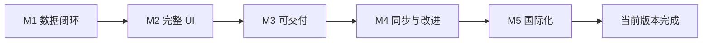
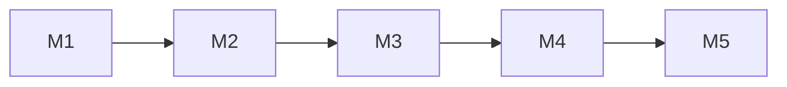

# 里程碑与详细需求

本文档定义各里程碑及每个里程碑的详细需求内容。与 `PRD.md` 一致，需求变更以 PRD 为准。

---

## 总览

| 里程碑 | 目标 | 状态 |
|--------|------|------|
| **M1** | 数据闭环：迁移 + 核心命令 + 最简验证 UI | ✅ 已完成 |
| **M2** | 完整 UI：页面、筛选、规则校验、成员/Partner 视图 | ✅ 已完成 |
| **M3** | 可交付：导出、打包、错误与空状态体验 | ✅ 已完成 |
| **M4** | 同步与改进：S3 多设备同步 + 导入 + 标签筛选 + Zustand | ✅ 已完成 |
| **M5** | 国际化：i18n 框架 + 英文/中文翻译 + 语言切换 | ✅ 已完成 |

---

## M1：数据闭环（已完成）

**目标**：后端与 DB 打通，核心写读与状态变更可验证，无死锁。

### 详细需求内容

#### 1.1 工程与数据
- [x] Tauri + Vite + React + TypeScript 脚手架
- [x] Mantine 接入（基础 Provider）
- [x] SQLite 迁移：`schema_migrations` + `0001_init.sql`（persons, partners, projects, assignments, status_history, project_tags）
- [x] 启动时自动创建 DB 并执行迁移，路径：`~/Library/Application Support/com.tauri.dev/app.db`

#### 1.2 领域与用例
- [x] Domain：`ProjectStatus` 枚举 + `StatusMachine::can_transition` / `note_required`
- [x] App：`project_create`（事务内：insert project + owner assignment + 初始 status_history + tags）
- [x] App：`project_get`、`project_list`、`project_change_status`（事务内：history + 更新 current_status，**释放连接后再调 project_get，避免死锁**）
- [x] App：`partner_create`、`partner_list`；`person_create`、`person_list`
- [x] 错误模型：`AppError` + 稳定 `code`（含 `From<rusqlite::Error>`）

#### 1.3 命令层
- [x] Commands：`cmd_partner_create/list`、`cmd_person_create/list`、`cmd_project_create/get/list`、`cmd_project_change_status`
- [x] DTO 与前端约定：请求体使用 **camelCase**（与 Rust `#[serde(rename_all = "camelCase")]` 一致）

#### 1.4 最简验证 UI
- [x] 单页：创建 Partner/Person、创建 Project（必选 partner/owner/country）、列表、状态变更按钮
- [x] 调用 `invoke` 封装（`src/api/invoke.ts`），错误在页面 log 区展示

#### 1.5 验收
- [x] 创建项目后状态为 BACKLOG，时间线至少 1 条
- [x] 状态变更不卡死，返回最新项目详情
- [x] 清空 DB 后重启，迁移重新执行无报错

---

## M2：完整 UI 与规则

**目标**：按 PRD 完成所有 MVP 页面与交互，规则与不变量在前后端一致落地。

### 详细需求内容

#### 2.1 路由与页面结构
- [x] 路由：Projects（列表 + 详情）、People（列表 + 详情）、Partners（列表 + 详情）、Settings（导出入口）
- [x] 导航：顶部或侧边导航，当前页高亮

#### 2.2 项目（Projects）
- [x] **列表页**
  - 表格/卡片：名称、状态、国家、Partner、负责人、截止日、更新时间、标签
  - 筛选：状态、国家、Partner、负责人、参与成员、仅未归档（默认 on）
  - 排序：更新时间（默认）、优先级、截止日
  - 操作：新建、进入详情、可选“快速改状态”
- [x] **新建/编辑项目**
  - 表单：名称（必填）、描述、优先级、国家（必填）、Partner（必填，下拉+搜索，创建后不可改）、负责人（必填，下拉+搜索）
  - 可选：开始/截止日期、标签
  - 校验：前端 zod 预校验；后端 `project_update` **禁止** `partnerId`（若传则 `PARTNER_IMMUTABLE`）
- [x] **项目详情**
  - 概览：基础信息、当前状态、国家、Partner（只读）、负责人（可改，且保证 owner 为当前成员）
  - 成员区：当前参与列表（姓名、角色、起止时间），操作“加入成员”“退出”
  - 状态时间线：倒序展示（时间、from→to、操作人、备注）
  - 状态变更：仅展示允许的下一状态；特殊路径（返工/取消归档/放弃）弹窗强制填备注

#### 2.3 成员（People）
- [x] **列表页**：姓名、是否启用、当前项目数（可选）
- [x] **新建/编辑**：姓名（必填）、备注；支持停用（不删）
- [x] **成员详情**
  - **当前项目**：`assignments.end_at IS NULL` 且项目未归档
  - **做过的项目**：存在任意 assignment 的项目（去重，按最近参与时间排序）

#### 2.4 Partner（合作方）
- [x] **列表页**：名称、是否启用、关联项目数（可选）
- [x] **新建/编辑**：名称（必填、唯一）、备注；支持停用（停用后不可被新项目选）
- [x] **Partner 详情**（可选）：关联项目列表

#### 2.5 国家与数据
- [x] 国家：项目表单为国家下拉，值域 ISO 3166-1 alpha-2，建议内置静态列表（如 CN/US/JP…）
- [x] 列表筛选与 PRD 第 7 章一致（状态、国家、Partner、负责人、参与成员、标签）

#### 2.6 后端补全（若 M1 未做）
- [x] `project_update`：可编辑 name/description/priority/country/owner/startDate/dueDate/tags；**禁止** `partnerId`，否则返回 `PARTNER_IMMUTABLE`
- [x] `assignment_add_member`、`assignment_end_member`、`assignment_list_by_project`
- [x] `person_get`、`person_update`、`person_deactivate`；`person_current_projects`、`person_all_projects`
- [x] `partner_get`、`partner_update`、`partner_deactivate`、`partner_projects`
- [x] 设置/更换 Owner 时：若新 owner 无当前参与记录，事务内自动创建 assignment

#### 2.7 验收
- [x] 项目创建/编辑/详情/状态变更全流程可走通，Partner 创建后不可改
- [x] 成员详情“当前项目”与“做过的项目”与 PRD 第 3 章口径一致
- [x] 特殊状态变更（返工、取消归档、放弃）必须填备注

---

## M3：可交付 ✅ 已完成

**目标**：可打包分发、数据可备份、错误与空状态体验完整。

### 详细需求内容

#### 3.1 导出/备份
- [x] 命令：`export_json_string`（或等价），返回符合 PRD 导出 schema 的 JSON 字符串（含 meta、persons、partners、projects、assignments、statusHistory、tags）
- [x] 前端：Settings 或独立“导出”入口，触发导出后通过“另存为”对话框写文件（路径由用户选择）

#### 3.2 打包与运行环境
- [x] `cargo tauri build` 成功，产出 macOS .app（或当前目标平台）
- [x] 首次运行自动创建应用数据目录与 DB，迁移正常执行
- [x] 关闭应用后再次打开，数据持久存在

#### 3.3 体验与健壮性
- [x] 错误提示：接口返回 `AppError` 时，前端统一解析 `code`/`message`，用 Mantine 通知或内联提示展示，避免白屏或静默失败
- [x] 空状态：列表无数据、成员无项目、Partner 无项目时，有明确文案与引导（如“先去创建 Partner / 项目”）
- [x] 关键操作确认（可选）：归档、取消归档、删除/停用前可二次确认

#### 3.4 文档与交付物
- [x] README：运行要求（Node、Rust）、`npm install` + `npm run tauri dev` / `npm run tauri build`
- [x] 可选：简短“使用说明”（如何创建项目、改状态、看成员视图、导出备份）

#### 3.5 验收
- [x] 导出文件可打开且结构符合 PRD 导出 schema
- [x] 打包后的应用可独立运行，数据目录与 DB 行为正确
- [x] 常见错误（如必填为空、非法状态跃迁、note 未填）有明确提示

---

## M4：同步与改进 ✅ 已完成

**目标**：支持 S3 多设备同步、数据导入、标签筛选 UI、Zustand 全局状态管理。

### 详细需求内容

#### 4.1 S3 多设备同步
- [x] 迁移 `0003_add_sync_support.sql`：新增 `sync_metadata`、`vector_clocks`、`sync_config` 表及变更触发器
- [x] `VectorClock`：因果一致性检测，LWW（Last Write Wins）冲突解决
- [x] `DeltaSyncEngine`：基于触发器收集本地变更 → 生成压缩 Delta → 上传 S3；下载远端 Delta → 应用到本地
- [x] `SnapshotManager`：全量快照创建/恢复/上传/下载，支持 checksum 校验与 gzip 压缩
- [x] `S3SyncClient`：兼容 AWS S3 / Cloudflare R2 / MinIO，支持自定义 endpoint
- [x] 前端 `SyncManager` 单例 + `SyncStatusBar` 组件（集成到 Layout footer）
- [x] Settings 页面：S3 配置表单（bucket/endpoint/accessKey/secretKey）+ 同步/快照/恢复操作按钮

#### 4.2 数据导入
- [x] 后端 `import_json_string`：解析 JSON，按 FK 依赖顺序写入（persons → partners → projects+tags → assignments → status_history）
- [x] `INSERT OR IGNORE` 幂等导入，重复 ID 自动跳过
- [x] Schema 版本校验（仅接受 version=1）
- [x] 返回 `ImportResult`（各类型导入数量 + 跳过数量）
- [x] 前端 Settings 页"导入数据"按钮，选择 .json 文件后调用后端导入
- [x] 5 个 import 集成测试（空库导入、重复跳过、无效 JSON、错误版本、往返一致性）

#### 4.3 项目列表增强
- [x] 后端 `project_list` 支持 6 种筛选条件（statuses/countryCodes/partnerIds/ownerPersonIds/participantPersonIds/tags）
- [x] 排序参数支持（sort_by: updatedAt/priority/dueDate, sort_order: asc/desc）
- [x] 返回 `Page<T>` 结构（含 total/limit/offset）
- [x] 前端标签多选筛选（`MultiSelect` 组件），从已有项目自动收集标签
- [x] 前端分页 UI（`Pagination` 组件）

#### 4.4 Zustand 全局状态管理
- [x] `usePartnerStore`：合作方列表缓存 + `activeOptions()`
- [x] `usePersonStore`：成员列表缓存 + `activeOptions()`
- [x] `useTagStore`：全局标签缓存
- [x] 所有表单页（ProjectForm/PersonForm/PartnerForm）在 CRUD 后自动 invalidate 相关 store
- [x] Settings 导入数据后 invalidate 所有 store

#### 4.5 其他改进
- [x] 新增 `assignment_list_by_project` 命令
- [x] `ConfirmModal` 统一确认弹窗组件
- [x] 重命名 `export.rs` → `data_transfer.rs`（反映导入导出双向职责）

#### 4.6 测试覆盖
- [x] 230 个后端集成测试全部通过
- [x] 12 个测试文件覆盖：assignment、delta、export/import、partner、person、project、snapshot、status_machine、sync_conflict、sync_engine、sync_triggers、vector_clock

#### 4.7 验收
- [x] 导出 → 导入往返数据一致
- [x] 标签筛选可组合使用，与后端 SQL `IN` 查询联动
- [x] 表单页下拉选项从 Zustand store 获取，避免重复 API 请求
- [x] S3 同步配置可保存，同步/快照/恢复功能可触发

---

## M5：国际化（i18n） ✅ 已完成

**目标**：支持中英文双语 UI，可运行时切换语言。

### 详细需求内容

#### 5.1 i18n 框架搭建
- [x] 接入 `i18next` + `react-i18next`
- [x] 创建 `src/i18n.ts` 初始化配置（默认 en，fallback en）
- [x] 创建 `src/locales/en.json` 和 `src/locales/zh.json` 翻译文件（约 250 个 key）
- [x] `main.tsx` 中导入 i18n 初始化文件

#### 5.2 全量字符串国际化
- [x] 所有 16 个前端文件（11 页面 + 2 共享组件 + 3 工具/常量）完成 i18n 改造
- [x] 所有硬编码中文字符串替换为 `t()` 调用
- [x] 动态内容使用插值（如 `t('project.list.total', { count })`）
- [x] 项目状态翻译：`getStatusLabel(status, t)` 基于 `status.*` key
- [x] 国家名称翻译：`getCountries(lng)` 基于 `i18n-iso-countries` 动态 locale
- [x] 角色标签翻译：`PERSON_ROLES.label` 存储 i18n key，`getRoleLabel()` 通过 `i18n.t()` 解析

#### 5.3 语言切换
- [x] Settings 页面新增语言切换区域（`SegmentedControl`：English / 中文）
- [x] 切换时调用 `i18n.changeLanguage(lng)` 即时生效（无需刷新）
- [x] `dayjs` locale 同步切换（en/zh-cn）
- [x] `i18n-iso-countries` 国家名称随语言切换

#### 5.4 验收
- [x] 默认英文界面，所有页面无残留中文硬编码
- [x] 切换中文后所有页面正确显示中文
- [x] `npm run build` 编译无错误

---

## 依赖关系

- **M2 依赖 M1**：M1 已有命令与 DB，M2 在此基础上补全命令并做完整 UI
- **M3 依赖 M2**：完整流程跑通后做导出与打包
- **M4 依赖 M3**：核心 MVP 稳定后扩展同步与改进
- **M5 依赖 M4**：稳定功能后做前端国际化
