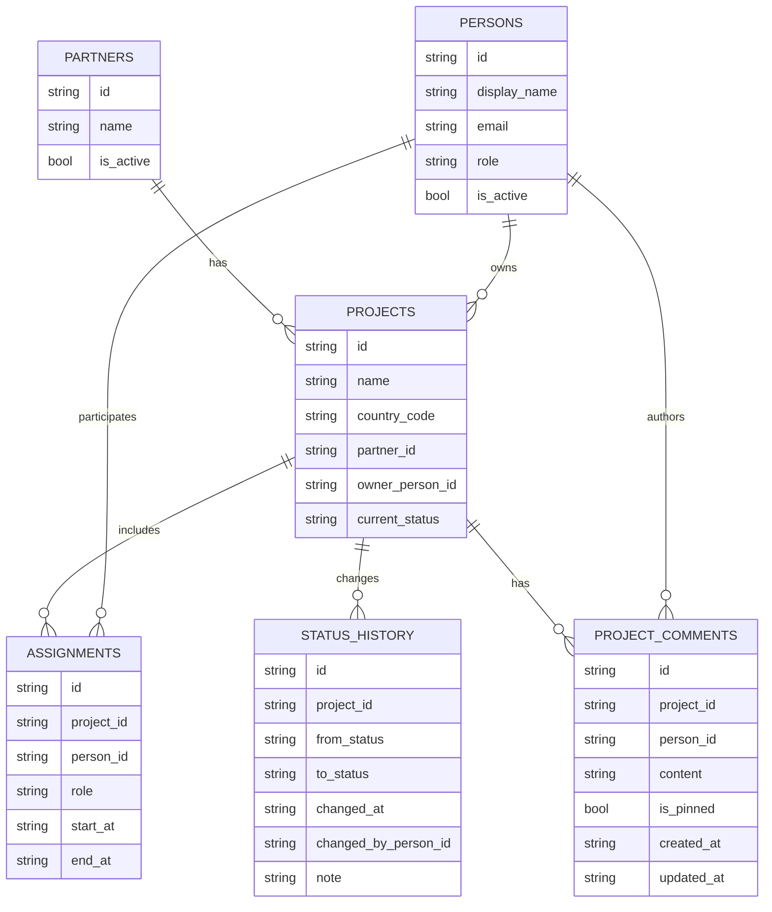
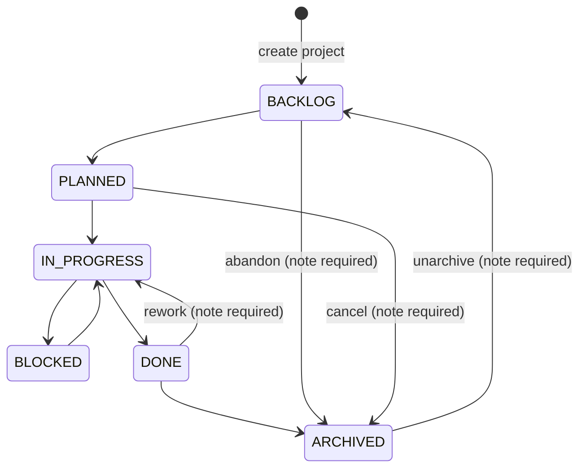
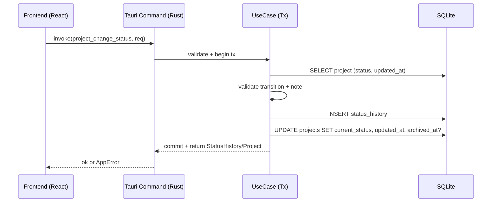

# Projex — 个人项目管理工具 PRD / 需求文档

## 1. 背景与目标
你需要一个**纯个人使用**的项目管理工具，用于：
- **记录项目基础信息**与**当前状态**
- 记录项目**状态变更时间线**（可追溯：何时从什么状态变到什么状态，附备注）
- 从**成员（真实人员）视角**查看：
  - 做过哪些项目（只要参与过即算）
  - 当前正在做哪些项目（当前参与且项目未归档）

## 2. 产品范围（MVP）
### 2.1 In Scope（本期必须）
- 项目 CRUD（创建/查看/编辑/归档/取消归档）
- 固定状态流转 + 状态变更时间线（不可变更、只追加）
- 成员（Person）管理（创建/编辑/停用）
- Partner 管理（创建/编辑/停用）
- Country（国家）字段（项目必填或强字段，支持筛选）
- 项目参与关系（Assignment）：成员加入/退出项目
- 负责人（Owner）设定：**Owner 必须是该项目当前成员**
- 列表筛选与排序：按状态/Partner/国家/负责人/成员等
- 本地数据持久化（SQLite） 
- 数据导出/备份（JSON 单文件）

### 2.2 Out of Scope（明确不做）
- 账号/权限/多用户协作
- 任务/子任务/看板
- 工时统计（Time Log）

### 2.3 已实现的扩展功能
- S3 多设备同步（Delta Sync + Snapshot + Vector Clock，兼容 AWS S3 / Cloudflare R2 / MinIO）
- 数据导入（幂等导入 JSON，重复 ID 自动跳过）
- Zustand 全局状态管理（合作方/成员/标签缓存）
- 标签多选筛选 UI
- 国际化（i18n）：`i18next` + `react-i18next`，支持 English / 中文运行时切换，覆盖所有 UI 文字、项目状态、国家名称、角色标签
- 项目富文本评论：基于 Tiptap 的富文本编辑器，支持文本格式化、标题、列表、任务清单、表格、图片（Base64）、链接，可置顶、关联操作人、编辑/删除，自动 S3 同步

## 3. 关键口径（必须遵守）
- **做过的项目**：成员只要存在任意参与记录（Assignment）即算“做过”
- **当前正在做的项目**：成员存在 `endAt = NULL` 的参与记录，且项目 `currentStatus != ARCHIVED`
- **取消归档**：允许，状态从 `ARCHIVED -> BACKLOG`（建议强制备注）
- **Partner 约束**：每个项目**必须关联且只能关联 1 个 Partner**；一个 Partner 可关联多个项目（1:N）
- **Partner 不可变更**：项目创建后 **partnerId 只读**，不允许项目中途更换 Partner
- **Owner 约束**：项目 `ownerPersonId` 必须存在对应 `Assignment(endAt = NULL)`（Owner 必须是当前成员）
- **时间线不可变**：不允许编辑/删除历史记录；如纠错通过“新增说明/新增状态变更”实现

## 4. 领域模型（DDD 视角）
### 4.1 核心实体/聚合
- **Project（项目聚合根）**
  - 基础信息：名称、描述、优先级、标签、起止日期
  - 约束字段：国家（Country）、Partner、Owner
  - 当前状态：`currentStatus`
  - 时间线：`statusHistory[]`（事件日志）
  - 参与关系：`assignments[]`
- **Person（成员）**
  - 真实人员，无账号体系
  - 基础信息：姓名、邮箱、角色、备注
  - 角色预设（存储英文值）：
    - `tester`（测试）
    - `product_manager`（产品经理）
    - `backend_developer`（后端开发）
    - `frontend_developer`（前端开发）
- **Partner（合作方）**
  - 项目必须关联 1 个 Partner（必填）
- **Assignment（参与关系）**
  - 记录成员参与某项目的时间段与角色
- **StatusHistory（状态变更历史）**
  - 每次状态变更的不可变记录

### 4.2 ER 图


## 5. 状态机（固定流转）
### 5.1 状态枚举
- `BACKLOG`：待评估
- `PLANNED`：已计划
- `IN_PROGRESS`：进行中
- `BLOCKED`：阻塞
- `DONE`：已完成
- `ARCHIVED`：已归档（收纳，不参与“当前”视图）

### 5.2 状态机


### 5.3 备注（note）强制策略
以下状态变更建议**强制填写 note**（可做成 UI 校验）：
- `ARCHIVED -> BACKLOG`（取消归档）
- `DONE -> IN_PROGRESS`（返工）
- `BACKLOG -> ARCHIVED` / `PLANNED -> ARCHIVED`（放弃/取消）

## 6. 核心流程
```mermaid
flowchart LR
  A[创建项目<br/>必须选择 Partner/Owner/Country] --> B[自动加入 Owner 成为成员]
  B --> C[写入初始状态历史<br/>null -> BACKLOG]
  C --> D{操作}
  D -->|变更状态| E[事务内：写 StatusHistory + 更新 currentStatus]
  D -->|成员加入| F[创建 Assignment(startAt=now,endAt=null)]
  D -->|成员退出| G[更新 Assignment(endAt=now)]
  D -->|归档/取消归档| H[按状态机变更并写历史]
  E --> D
  F --> D
  G --> D
  H --> D
```

## 7. 功能需求明细（按模块）
### 7.1 项目（Projects）
- **创建项目**
  - 必填：`name`、`countryCode`、`partnerId`、`ownerPersonId`
  - 默认：`currentStatus = BACKLOG`
  - 系统行为：
    - 自动创建 Owner 的 `Assignment(endAt=NULL)`
    - 写入 `StatusHistory(from=NULL,to=BACKLOG)`
- **编辑项目**
  - 可编辑：名称、描述、优先级、标签、开始/截止日期、国家
  - Partner 是否可编辑：**不允许**（`partnerId` 创建后只读）
  - Owner 可编辑：更换 Owner 时必须保证新 Owner 为当前成员（若不是则自动加入）
- **项目列表**
  - 默认过滤：不显示 `ARCHIVED`（可切换显示）
  - 筛选：状态、国家、Partner、Owner、参与成员、标签
  - 排序：更新时间（默认）、优先级、截止日期
- **项目详情**
  - 展示：基础信息、当前状态、国家、Partner、Owner
  - 展示：成员参与列表（含角色、起止时间）
  - 展示：状态时间线（倒序）

### 7.2 状态时间线（Status Timeline）
- 每次状态变更必须：
  - 新增一条 `status_history`
  - 更新 `projects.current_status`
  - 两者在**同一事务**中提交

### 7.3 成员（People）
- 成员 CRUD（建议支持“停用”，不提供硬删除）
- 成员详情：
  - 当前项目：`assignments.end_at IS NULL` 且项目未归档
  - 做过的项目：出现过任意 assignment 的项目集合（去重）

### 7.4 Partner（合作方）
- Partner CRUD（建议支持“停用”，不提供硬删除）
- 约束：
  - Partner 名称唯一（忽略大小写建议）
  - 停用 Partner 不可被新项目选择，但历史项目仍正常展示
- Partner 详情（可选）：
  - 展示关联项目列表

### 7.5 国家（Country）
- 项目字段：`countryCode`
- 值域：
  - 推荐：ISO 3166-1 alpha-2（如 `CN`、`US`）
  - 国家字典可内置静态表（离线、稳定）

### 7.6 标签（Tags，可选但推荐）
- 以项目-标签的关联表实现（查询与筛选更稳定）

### 7.7 备份/导出/导入
- 导出：单文件 JSON（包含 persons/projects/partners/assignments/statusHistory/comments/tags）
- 导入：`import_json_string` 幂等导入，`INSERT OR IGNORE` 处理 ID 冲突，按 FK 依赖顺序写入
- 返回 `ImportResult`（各类型导入数量 + 跳过的重复数量）
- Schema 版本：version 1（不含 comments）、version 2（含 comments），导入时兼容两个版本

## 8. 数据模型（SQLite 建议）
> SQL 注释为英文；复杂约束点用中文补充说明。

### 8.1 表结构（建议）
```sql
CREATE TABLE persons (
  id TEXT PRIMARY KEY,
  display_name TEXT NOT NULL,
  note TEXT NOT NULL DEFAULT '',
  is_active INTEGER NOT NULL DEFAULT 1,
  created_at TEXT NOT NULL,
  updated_at TEXT NOT NULL
);

CREATE TABLE partners (
  id TEXT PRIMARY KEY,
  name TEXT NOT NULL,
  note TEXT NOT NULL DEFAULT '',
  is_active INTEGER NOT NULL DEFAULT 1,
  created_at TEXT NOT NULL,
  updated_at TEXT NOT NULL
);
CREATE UNIQUE INDEX idx_partners_name ON partners(name);

CREATE TABLE projects (
  id TEXT PRIMARY KEY,
  name TEXT NOT NULL,
  description TEXT NOT NULL DEFAULT '',
  priority INTEGER NOT NULL DEFAULT 3, -- 1(high)~5(low)
  current_status TEXT NOT NULL,        -- BACKLOG/PLANNED/...
  country_code TEXT NOT NULL,          -- ISO 3166-1 alpha-2
  partner_id TEXT NOT NULL,
  owner_person_id TEXT NOT NULL,
  start_date TEXT NULL, -- ISO-8601 date
  due_date TEXT NULL,   -- ISO-8601 date
  created_at TEXT NOT NULL,
  updated_at TEXT NOT NULL,
  archived_at TEXT NULL,
  FOREIGN KEY(partner_id) REFERENCES partners(id),
  FOREIGN KEY(owner_person_id) REFERENCES persons(id)
);
CREATE INDEX idx_projects_status  ON projects(current_status);
CREATE INDEX idx_projects_partner ON projects(partner_id);
CREATE INDEX idx_projects_country ON projects(country_code);

CREATE TABLE assignments (
  id TEXT PRIMARY KEY,
  project_id TEXT NOT NULL,
  person_id TEXT NOT NULL,
  role TEXT NOT NULL DEFAULT 'member',
  start_at TEXT NOT NULL,
  end_at TEXT NULL,
  created_at TEXT NOT NULL,
  FOREIGN KEY(project_id) REFERENCES projects(id),
  FOREIGN KEY(person_id) REFERENCES persons(id)
);
CREATE INDEX idx_assignments_person ON assignments(person_id, end_at);
CREATE INDEX idx_assignments_project ON assignments(project_id, end_at);

-- 可选：用 partial unique index 强制“同一成员同一项目仅一个当前参与”
-- CREATE UNIQUE INDEX uniq_assignment_active
-- ON assignments(project_id, person_id)
-- WHERE end_at IS NULL;

CREATE TABLE status_history (
  id TEXT PRIMARY KEY,
  project_id TEXT NOT NULL,
  from_status TEXT NULL,
  to_status TEXT NOT NULL,
  changed_at TEXT NOT NULL,
  changed_by_person_id TEXT NULL,
  note TEXT NOT NULL DEFAULT '',
  FOREIGN KEY(project_id) REFERENCES projects(id),
  FOREIGN KEY(changed_by_person_id) REFERENCES persons(id)
);
CREATE INDEX idx_status_history_project_time
ON status_history(project_id, changed_at DESC);

CREATE TABLE project_tags (
  project_id TEXT NOT NULL,
  tag TEXT NOT NULL,
  created_at TEXT NOT NULL,
  PRIMARY KEY(project_id, tag),
  FOREIGN KEY(project_id) REFERENCES projects(id)
);
CREATE INDEX idx_project_tags_tag ON project_tags(tag);

-- 项目评论（富文本，Tiptap JSON 格式存储）
CREATE TABLE project_comments (
  id TEXT PRIMARY KEY,
  project_id TEXT NOT NULL,
  person_id TEXT,              -- 可选：关联操作人
  content TEXT NOT NULL,       -- Tiptap JSON document
  is_pinned INTEGER NOT NULL DEFAULT 0,
  created_at TEXT NOT NULL,
  updated_at TEXT NOT NULL,
  _version INTEGER DEFAULT 1,  -- 同步版本号
  FOREIGN KEY(project_id) REFERENCES projects(id),
  FOREIGN KEY(person_id) REFERENCES persons(id)
);
CREATE INDEX idx_comments_project ON project_comments(project_id);
CREATE INDEX idx_comments_pinned ON project_comments(is_pinned, created_at);
```

### 8.2 关键一致性约束（应用层必须保证）
- `owner_person_id` 必须对应一条 `assignments(project_id, owner_person_id, end_at IS NULL)`
  - 建议策略：设置 Owner 时自动 upsert 当前参与记录
- 所有状态变更必须事务内同时写 `status_history` 与更新 `projects.current_status`

## 9. 关键查询（用于实现列表/详情）
### 9.1 成员当前项目
```sql
SELECT p.id, p.name, p.current_status, p.priority, p.due_date, p.updated_at
FROM assignments a
JOIN projects p ON p.id = a.project_id
WHERE a.person_id = :person_id
  AND a.end_at IS NULL
  AND p.current_status <> 'ARCHIVED'
ORDER BY p.updated_at DESC;
```

### 9.2 成员做过的项目（只要参与过即算）
```sql
SELECT
  p.id, p.name, p.current_status, p.updated_at,
  MAX(COALESCE(a.end_at, a.start_at)) AS last_involved_at
FROM assignments a
JOIN projects p ON p.id = a.project_id
WHERE a.person_id = :person_id
GROUP BY p.id
ORDER BY last_involved_at DESC;
```

### 9.3 项目状态时间线
```sql
SELECT
  h.changed_at, h.from_status, h.to_status, h.note,
  pb.display_name AS changed_by_name
FROM status_history h
LEFT JOIN persons pb ON pb.id = h.changed_by_person_id
WHERE h.project_id = :project_id
ORDER BY h.changed_at DESC;
```

## 10. 非功能需求（NFR）
- **安全**：本地存储；不引入账号系统；备份文件可选“用户自行加密”或后续加密导出
- **性能**：项目/时间线查询必须走索引；列表分页
- **可靠性**：关键写操作必须事务；崩溃恢复后数据一致
- **可维护性**：状态机固定，变化点集中；导出 schema 版本化（`schemaVersion`）

## 11. 验收标准（Definition of Done）
- 创建项目时必须选择 `Partner/Owner/Country`；创建后项目状态为 `BACKLOG` 且时间线至少 1 条
- 任意状态变更：
  - `projects.current_status` 更新正确
  - `status_history` 新增 1 条且字段齐全
  - 特殊路径变更必须有 `note`
- 项目创建后不允许变更 Partner（编辑项目时 `partnerId` 不可修改）
- Owner 更换后，Owner 必须存在“当前参与”记录（若无则自动加入）
- 成员详情页：
  - “当前项目”与“做过的项目”口径符合第 3 章定义
- 每个项目必须关联且只能关联 1 个 Partner；Partner 可关联多个项目
- 备份导出文件包含必要数据且可用于恢复（若本期不做导入，则至少可用于审计/迁移）

## 12. 未来扩展（不影响当前版本的演进方向）
- 项目审计日志（除状态外的字段变更历史：Partner/国家/Owner/描述等）
- 里程碑/任务管理
- 工时与成本统计
- ~~多端同步（iCloud / 自建服务）~~ **已实现**：S3 多设备同步（见 `docs/SYNC_S3_DESIGN.md`）

## 13. 技术选型与架构（方案 B：Tauri + Vite）
### 13.1 技术栈（拍板）
- **桌面壳**：Tauri（macOS）
- **前端**：React + TypeScript
- **构建工具**：Vite
- **本地存储**：SQLite（DB 文件放 `~/Library/Application Support/<AppName>/app.db`）
- **后端（Tauri Rust）**：
  - 数据访问：`rusqlite`（同步、事务清晰，适合个人本地应用）
  - 序列化：`serde` / `serde_json`
  - 错误处理：`thiserror`（对外映射为稳定错误码）
  - ID：`uuid`
  - 时间：`chrono`（ISO-8601）
- **前端校验**：`zod`（对表单/DTO 做输入校验）
- **前端状态管理**：`zustand`（已接入，管理合作方/成员/标签缓存）
- **UI 组件**：Mantine（表单/表格/弹窗效率高）
- **S3 同步**：`aws-sdk-s3`、`aws-config`、`sha2`、`flate2`（多设备 Delta Sync + Snapshot）

### 13.2 目标架构（Clean Architecture 落地）
```mermaid
flowchart TB
  UI[Frontend (React/Vite)<br/>Pages + Components + Stores] -->|invoke| CMD[Tauri Commands (Rust)<br/>DTO In/Out + Error Codes]
  CMD --> APP[Application Layer (Rust)<br/>UseCases + Transactions]
  APP --> DOMAIN[Domain Layer (Rust)<br/>Status Machine + Invariants]
  APP --> REPO[Repository Ports (Rust traits)]
  REPO --> INFRA[Infrastructure (Rust)<br/>SQLite + Migrations + Backup/Export]
```

### 13.3 前后端边界与安全
- **原则**：前端不直接拼 SQL；只调用受控的命令（Commands），由 Rust 侧完成：
  - 事务控制
  - 状态机校验
  - 不变量校验（如 owner 必须是成员、项目必须有 partner）
- **Tauri 安全建议**：
  - 仅暴露白名单命令（Commands）
  - 禁止任意文件路径写入（导出文件路径由“保存对话框”返回或限定到用户目录）
  - 关闭不必要的 API（按需开启）

### 13.4 SQLite 迁移策略（Migrations）
- 使用 `schema_migrations(version, applied_at)` 表记录迁移版本。
- 迁移脚本按序号执行，例如：
  - `0001_init.sql`
  - `0002_add_project_tags.sql`
- 应用启动时（Rust side）：
  - 打开 DB（如不存在则创建）
  - `BEGIN IMMEDIATE` 执行 migrations（保证单实例一致性）
  - 失败则回滚并提示（避免部分迁移导致损坏）

### 13.5 核心命令（Commands）建议清单（MVP）
> 命名使用英文，保持 API 稳定；返回统一 `Result<Dto, AppError>`。

- **Projects**
  - `project_create`
  - `project_update`
  - `project_get`
  - `project_list`（支持筛选：status/country/partner/owner/person/tag）
  - `project_change_status`（事务：insert status_history + update projects）
  - `project_archive` / `project_unarchive`（本质走状态机）
- **People**
  - `person_create` / `person_update` / `person_deactivate`
  - `person_get`
  - `person_current_projects`
  - `person_all_projects`（做过的项目）
- **Partners**
  - `partner_create` / `partner_update` / `partner_deactivate`
  - `partner_list`
  - `partner_projects`
- **Assignments**
  - `assignment_add_member`
  - `assignment_end_member`
  - `assignment_list_by_project`
- **Backup**
  - `export_json`（输出符合 `schemaVersion` 的 JSON）
  - `import_json`（幂等导入 JSON）
- **Sync（S3 同步）**
  - `sync_get_config` / `sync_update_config`
  - `sync_get_status`
  - `sync_full`（完整同步：上传本地变更 + 下载远端变更）
  - `sync_create_snapshot` / `sync_restore_snapshot`

### 13.6 事务边界（必须）
- `project_change_status`：**一个事务内**完成：
  - 校验状态机允许的跃迁
  - 校验 note（特殊路径必填）
  - 插入 `status_history`
  - 更新 `projects.current_status`/`updated_at`/`archived_at`（如适用）
- `set_project_owner`（若实现为单独命令）：**一个事务内**完成：
  - 确保 owner 有 `Assignment(end_at IS NULL)`（没有则创建）
  - 更新 `projects.owner_person_id`

### 13.7 工程目录结构（建议）
```text
project-management/
  docs/
    PRD.md
  src/                      # Vite React frontend
    pages/
    components/
    stores/
    api/                    # typed wrappers for invoke()
    validators/             # zod schemas
  src-tauri/                # Rust backend
    migrations/             # *.sql migrations
    src/
      commands/             # Tauri command handlers (DTO boundary)
      app/                  # use cases + transactions
      domain/               # entities + status machine + invariants
      repo/                 # traits (ports)
      infra/                # sqlite implementation + export
      main.rs
```

### 13.8 Pros vs. Cons（方案 B）
- **Pros**
  - UI 开发效率高（React 生态 + Vite）
  - 包体与性能优于 Electron
  - Rust 侧可严格保证事务与一致性
- **Cons**
  - 双栈（TS + Rust）带来工程复杂度
  - 需要一次性打通：DB 路径、迁移、打包与签名（macOS）

### 13.9 命令层 API 设计（Tauri Commands）
本节定义前后端的稳定契约：**命令名、DTO、错误码、校验规则、事务边界**。  
原则：前端不拼 SQL；所有一致性规则在 Rust Command -> UseCase 内完成。

#### 13.9.1 约定（Naming / Types）
- **命令命名**：`snake_case`，按领域前缀分组，例如 `project_create`
- **ID**：统一 `string`（UUID v4）
- **时间**：统一 ISO-8601（UTC），例如 `2026-02-09T12:34:56Z`
- **枚举**：前端/后端使用同名字符串枚举（如 `ProjectStatus`）
- **分页**：列表接口统一 `limit/offset`（MVP），未来可扩展 cursor

#### 13.9.2 错误模型（稳定错误码）
前端只依赖 `code` 做分支，`message` 用于展示，`details` 便于调试。

```ts
type AppError = {
  code:
    | "VALIDATION_ERROR"
    | "NOT_FOUND"
    | "CONFLICT"
    | "PARTNER_IMMUTABLE"
    | "INVALID_STATUS_TRANSITION"
    | "NOTE_REQUIRED"
    | "ASSIGNMENT_ALREADY_ACTIVE"
    | "ASSIGNMENT_NOT_ACTIVE"
    | "DB_ERROR";
  message: string;
  details?: Record<string, unknown>;
};
```

> Rust 侧建议用 `thiserror` 映射到上述 `code`。**不要把原始 SQL 错误直接透传**到 UI（只放 `details`，且开发模式可更详细）。

#### 13.9.3 “Partner 不可变更”的 API 策略（拍板）
对 `project_update`：
- **不允许**携带 `partnerId` 字段；若前端误传，直接返回错误：`PARTNER_IMMUTABLE`

**Pros vs. Cons**
- Pros：立刻暴露调用方错误，防止“静默忽略”导致数据与 UI 不一致
- Cons：前端需要保证 form/DTO 不包含该字段（但这是好事）

#### 13.9.4 Commands 清单与 DTO（MVP）
下面以 TypeScript 视角描述输入输出（Rust 使用 `serde` 同构 DTO）。

##### A) Projects
**1) `project_create`**
```ts
type ProjectCreateReq = {
  name: string;
  description?: string;
  priority?: 1 | 2 | 3 | 4 | 5;
  countryCode: string; // ISO 3166-1 alpha-2
  partnerId: string;   // required, immutable after create
  ownerPersonId: string;
  startDate?: string;  // YYYY-MM-DD
  dueDate?: string;    // YYYY-MM-DD
  tags?: string[];
  createdByPersonId?: string | null; // optional, for history attribution
};

type ProjectDto = {
  id: string;
  name: string;
  description: string;
  priority: number;
  countryCode: string;
  partnerId: string;
  ownerPersonId: string;
  currentStatus: ProjectStatus;
  startDate: string | null;
  dueDate: string | null;
  createdAt: string;
  updatedAt: string;
  archivedAt: string | null;
  tags: string[];
};
```
**行为/校验**
- 必填：`name/countryCode/partnerId/ownerPersonId`
- 事务内执行：
  - insert `projects`（`currentStatus=BACKLOG`）
  - upsert owner 的 active assignment（确保 owner 是成员）
  - insert `status_history(from=null,to=BACKLOG)`
  - upsert tags

**2) `project_update`（Partner 只读）**
```ts
type ProjectUpdateReq = {
  id: string;
  name?: string;
  description?: string;
  priority?: 1 | 2 | 3 | 4 | 5;
  countryCode?: string;
  ownerPersonId?: string;
  startDate?: string | null;
  dueDate?: string | null;
  tags?: string[];
  ifMatchUpdatedAt?: string; // optional optimistic lock

  // 禁止字段：partnerId（若出现 -> PARTNER_IMMUTABLE）
};
```
**行为/校验**
- 若 `ownerPersonId` 变化：事务内确保新 owner 有 active assignment（无则创建）
- 若提供 `ifMatchUpdatedAt`：与 DB 当前 `updated_at` 不一致则 `CONFLICT`

**3) `project_get`**
```ts
type ProjectGetReq = { id: string };

type ProjectDetailDto = ProjectDto & {
  owner: { id: string; displayName: string };
  partner: { id: string; name: string };
  assignments: AssignmentDto[];
  statusHistory: StatusHistoryDto[];
};
```

**4) `project_list`**
```ts
type ProjectListReq = {
  onlyUnarchived?: boolean; // default true
  statuses?: ProjectStatus[];
  countryCodes?: string[];
  partnerIds?: string[];
  ownerPersonIds?: string[];
  participantPersonIds?: string[]; // "参与过"筛选：join assignments
  tags?: string[];
  limit?: number;  // default 50
  offset?: number; // default 0
};

type ProjectListItemDto = {
  id: string;
  name: string;
  currentStatus: ProjectStatus;
  priority: number;
  countryCode: string;
  partnerName: string;
  ownerName: string;
  dueDate: string | null;
  updatedAt: string;
  tags: string[];
};

type Page<T> = { items: T[]; total: number; limit: number; offset: number };
```

**5) `project_change_status`**
```ts
type ProjectStatus =
  | "BACKLOG"
  | "PLANNED"
  | "IN_PROGRESS"
  | "BLOCKED"
  | "DONE"
  | "ARCHIVED";

type ProjectChangeStatusReq = {
  projectId: string;
  toStatus: ProjectStatus;
  note?: string; // 特殊路径必填
  changedByPersonId?: string | null;
  changedAt?: string; // optional: default now()
  ifMatchUpdatedAt?: string; // optional optimistic lock
};

type StatusHistoryDto = {
  id: string;
  projectId: string;
  fromStatus: ProjectStatus | null;
  toStatus: ProjectStatus;
  changedAt: string;
  changedByPersonId: string | null;
  note: string;
};
```
**事务边界（必须）**
- 校验状态机跃迁；非法则 `INVALID_STATUS_TRANSITION`
- 校验 `note`：特殊路径缺失则 `NOTE_REQUIRED`
- insert `status_history` + update `projects.current_status/updated_at/archived_at` 同事务



##### B) Assignments（成员参与）
```ts
type AssignmentDto = {
  id: string;
  projectId: string;
  personId: string;
  role: string;
  startAt: string;
  endAt: string | null;
  createdAt: string;
};

type AssignmentAddMemberReq = {
  projectId: string;
  personId: string;
  role?: string; // default "member"
  startAt?: string; // default now()
};

type AssignmentEndMemberReq = {
  projectId: string;
  personId: string;
  endAt?: string; // default now()
};
```
**规则**
- 同一 `(projectId, personId)` 不允许存在两条 active assignment（否则 `ASSIGNMENT_ALREADY_ACTIVE`）
- 结束参与时若不存在 active assignment 则 `ASSIGNMENT_NOT_ACTIVE`

##### C) People（成员）
```ts
type PersonDto = {
  id: string;
  displayName: string;
  note: string;
  isActive: boolean;
  createdAt: string;
  updatedAt: string;
};

type PersonCreateReq = { displayName: string; note?: string };
type PersonUpdateReq = { id: string; displayName?: string; note?: string };
type PersonDeactivateReq = { id: string };

type PersonCurrentProjectsReq = { personId: string };
type PersonAllProjectsReq = { personId: string }; // "做过的项目"
```

##### D) Partners（合作方）
```ts
type PartnerDto = {
  id: string;
  name: string;
  note: string;
  isActive: boolean;
  createdAt: string;
  updatedAt: string;
};

type PartnerCreateReq = { name: string; note?: string };
type PartnerUpdateReq = { id: string; name?: string; note?: string };
type PartnerDeactivateReq = { id: string };
type PartnerListReq = { onlyActive?: boolean };
type PartnerProjectsReq = { partnerId: string };
```

##### E) Backup（导出/导入）
**导出**：`export_json_string` — Rust 生成 JSON 字符串返回前端；前端用保存对话框决定落盘路径。
```ts
type ExportJsonStringReq = { schemaVersion?: number };
type ExportJsonStringResp = { schemaVersion: number; exportedAt: string; json: string };
```

**导入**：`import_json_string` — 幂等导入 JSON，按 FK 依赖顺序写入，重复 ID 自动跳过。支持 schema version 1（不含 comments）和 version 2（含 comments）。
```ts
type ImportJsonReq = { json: string };
type ImportResult = {
  persons: number;
  partners: number;
  projects: number;
  assignments: number;
  statusHistory: number;
  comments: number;
  skippedDuplicates: number;
};
```

##### F) Comments（项目评论）

**1) `cmd_comment_create`**
```ts
type CommentCreateReq = {
  projectId: string;
  personId?: string;   // 可选：关联操作人
  content: string;     // Tiptap JSON document
  isPinned?: boolean;  // default false
};

type CommentDto = {
  id: string;
  projectId: string;
  personId: string | null;
  personName: string | null; // JOIN persons.display_name
  content: string;           // Tiptap JSON document
  isPinned: boolean;
  createdAt: string;
  updatedAt: string;
};
```
**行为/校验**
- 必填：`projectId`、`content`
- 校验 `projectId` 对应的项目存在（否则 `NOT_FOUND`）
- 若提供 `personId`，校验对应的成员存在（否则 `NOT_FOUND`）
- 返回创建后的 `CommentDto`（含 `personName`）

**2) `cmd_comment_update`**
```ts
type CommentUpdateReq = {
  id: string;
  content?: string;    // 更新评论内容
  personId?: string;   // 更新关联操作人
  isPinned?: boolean;  // 更新置顶状态
};
```
**行为/校验**
- 校验评论存在（否则 `NOT_FOUND`）
- 若提供 `personId`，校验对应的成员存在（否则 `NOT_FOUND`）
- 仅更新提供的字段（PATCH 语义），自动更新 `updatedAt` 和 `_version`

**3) `cmd_comment_delete`**
```ts
type CommentDeleteReq = { id: string };
// Returns: void
```
**行为**：评论不存在则 `NOT_FOUND`

**4) `cmd_comment_list`**
```ts
type CommentListReq = { projectId: string };
// Returns: CommentDto[] — 置顶优先 + 时间倒序
```
**排序**：`is_pinned DESC, created_at DESC`

#### 13.9.5 前端 `invoke()` 包装建议
前端建议封装统一调用器，做：
- `AppError` 统一解析与 toast 展示
- `zod` 预校验（避免无效请求打到 Rust）
- 类型安全（`invoke<TResp>(cmd, req)`）

