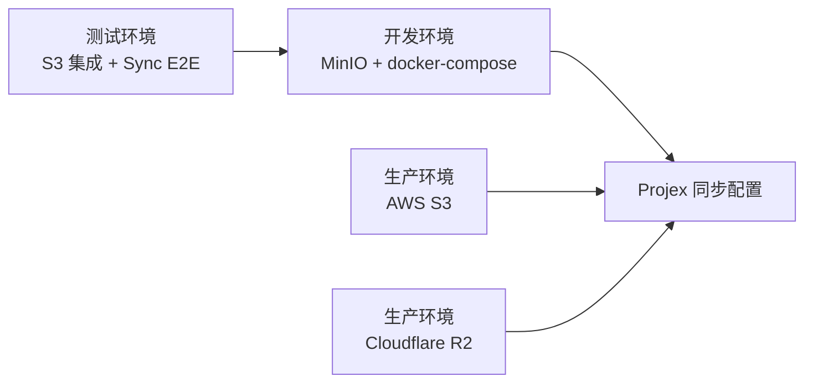

# Sync 环境配置（开发 MinIO / 生产 S3-R2）

本文件定义一套统一的同步环境接入方式：
- 开发环境：本地 `MinIO`（docker-compose）
- 生产环境：`AWS S3` 或 `Cloudflare R2`
- 测试环境：可选 MinIO 自动化测试（集成测试 + 同步端到端测试）

> Android 说明：
>
> - Android MVP **仅允许 HTTPS endpoint**，不支持生产环境 `http://`（详见 `docs/ANDROID_SUPPORT.md`）。
> - 因此本文件的 “MinIO（开发）” 主要面向桌面开发与 CI/E2E；Android 生产建议使用 AWS S3 或 Cloudflare R2。

---

## 1. 配置总览



### 字段映射

| Projex 设置项 | MinIO（开发） | AWS S3（生产） | Cloudflare R2（生产） |
|---|---|---|---|
| Bucket | `SYNC_S3_BUCKET` | 真实 S3 bucket | 真实 R2 bucket |
| Endpoint | `SYNC_S3_ENDPOINT` | 留空（可选） | 必填，如 `https://<account>.r2.cloudflarestorage.com` |
| Access Key | `SYNC_S3_ACCESS_KEY` | IAM Access Key | R2 Access Key ID |
| Secret Key | `SYNC_S3_SECRET_KEY` | IAM Secret Key | R2 Secret Access Key |

---

## 2. 开发环境（MinIO）

### 2.1 启动 MinIO

1) 复制示例配置：

```bash
cp .env.minio.example .env.minio
```

2) 启动服务：

```bash
docker compose --env-file .env.minio -f docker-compose.minio.yml up -d
```

3) 访问控制台：
- URL: `http://127.0.0.1:9001`
- 用户名/密码：`MINIO_ROOT_USER` / `MINIO_ROOT_PASSWORD`

> `docker-compose.minio.yml` 会通过 `minio-init` 自动创建 bucket（`MINIO_BUCKET`）。

### 2.2 在 Projex 中填写配置

进入 `Settings -> S3 Sync`，填写：
- Bucket: `SYNC_S3_BUCKET`
- Endpoint: `SYNC_S3_ENDPOINT`
- Access Key: `SYNC_S3_ACCESS_KEY`
- Secret Key: `SYNC_S3_SECRET_KEY`

保存后点击：
- `Test Connection`
- `Enable Sync`
- `Sync Now`

---

## 3. 生产环境配置

### 3.1 AWS S3

- Endpoint 可留空（默认 AWS）
- 建议使用最小权限 IAM（仅允许目标 bucket 的 `ListBucket/GetObject/PutObject/DeleteObject`）
- 建议按环境分 bucket：`projex-sync-prod` / `projex-sync-staging`

### 3.2 Cloudflare R2

- Endpoint 必填：`https://<account-id>.r2.cloudflarestorage.com`
- Access Key / Secret Key 使用 R2 API Token 派生凭据
- Bucket 策略建议最小权限并按环境隔离

---

## 4. MinIO 自动化测试配置（集成 + E2E）

测试位置：
- `src-tauri/tests/test_s3_minio.rs`（S3 客户端集成测试）
- `src-tauri/tests/test_sync_e2e_minio.rs`（同步端到端测试）

### 4.1 测试说明

- 测试默认不执行（`SYNC_MINIO_TEST != 1` 时自动跳过）。
- 打开开关后会执行：
  - 上传/下载/删除 smoke 测试
  - `>1000` 对象分页扫描测试（验证 list pagination）
  - 双设备 A/B 真实同步闭环（上传本地增量 -> 拉取远端增量 -> 反回流 -> 游标推进 -> 幂等）
  - 双设备删除传播（DELETE 增量跨设备生效）
  - 版本冲突保护（stale remote update 不覆盖 newer local）
  - 临时网络故障恢复（失败记录 `last_sync_error`，恢复后清除并继续同步）
  - 远端损坏 delta 拒绝（checksum mismatch）与恢复后重试成功
  - 三设备乱序收敛（跨 device 顺序非全局时间序时仍可最终一致）
  - 调度器/手动同步锁竞争（运行时锁保证同一时刻仅一个 sync pipeline 执行）
  - 快照创建/恢复链路（snapshot create + restore）
  - 多表联动（`projects` + `project_tags` + `project_comments` 的新增/更新/删除）

### 4.2 运行方式

```bash
set -a
source .env.minio
set +a

cd src-tauri
cargo test --test test_s3_minio -- --nocapture
cargo test --test test_sync_e2e_minio -- --nocapture
```

---

## 5. 安全与运维建议

### Pros vs Cons

| 方案 | Pros | Cons |
|---|---|---|
| 开发用 MinIO | 本地可控、低成本、可重复测试 | 与真实云服务仍有行为差异 |
| 生产用 S3/R2 | 高可用、运维成熟 | 凭据管理和权限策略更复杂 |

### 建议

- 开发与生产使用不同 bucket，避免数据污染。
- 密钥不要提交到仓库；仅提交 `*.example` 模板。
- CI 已接入 `sync-minio-e2e` job：自动启动 MinIO 并执行 `test_s3_minio` + `test_sync_e2e_minio`。
- 为减少耗时，CI 通过路径过滤仅在同步相关文件变更时触发该 job。

