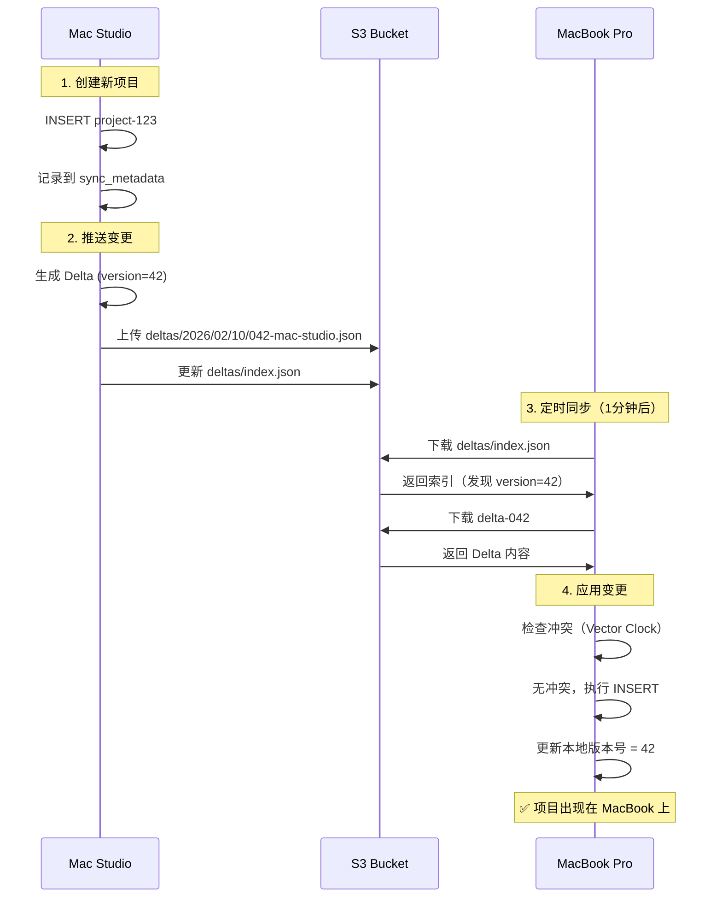

# S3 同步方案详解

## 📖 核心概念

### 1. 增量同步（Delta Sync）

**不同步整个数据库，只同步变更**

```
传统方案（全量同步）:
每次同步上传整个 50MB 数据库 ❌
- 慢、浪费带宽、容易冲突

增量同步（Delta）:
只上传变更的记录（例如 1KB）✅
- 快、节省成本、精确冲突检测
```

#### Delta 数据结构

```json
{
  "id": "delta-uuid-123",
  "device_id": "mac-studio-001",
  "version": 42,
  "timestamp": "2026-02-10T10:30:00Z",
  "operations": [
    {
      "table": "projects",
      "record_id": "project-abc",
      "op_type": "Update",
      "data": {
        "id": "project-abc",
        "name": "新项目名称",
        "priority": 1,
        "_version": 5
      },
      "vector_clock": {
        "mac-studio-001": 42,
        "macbook-002": 35
      }
    }
  ],
  "checksum": "sha256:abcdef..."
}
```

---

## 🔄 完整同步流程

### 场景：您在两台 Mac 上使用



---

## 🧮 向量时钟（Vector Clock）

### 为什么需要向量时钟？

**问题**：简单的时间戳不可靠

```
设备A的系统时间: 10:00（慢了5分钟）
设备B的系统时间: 10:10（准确）

设备A: 10:05 修改 priority=1
设备B: 10:08 修改 priority=2

按时间戳: 10:08 > 10:05 → 保留 priority=2
但实际上设备A的修改更新！❌
```

**解决**：使用逻辑时钟（不依赖系统时间）

### 向量时钟原理

```
向量时钟 = 每个设备的操作计数器

初始状态:
设备A: {A: 0, B: 0}
设备B: {A: 0, B: 0}

设备A 修改:
设备A: {A: 1, B: 0}  ← A 递增

设备B 修改:
设备B: {A: 0, B: 1}  ← B 递增

同步后合并:
设备A: {A: 1, B: 1}  ← 知道双方都有修改
设备B: {A: 1, B: 1}
```

### 三种关系判断

```rust
// 1. 因果关系（Causality）- 无冲突
Clock1: {A: 5, B: 2}
Clock2: {A: 5, B: 3}  ← B 的所有计数器 >= Clock1
结论: Clock2 比 Clock1 新，直接应用 ✅

// 2. 并发（Concurrent）- 有冲突
Clock1: {A: 5, B: 2}  ← A 更大
Clock2: {A: 4, B: 3}  ← B 更大
结论: 并发修改，需要冲突解决 ⚠️

// 3. 相等 - 无需同步
Clock1: {A: 5, B: 2}
Clock2: {A: 5, B: 2}
结论: 相同版本 ✅
```

### 代码实现

```rust
pub fn conflicts_with(&self, other: &VectorClock) -> bool {
    let mut self_greater = false;
    let mut other_greater = false;
    
    for device in all_devices {
        let self_clock = self.clocks.get(device).unwrap_or(&0);
        let other_clock = other.clocks.get(device).unwrap_or(&0);
        
        if self_clock > other_clock {
            self_greater = true;  // 自己有更新的操作
        } else if other_clock > self_clock {
            other_greater = true;  // 对方有更新的操作
        }
    }
    
    // 双方都有对方不知道的操作 = 冲突
    self_greater && other_greater
}
```

---

## 🎬 实际使用场景演示

### 场景1：正常同步（无冲突）

```
9:00 - 设备A：创建项目 "Mobile App"
    Vector Clock: {A: 1, B: 0}
    ↓
    上传 Delta 到 S3

9:01 - 设备B：拉取同步
    本地 Clock: {A: 0, B: 0}
    远程 Clock: {A: 1, B: 0}
    ↓
    判断：远程更新，无冲突
    ↓
    应用：创建项目
    ↓
    本地 Clock: {A: 1, B: 0}

✅ 结果：两台设备数据一致
```

### 场景2：冲突解决（并发修改）

```
初始状态:
设备A Clock: {A: 10, B: 10}
设备B Clock: {A: 10, B: 10}
项目名称: "Website"

9:00 - 设备A 离线，修改项目名称
    项目名称: "Website Redesign"
    设备A Clock: {A: 11, B: 10}

9:01 - 设备B 离线，也修改项目名称
    项目名称: "Website v2"
    设备B Clock: {A: 10, B: 11}

9:05 - 设备B 上线，推送
    上传到 S3: Clock {A: 10, B: 11}

9:10 - 设备A 上线，拉取
    本地: {A: 11, B: 10}
    远程: {A: 10, B: 11}
    ↓
    检测冲突！
    A 有新操作（A: 11 > 10）
    B 也有新操作（B: 11 > 10）
    ↓
    使用 LWW 解决:
    比较总和: (11+10=21) vs (10+11=21) → 相等
    比较设备ID: "mac-studio" vs "macbook" 
    字母序: "mac-studio" > "macbook"
    ↓
    保留设备A的 "Website Redesign" ✅

9:11 - 设备A 推送
    上传合并后的状态到 S3
    
9:12 - 设备B 拉取
    应用 "Website Redesign"
    
✅ 最终一致
```

---

## 📦 Delta 的生命周期

### 1. 本地变更追踪

```sql
-- sync_metadata 表记录所有变更
CREATE TABLE sync_metadata (
    id INTEGER PRIMARY KEY AUTOINCREMENT,
    table_name TEXT NOT NULL,
    record_id TEXT NOT NULL,
    operation TEXT NOT NULL,  -- INSERT/UPDATE/DELETE
    data_snapshot TEXT,        -- JSON 格式
    device_id TEXT NOT NULL,
    version INTEGER NOT NULL,
    created_at TEXT NOT NULL,
    synced BOOLEAN DEFAULT 0   -- 是否已同步
);

-- 触发器：自动记录变更
CREATE TRIGGER track_project_changes
AFTER UPDATE ON projects
FOR EACH ROW
BEGIN
    INSERT INTO sync_metadata (table_name, record_id, operation, data_snapshot, device_id, version, created_at)
    VALUES ('projects', NEW.id, 'UPDATE', json_object(...), 'device-id', NEW._version, datetime('now'));
END;
```

### 2. 打包成 Delta

```rust
pub async fn push(&mut self) -> Result<(), Box<dyn std::error::Error>> {
    // 1. 查询 sync_metadata 表
    let changes = db.query("SELECT * FROM sync_metadata WHERE synced = 0")?;
    
    // 2. 转换为 Operations
    let operations: Vec<Operation> = changes
        .into_iter()
        .map(|row| Operation {
            table: row.table_name,
            record_id: row.record_id,
            op_type: parse_op_type(&row.operation),
            data: serde_json::from_str(&row.data_snapshot)?,
            vector_clock: self.vector_clock.clone(),
        })
        .collect();
    
    // 3. 创建 Delta
    let delta = Delta {
        id: uuid::Uuid::new_v4().to_string(),
        device_id: self.device_id.clone(),
        version: self.local_version + 1,
        timestamp: Utc::now().to_rfc3339(),
        operations,
        checksum: calculate_checksum(&operations),
    };
    
    // 4. 上传
    upload_to_s3(delta)?;
    
    // 5. 标记已同步
    db.execute("UPDATE sync_metadata SET synced = 1 WHERE id IN (...)")?;
    
    Ok(())
}
```

### 3. S3 存储

```
上传路径格式:
deltas/2026/02/10/042-mac-studio-001.json

内容:
{
  "id": "delta-uuid",
  "device_id": "mac-studio-001",
  "version": 42,
  "operations": [...]
}
```

### 4. 索引更新

```json
// deltas/index.json
{
  "last_version": 42,
  "deltas": [
    {
      "version": 40,
      "device_id": "macbook-002",
      "path": "deltas/2026/02/10/040-macbook-002.json",
      "timestamp": "2026-02-10T09:00:00Z"
    },
    {
      "version": 41,
      "device_id": "mac-studio-001",
      "path": "deltas/2026/02/10/041-mac-studio-001.json",
      "timestamp": "2026-02-10T09:30:00Z"
    },
    {
      "version": 42,
      "device_id": "mac-studio-001",
      "path": "deltas/2026/02/10/042-mac-studio-001.json",
      "timestamp": "2026-02-10T10:00:00Z"
    }
  ]
}
```

### 5. 其他设备拉取

```rust
pub async fn pull(&mut self) -> Result<Vec<Delta>, Box<dyn std::error::Error>> {
    // 1. 下载索引
    let index = download_index_from_s3()?;
    
    // 2. 筛选新 Delta
    let new_deltas = index.deltas
        .into_iter()
        .filter(|d| d.version > self.local_version)  // 版本比我新
        .filter(|d| d.device_id != self.device_id);  // 不是我自己的
    
    // 3. 逐个下载并应用
    for delta_meta in new_deltas {
        let delta = download_delta_from_s3(&delta_meta.path)?;
        
        // 验证完整性
        verify_checksum(&delta)?;
        
        // 应用到本地数据库
        apply_delta(&delta)?;
    }
    
    Ok(())
}
```

---

## 🔍 冲突检测详解

### 什么时候发生冲突？

```
条件: 两个设备离线时都修改了同一条记录

例子:
- Mac Studio: 修改 project-123 的 priority = 1
- MacBook Pro: 修改 project-123 的 priority = 3

两者都不知道对方的修改 → 冲突！
```

### 检测流程

```rust
// 应用远程 Delta 时
async fn apply_delta(&mut self, delta: &Delta) -> Result<()> {
    for op in &delta.operations {
        // 1. 获取本地记录的向量时钟
        let local_clock = get_local_vector_clock(&op.table, &op.record_id)?;
        
        // 2. 比较向量时钟
        if let Some(local) = local_clock {
            if local.conflicts_with(&op.vector_clock) {
                // 检测到冲突！
                log::warn!("Conflict: {}/{}", op.table, op.record_id);
                
                // 3. 调用冲突解决
                resolve_conflict(op, &local)?;
                continue;
            }
        }
        
        // 4. 无冲突，直接应用
        apply_operation(op)?;
    }
    
    Ok(())
}
```

### 冲突解决（LWW）

```rust
fn resolve_conflict(remote: &Operation, local: &VectorClock) -> Result<()> {
    // 计算向量时钟"总和"（代表总的修改次数）
    let remote_sum: i64 = remote.vector_clock.clocks.values().sum();
    let local_sum: i64 = local.clocks.values().sum();
    
    if remote_sum > local_sum {
        // 远程修改次数更多 → 认为远程更新
        log::info!("Remote wins");
        apply_operation(remote)?;
    } else if local_sum > remote_sum {
        // 本地修改次数更多 → 保留本地
        log::info!("Local wins");
        // 不做任何操作
    } else {
        // 总和相等 → 使用设备ID字母序
        if remote.vector_clock.device_id > local.device_id {
            log::info!("Remote wins (by device_id)");
            apply_operation(remote)?;
        } else {
            log::info!("Local wins (by device_id)");
        }
    }
    
    // 合并向量时钟
    local.merge(&remote.vector_clock);
    
    Ok(())
}
```

---

## 📸 快照机制

### 为什么需要快照？

**问题**：Delta 累积太多

```
Day 1: 10 个 Deltas
Day 30: 300 个 Deltas
Day 365: 3650 个 Deltas ❌

新设备加入需要下载3650个文件！
```

**解决**：定期快照

```
每周创建一个完整快照:
- Week 1: snapshot-v1000.json.gz (包含所有数据)
- Week 2: snapshot-v1500.json.gz
- Week 3: snapshot-v2000.json.gz

新设备:
1. 下载最新快照 (1个文件)
2. 下载之后的 Deltas (只有几个)
3. 应用 Deltas
✅ 快速完成初始同步
```

### 快照创建流程

```rust
pub async fn create_snapshot(&self, version: i64) -> Result<()> {
    // 1. 导出所有表
    let snapshot = Snapshot {
        version,
        timestamp: Utc::now().to_rfc3339(),
        tables: vec![
            export_table("projects")?,
            export_table("persons")?,
            export_table("partners")?,
            export_table("assignments")?,
            export_table("status_history")?,
        ],
    };
    
    // 2. 序列化为 JSON
    let json = serde_json::to_vec(&snapshot)?;
    
    // 3. Gzip 压缩（减少90%体积）
    let compressed = gzip_compress(&json)?;
    
    // 4. 上传到 S3
    s3.upload(
        &format!("snapshots/snapshot-v{}.json.gz", version),
        compressed
    ).await?;
    
    // 5. 更新指针
    s3.upload(
        "snapshots/latest.json",
        json!({"version": version, "updated_at": "2026-02-10T10:00:00Z"})
    ).await?;
    
    Ok(())
}
```

---

## 🚀 完整工作流示例

### 典型的一天

```
08:00 - 打开 Mac Studio
    ↓
    自动拉取 S3 变更
    ↓
    应用昨晚 MacBook 的修改
    ↓
    ✅ 数据已是最新

09:00 - 创建新项目
    ↓
    INSERT projects 表
    ↓
    触发器记录到 sync_metadata
    ↓
    1分钟后自动同步
    ↓
    生成 Delta (version=43)
    ↓
    上传到 S3

12:00 - 修改项目优先级
    ↓
    UPDATE projects
    ↓
    触发器记录变更
    ↓
    自动同步

18:00 - 回家，打开 MacBook
    ↓
    自动拉取 S3
    ↓
    下载 Delta 43 (新项目)
    ↓
    下载其他 Deltas (优先级修改)
    ↓
    ✅ MacBook 数据与 Mac Studio 一致

每周日 00:00 - 自动快照
    ↓
    导出所有数据
    ↓
    压缩 (50MB → 5MB)
    ↓
    上传快照
    ↓
    清理旧快照（保留最近7个）
```

---

## 🔧 数据库设计变更

### 需要添加的表和字段

```sql
-- 1. 同步元数据表
CREATE TABLE sync_metadata (
    id INTEGER PRIMARY KEY AUTOINCREMENT,
    table_name TEXT NOT NULL,
    record_id TEXT NOT NULL,
    operation TEXT NOT NULL,
    data_snapshot TEXT,        -- 完整的记录 JSON
    device_id TEXT NOT NULL,
    version INTEGER NOT NULL,
    created_at TEXT NOT NULL,
    synced BOOLEAN DEFAULT 0
);

CREATE INDEX idx_sync_meta_synced ON sync_metadata(synced);
CREATE INDEX idx_sync_meta_version ON sync_metadata(version);

-- 2. 向量时钟表（记录每条记录的向量时钟）
CREATE TABLE vector_clocks (
    table_name TEXT NOT NULL,
    record_id TEXT NOT NULL,
    device_id TEXT NOT NULL,
    clock_value INTEGER NOT NULL,
    updated_at TEXT NOT NULL,
    PRIMARY KEY (table_name, record_id, device_id)
);

-- 3. 同步配置表
CREATE TABLE sync_config (
    key TEXT PRIMARY KEY,
    value TEXT NOT NULL
);

-- 插入设备ID
INSERT INTO sync_config (key, value) 
VALUES ('device_id', 'mac-studio-001');

-- 插入本地版本号
INSERT INTO sync_config (key, value) 
VALUES ('local_version', '0');

-- 4. 为所有表添加 _version 字段
ALTER TABLE projects ADD COLUMN _version INTEGER DEFAULT 1;
ALTER TABLE persons ADD COLUMN _version INTEGER DEFAULT 1;
ALTER TABLE partners ADD COLUMN _version INTEGER DEFAULT 1;
ALTER TABLE assignments ADD COLUMN _version INTEGER DEFAULT 1;
ALTER TABLE status_history ADD COLUMN _version INTEGER DEFAULT 1;

-- 5. 触发器：自动追踪变更
CREATE TRIGGER track_project_insert
AFTER INSERT ON projects
FOR EACH ROW
BEGIN
    INSERT INTO sync_metadata (
        table_name, record_id, operation, 
        data_snapshot, device_id, version, created_at
    )
    SELECT 
        'projects',
        NEW.id,
        'INSERT',
        json_object(
            'id', NEW.id,
            'name', NEW.name,
            'description', NEW.description,
            'priority', NEW.priority,
            -- ... 其他字段
            '_version', NEW._version
        ),
        value,
        NEW._version,
        datetime('now')
    FROM sync_config WHERE key = 'device_id';
END;

CREATE TRIGGER track_project_update
AFTER UPDATE ON projects
FOR EACH ROW
BEGIN
    -- 更新版本号
    UPDATE projects SET _version = OLD._version + 1 WHERE id = NEW.id;
    
    -- 记录变更
    INSERT INTO sync_metadata (table_name, record_id, operation, data_snapshot, device_id, version, created_at)
    SELECT 
        'projects', NEW.id, 'UPDATE',
        json_object(...),
        value, NEW._version + 1, datetime('now')
    FROM sync_config WHERE key = 'device_id';
END;

-- ... 为其他表也创建类似触发器
```

---

## 💻 前端使用流程

### 初始化（应用启动时）

```typescript
// src/main.tsx

import { S3SyncManager } from './sync/s3-sync-manager';

// 全局同步管理器
let syncManager: S3SyncManager | null = null;

async function initializeApp() {
  // 1. 检查是否配置了同步
  const config = await loadSyncConfig();
  
  if (config && config.enabled) {
    // 2. 创建同步管理器
    syncManager = new S3SyncManager({
      bucket: config.bucket,
      deviceId: config.deviceId,
      endpoint: config.endpoint,
      accessKey: config.accessKey,
      secretKey: config.secretKey,
    });
    
    // 3. 初始化
    await syncManager.initialize();
    
    // 4. 首次同步
    await syncManager.sync();
    
    // 5. 启动自动同步（每分钟）
    syncManager.startAutoSync(60000);
    
    console.log('✅ S3 同步已启动');
  }
}

// 应用启动
initializeApp();
```

### 在 Layout 中显示同步状态

```typescript
// src/pages/Layout.tsx

import { SyncStatusBar } from '../components/SyncStatusBar';

export function Layout() {
  return (
    <AppShell>
      <AppShell.Header>{/* ... */}</AppShell.Header>
      <AppShell.Navbar>{/* ... */}</AppShell.Navbar>
      
      <AppShell.Main>
        <Outlet />
      </AppShell.Main>
      
      {/* 底部显示同步状态 */}
      <AppShell.Footer>
        {syncManager && <SyncStatusBar syncManager={syncManager} />}
      </AppShell.Footer>
    </AppShell>
  );
}
```

---

## 🎯 关键技术点

### 1. 乐观锁（Optimistic Locking）

```rust
// 使用 _version 字段实现乐观锁
UPDATE projects 
SET name = 'New Name', _version = _version + 1
WHERE id = 'project-123' AND _version = 5;

// 如果 _version 不匹配，UPDATE 失败 → 检测到并发修改
```

### 2. 幂等性（Idempotency）

```rust
// Delta 可以重复应用，不会产生副作用
apply_delta(delta);  // 第一次
apply_delta(delta);  // 第二次（幂等，结果相同）

// 实现方式: INSERT OR REPLACE
INSERT OR REPLACE INTO projects (id, name, _version) 
VALUES ('project-123', 'New Name', 6);
```

### 3. 最终一致性（Eventual Consistency）

```
不保证立即一致，但保证最终一致

时间线:
T0: 设备A有数据X，设备B有数据Y（不一致）
T1: 设备A推送X
T2: 设备B拉取X，推送Y
T3: 设备A拉取Y
T4: 两设备都有X和Y，合并后一致 ✅
```

---

## 📊 性能优化

### 1. 批量上传

```rust
// 不要每个变更都上传，而是批量
let changes = collect_changes_in_last_minute();

if changes.len() > 0 {
    let delta = create_delta(changes);
    upload_to_s3(delta);
}
```

### 2. 压缩

```rust
// 使用 Gzip 压缩 JSON
let json = serde_json::to_vec(&delta)?;
let compressed = gzip_compress(&json)?;

// 压缩率: ~90%
// 原始: 10KB → 压缩后: 1KB
```

### 3. 增量索引

```json
// 不要每次都下载所有 Deltas
// 使用索引文件快速定位

{
  "last_version": 42,
  "deltas": [
    // 只包含元数据，不包含完整内容
    {"version": 40, "path": "..."},
    {"version": 41, "path": "..."},
    {"version": 42, "path": "..."}
  ]
}

// 客户端逻辑
if (index.last_version > local_version) {
  // 只下载需要的 Deltas
  for (let v = local_version + 1; v <= index.last_version; v++) {
    download_delta(v);
  }
}
```

### 4. 并发控制

```rust
// 使用 Mutex 避免同时同步
pub struct SyncState {
    pub engine: Arc<Mutex<Option<DeltaSyncEngine>>>,
}

// 同步时加锁
let mut guard = state.engine.lock().await;
if let Some(engine) = guard.as_mut() {
    engine.sync().await?;
}
```

---

## 🛡️ 错误处理

### 1. 网络错误

```rust
pub async fn sync_with_retry(&mut self, max_retries: usize) -> Result<()> {
    let mut retries = 0;
    
    loop {
        match self.sync().await {
            Ok(_) => return Ok(()),
            Err(e) if retries < max_retries => {
                log::warn!("Sync failed, retry {}/{}: {}", retries + 1, max_retries, e);
                retries += 1;
                
                // 指数退避
                let delay = std::time::Duration::from_secs(2_u64.pow(retries as u32));
                tokio::time::sleep(delay).await;
            }
            Err(e) => return Err(e),
        }
    }
}
```

### 2. 数据损坏

```rust
// 使用 SHA256 校验和
let checksum = sha256(&operations);

// 下载后验证
if received_delta.checksum != calculated_checksum {
    log::error!("Checksum mismatch, rejecting delta");
    return Err("Data corruption detected");
}
```

### 3. 冲突过多

```rust
// 如果冲突率超过阈值，触发完整同步
if conflict_rate > 0.1 {  // 10%
    log::warn!("High conflict rate, performing full sync");
    restore_latest_snapshot().await?;
}
```

---

## 🎭 实际场景模拟

### 场景 A：正常使用

```
用户: 早上用 Mac Studio，晚上用 MacBook

早上 Mac Studio:
09:00 - 打开应用
  ↓ 拉取昨晚的变更
  ↓ 应用 3 个 Deltas
  ↓ ✅ 看到昨晚在 MacBook 创建的项目

10:00 - 修改项目状态
  ↓ 记录到 sync_metadata
  ↓ 1分钟后自动推送到 S3
  ↓ ✅ 上传成功

晚上 MacBook:
19:00 - 打开应用
  ↓ 拉取白天的变更
  ↓ 下载 5 个 Deltas
  ↓ ✅ 看到今天的所有修改

20:00 - 添加新成员
  ↓ 自动同步到 S3
  
✅ 两台设备保持同步
```

### 场景 B：飞行模式（离线）

```
用户: 在飞机上使用 MacBook（无网络）

离线期间:
- 创建 5 个项目
- 修改 10 条记录
- 所有变更记录到 sync_metadata (synced=0)

落地后连接 WiFi:
  ↓ 自动检测网络恢复
  ↓ 拉取其他设备的变更（如果有）
  ↓ 推送自己的 15 个变更
  ↓ ✅ 同步完成

✅ 离线工作无障碍
```

### 场景 C：冲突场景

```
两台设备都离线，同时修改同一项目

Mac Studio:
10:00 - 修改项目名称 "Project A" → "Project Alpha"
      Vector Clock: {studio: 15, macbook: 10}

MacBook:
10:05 - 修改项目名称 "Project A" → "Project Beta"
      Vector Clock: {studio: 10, macbook: 15}

10:10 - MacBook 上线，推送
      S3 现在有: "Project Beta", Clock {studio: 10, macbook: 15}

10:15 - Mac Studio 上线，拉取
      本地: "Project Alpha", Clock {studio: 15, macbook: 10}
      远程: "Project Beta",  Clock {studio: 10, macbook: 15}
      
      检测冲突！
      ↓
      Studio: 15, MacBook: 10 → sum = 25
      Studio: 10, MacBook: 15 → sum = 25
      ↓
      相等！比较设备ID
      "mac-studio" vs "macbook" (字母序)
      ↓
      "macbook" < "mac-studio"
      ↓
      保留 MacBook 的修改
      ↓
      最终结果: "Project Beta"

10:16 - Mac Studio 推送合并后状态
      Clock: {studio: 15, macbook: 15}

✅ 最终两设备一致
```

---

## 🔑 关键设计决策

### 决策 1: 为什么用 S3 而不是 WebSocket？

**WebSocket 方案**:
```
优点: 实时（毫秒级延迟）
缺点: 需要服务器一直在线 + 复杂
成本: $20-100/月
```

**S3 方案**:
```
优点: 简单 + 便宜 + 高可靠
缺点: 延迟较高（分钟级）
成本: $0-5/月
```

**结论**: 项目管理工具不需要毫秒级实时性，分钟级足够 → S3 胜出

### 决策 2: 为什么用向量时钟而不是时间戳？

```
时间戳问题:
- 依赖系统时间准确性
- 时区差异
- 手动调整时间导致错误

向量时钟:
- 逻辑时钟，不依赖系统时间
- 准确表达因果关系
- 可靠检测冲突
```

### 决策 3: 为什么用增量而不是全量？

```
全量同步:
每次上传 50MB 数据库
- 慢（需要几秒）
- 贵（流量费用）
- 容易冲突（整个文件级别）

增量同步:
每次只上传修改的记录（1KB）
- 快（几毫秒）
- 便宜（几乎不花钱）
- 精确冲突检测（记录级别）
```

### 决策 4: 为什么需要快照？

```
只有 Delta:
新设备需要下载从第1版到最新的所有变更
- 10000 个 Delta = 10000 次下载 ❌

Delta + 快照:
新设备下载最新快照 + 最近的 Deltas
- 1 个快照 + 10 个 Delta = 11 次下载 ✅
```

---

## 📈 容量规划

### 存储空间估算

```
假设使用1年:

增量 Deltas:
- 平均每天 10 次修改
- 每个 Delta 约 1KB
- 365 天 × 10 × 1KB = 3.65 MB

快照（每周一次）:
- 完整数据库 50MB
- Gzip 压缩后 5MB
- 52 周 × 5MB = 260 MB
- 保留最近 7 个 = 35 MB

总计: ~40 MB/年
成本: 免费（R2 10GB额度内）
```

### 请求次数估算

```
读取:
- 每分钟检查索引: 1 次/分钟 × 60 × 24 = 1440 次/天
- 下载 Deltas: 10 次/天
- 月总计: ~45,000 次

写入:
- 上传 Deltas: 10 次/天
- 更新索引: 10 次/天
- 月总计: ~600 次

✅ 远低于 R2 100万次/月的免费额度
```

---

## 🎓 核心概念总结

| 概念 | 作用 | 类比 |
|------|------|------|
| **Delta** | 记录变更 | Git Commit |
| **Vector Clock** | 检测冲突 | Git 分支历史 |
| **LWW** | 解决冲突 | Git merge 策略 |
| **Snapshot** | 快速恢复 | Git Tag |
| **Checksum** | 数据完整性 | Git SHA |

### 数据流向

```
本地修改 → 触发器 → sync_metadata → Delta → S3
  ↑                                              ↓
  └────── 拉取 ← 应用 ← 冲突检测 ← 下载 ← 定时轮询
```

### 同步保证

- ✅ **最终一致性**：所有设备最终收敛到相同状态
- ✅ **不丢数据**：所有操作都被记录
- ✅ **可审计**：Delta 历史可追溯
- ✅ **可恢复**：快照 + Delta = 完整历史

---

## 🚀 总结

### 这个方案的精髓

1. **S3 作为真相源**
   - 所有设备从 S3 拉取
   - 所有设备向 S3 推送
   - S3 保存完整历史

2. **增量而非全量**
   - 只传输变更的数据
   - 节省时间和成本

3. **向量时钟检测冲突**
   - 不依赖系统时间
   - 准确判断因果关系

4. **LWW 自动解决冲突**
   - 无需用户介入
   - 简单可靠

5. **定期快照加速初始化**
   - 新设备快速同步
   - 减少 Delta 数量

### 适合您的项目吗？

**✅ 非常适合**，因为：
- 主要个人使用，冲突少
- 不需要实时协同
- 成本几乎为零
- 实现相对简单
- 可靠性高

### 下一步

需要我帮您：
1. **实现核心代码**？（S3 客户端 + 同步引擎）
2. **配置 Cloudflare R2**？（手把手教程）
3. **添加数据库迁移**？（sync_metadata 表 + 触发器）

准备好开始实施了吗？🎯
