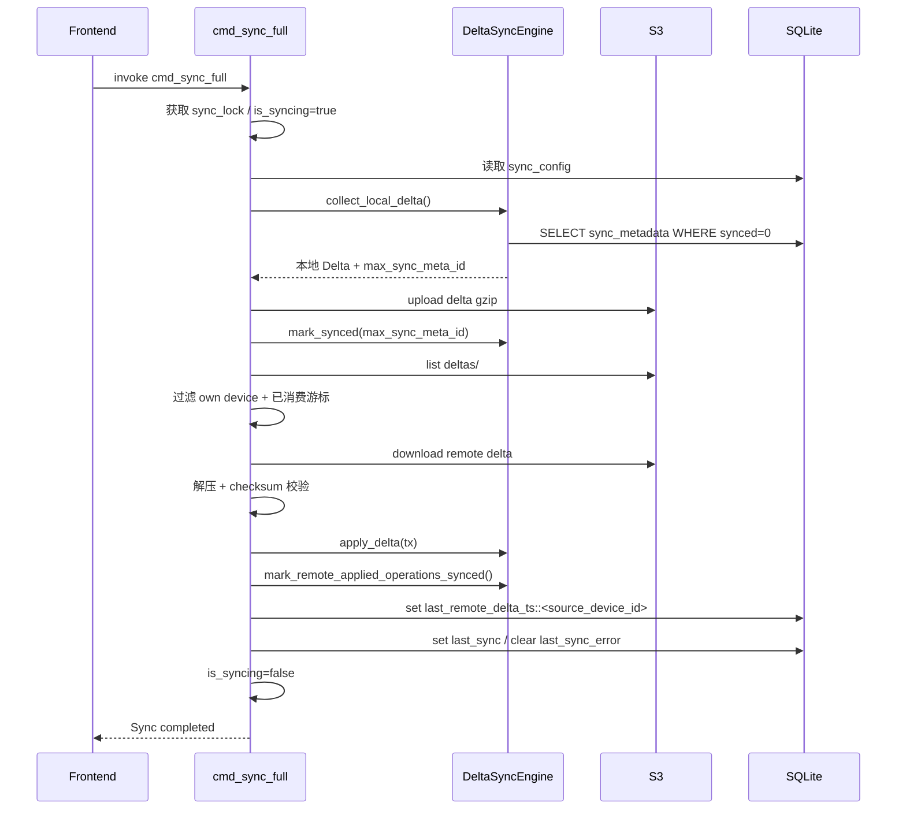
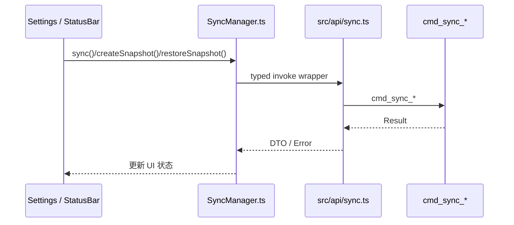

# S3 同步机制详解（实现对齐版）

> 文档状态（2026-02）
>
> - 本文档已按当前代码实现重写，和 `docs/SYNC_S3_DESIGN.md` 保持一致口径。
> - 命令契约与错误码以 `docs/PRD.md` 为准。
> - Android 支持（后台自动同步、HTTPS-only、Keystore 凭据）见 `docs/ANDROID_SUPPORT.md`。
> - 代码真相源：
>   - `src-tauri/src/commands/sync.rs`
>   - `src-tauri/src/sync/delta_sync.rs`
>   - `src-tauri/src/sync/snapshot.rs`
>   - `src-tauri/src/sync/s3_client.rs`
>   - `src/sync/SyncManager.ts`

---

## 1. 当前同步闭环（先看全局）

```mermaid
flowchart LR
  A[本地业务写入] --> B[SQLite 触发器写 sync_metadata]
  B --> C[collect_local_delta]
  C --> D[gzip + checksum]
  D --> E[上传 deltas/<device_id>/delta-<ts>-<uuid>.gz]
  E --> F[list deltas/]
  F --> G[按 source_device_id + 本地游标过滤]
  G --> H[下载并解压]
  H --> I[checksum 校验]
  I --> J[apply_delta 事务写库]
  J --> K[mark_remote_applied_operations_synced 防回流]
  K --> L[推进 last_remote_delta_ts::<source_device_id>]
```



核心点：
- 当前实现不依赖 `deltas/index.json`，而是直接 `list("deltas/")`。
- Delta 与 Snapshot 都使用 gzip + SHA-256 校验。
- 冲突策略是“Vector Clock 冲突检测入口 + 最小 LWW 保护”。

---

## 2. 关键对象与路径

### 2.1 S3 对象命名

- Delta：`deltas/<source_device_id>/delta-<unix_nanos>-<uuid>.gz`
- 兼容读取旧格式：`deltas/<source_device_id>/delta-<unix_timestamp>.gz`
- Snapshot：`snapshots/latest-<device_id>.gz`

### 2.2 本地游标（每源设备）

- 存储位置：`sync_config` 表
- 键格式：`last_remote_delta_ts::<source_device_id>`
- 含义：记录“该源设备已成功应用到本地的最大远端时间戳”

### 2.3 Delta 数据结构（当前实现）

```json
{
  "id": 0,
  "operations": [
    {
      "table_name": "projects",
      "record_id": "project-123",
      "op_type": "Update",
      "data": {
        "id": "project-123",
        "name": "New Name",
        "_version": 5
      },
      "version": 5
    }
  ],
  "device_id": "device-a",
  "vector_clock": {
    "clocks": {
      "device-a": 12,
      "device-b": 9
    }
  },
  "created_at": "2026-02-12T10:00:00Z",
  "checksum": "sha256-hex"
}
```

---

## 3. `cmd_sync_full` 真实执行路径



补充行为：
- 若本地无 Delta 且远端 `snapshots/`、`deltas/` 都为空，会自动上传一次 bootstrap snapshot。
- 远端 Delta 会按 `source_device_id -> timestamp -> key` 排序后应用。
- 任一步失败会 best-effort 写入 `last_sync_error` 供 UI 展示。

---

## 4. Delta 应用范围与特殊处理

### 4.1 已覆盖表

- `projects`
- `persons`
- `partners`
- `assignments`
- `status_history`
- `project_tags`
- `project_comments`

### 4.2 特殊语义

- `project_tags` 使用复合键：`record_id = "<project_id>:<tag>"`。
- `project_tags` delete 通过解析复合键执行精准删除。
- `project_comments` 已纳入 upsert/delete 与 snapshot restore 闭环。

---

## 5. 冲突检测与一致性策略（当前版本）

### 5.1 当前策略

- Vector Clock：保留冲突检测入口（`conflicts_with`）。
- 最小 LWW 保护：当 `remote_version < local_version` 时，跳过远端 upsert，避免旧数据覆盖新数据。
- 事务应用：每个 Delta 在事务中应用，失败则回滚。

### 5.2 设计取舍（Pros vs Cons）

| 方案 | Pros | Cons |
|------|------|------|
| 最小 LWW（按 `_version` 保底） | 低风险、实现简单、快速阻断明显覆盖错误 | 不是完整 CRDT 合并，无法表达复杂字段级冲突 |
| 保留 Vector Clock 结构 | 为后续更强冲突策略预留扩展点 | 当前还未做“并发冲突可解释化”输出 |

---

## 6. 防回流（Anti-Reupload）机制

问题场景：
- 设备 B 应用了来自设备 A 的 Delta；
- SQLite 触发器会再写一批 `sync_metadata`；
- 若不处理，B 下次会把这批“远端来过的数据”再上传，形成 ping-pong。

当前实现：
1. 应用远端 Delta 前，记录 `sync_metadata` 当前最大 id；
2. 应用结束后，按 `(table_name, record_id, operation, version)` 匹配；
3. 把 `id > before_id` 且匹配到的 metadata 标记为 `synced=1`。

效果：
- 显著降低回流和重复上传概率；
- 保留本地真实新增变更的上传能力。

---

## 7. Snapshot 机制（创建与恢复）

### 7.1 创建

- `SnapshotManager::create_snapshot()`：
  - 基于 `export_json_string` 导出全量 JSON；
  - 计算 SHA-256；
  - gzip 压缩；
  - 上传到 `snapshots/latest-<device_id>.gz`。

### 7.2 恢复

- `cmd_sync_restore_snapshot`：
  - `list("snapshots/")` 后按 `last_modified` 显式排序并选择最新对象下载；
  - 解压 + 校验；
  - 事务内清空并恢复：
    - `project_comments`
    - `status_history`
    - `assignments`
    - `project_tags`
    - `projects`
    - `persons`
    - `partners`

说明：
- 恢复路径已包含 comments（schema v2）。
- “快照轮转/保留策略”尚未内建自动清理。

---

## 8. 前端与后端协作



职责边界：
- 前端：状态展示、参数输入、手动触发。
- 后端：调度、并发控制、冲突/一致性、S3 IO、事务恢复。

实现细节补充（Settings 测试连接）：
- 编辑态点击“测试连接”时，前端先本地校验 `bucket/access/secret` 必填，失败直接提示，不发后端请求。
- 后端 `cmd_sync_test_connection` 支持“草稿参数优先 + 已保存配置回退”，用于未保存配置的连通性验证。

---

## 9. NFR 对齐（Security / Scalability / Performance）

### 9.1 Security（已实现 + 缺口）

- 已实现：
  - 传输链路依赖 S3 TLS；
  - Delta/Snapshot 完整性校验（checksum）；
  - 错误码与消息统一映射，便于排障。
- 缺口：
  - 尚未支持端到端加密（E2E）；
  - 尚未支持 KMS/密钥轮换自动化。

### 9.2 Scalability

- 当前模式：前缀扫描 `list("deltas/") + 本地游标`，适合个人/小团队规模。
- 已知边界：对象数增长后，`list` 成本和延迟上升。
- 后续方向：分页扫描、时间分片前缀、服务端索引对象。

### 9.3 Performance

- 增量上传（仅 `synced=0`）减少网络与序列化成本。
- gzip 压缩显著降低对象体积。
- 事务批量应用降低中间态风险。

---

## 10. 测试对齐点（Rust）

已补充的关键覆盖：
- `tests/test_sync_conflict.rs`
  - `apply_delta_upsert_project_tags`
  - `apply_delta_upsert_project_comments`
  - `apply_delta_delete_project_tag_by_composite_record_id`
  - `apply_delta_upsert_person_stale_version_is_ignored`
- `tests/test_sync_engine.rs`
  - `mark_remote_applied_operations_synced_marks_trigger_rows`
- `tests/test_snapshot.rs`
  - `restore_snapshot_full_flow`
  - `restore_snapshot_clears_all_tables`

---

## 11. 后续路线图（建议）

### P1（可靠性）
- 快照选择逻辑显式排序（避免依赖对象列表顺序）。
- Delta key 增加更强唯一性（避免同秒并发写覆盖）。

### P2（安全）
- 引入可选 E2E 加密（对象体加密 + 本地密钥管理）。
- 配置密钥读取最小权限化。

### P3（冲突）
- 从“最小 LWW”升级到字段级冲突策略（可解释化冲突日志）。
- 增加冲突审计视图（便于定位异常覆盖）。

### P4（可观测）
- 增加同步指标：pull/apply/upload 耗时、失败率、回流命中率。
- 增加分阶段错误码（配置、网络、解压、校验、应用）。

---

## 12. 总结

当前同步能力已经形成“可用且稳定”的闭环：
- 本地变更可上传；
- 远端变更可拉取并应用；
- checksum 可兜底完整性；
- 防回流机制可降低 ping-pong；
- 最小 LWW 可避免明显的旧数据覆盖；
- comments/tags/snapshot 关键链路已打通。

这版文档可直接作为当前实现说明；如后续推进 P1/P2，建议同步更新 `docs/PRD.md` 与本文件。

