# S3 同步方案技术设计

> 文档状态（2026-02）
>
> - 本文档已升级为“设计 + 实现对齐说明”。
> - **命令/API 契约以 `docs/PRD.md` 为准**，尤其是 `13.5` 与 `13.9`。
> - **代码行为以 `src-tauri/src/commands/sync.rs`、`src-tauri/src/sync/*` 为准**。
> - 文中部分长代码片段属于历史设计草案，已在下文“实现状态”中标注替代路径。

### 近期变更（2026-02）

- 补齐 `cmd_sync_full` 远端 Delta 下载、校验、应用链路。
- 新增每设备游标：`last_remote_delta_ts::<source_device_id>`。
- 补齐 `project_tags` / `project_comments` 的 Delta upsert/delete。
- 补齐 snapshot restore 的 `project_comments` 恢复。
- 增加回流抑制：远端应用后将触发器产生的 `sync_metadata` 标记为已同步。
- 增加最小 LWW 防护：`remote_version < local_version` 时跳过覆盖。
- **新增**：`cmd_sync_export_config` / `cmd_sync_import_config` — 同步配置导入导出，支持跨设备快速迁移凭据。

## 1. 方案概述

使用 AWS S3（或兼容服务）作为中心化存储，实现多设备数据同步。

### 核心优势

- ✅ **成本低**：$0-5/月（推荐 Cloudflare R2 零成本）
- ✅ **高可靠**：99.999999999% 数据持久性
- ✅ **简单**：无需维护服务器
- ✅ **跨平台**：所有设备都支持
- ✅ **全球 CDN**：访问速度快

### 支持的 S3 兼容服务

| 服务商 | 月费用 | 免费额度 | 推荐度 |
|--------|--------|----------|--------|
| **Cloudflare R2** | $0.015/GB | 10GB免费 + 零出站费用 | ⭐⭐⭐⭐⭐ |
| **AWS S3** | $0.023/GB | 12个月免费 | ⭐⭐⭐⭐ |
| **MinIO** | 自托管/$0 | 无限 | ⭐⭐⭐⭐ |
| **Backblaze B2** | $0.005/GB | 10GB免费 | ⭐⭐⭐⭐ |
| **阿里云 OSS** | ¥0.12/GB | 3个月免费 | ⭐⭐⭐⭐ |

**推荐：Cloudflare R2**（零出站费用，性价比最高）

---

## 2. 架构设计

### 2.1 整体架构

```mermaid
graph TB
    subgraph "设备 A (Mac)"
        A1[Tauri App A]
        A2[Local SQLite]
        A3[CRDT Engine]
    end
    
    subgraph "设备 B (Mac)"
        B1[Tauri App B]
        B2[Local SQLite]
        B3[CRDT Engine]
    end
    
    subgraph "S3 存储桶"
        S3_STATE["devices/<br/>设备状态"]
        S3_DELTAS["deltas/<br/>增量变更"]
        S3_SNAPSHOTS["snapshots/<br/>完整快照"]
    end
    
    A1 -->|读写| A2
    A2 -->|生成变更| A3
    A3 -->|上传| S3_DELTAS
    A3 -->|定期快照| S3_SNAPSHOTS
    A3 -->|注册| S3_STATE
    
    B3 -->|下载| S3_DELTAS
    B3 -->|拉取快照| S3_SNAPSHOTS
    B3 -->|读状态| S3_STATE
    B3 -->|应用变更| B2
    B2 -->|读写| B1
```



### 2.2 S3 目录结构

```
s3://my-project-sync/
├── deltas/
│   ├── <device_id>/
│   │   ├── delta-1707724201.gz
│   │   ├── delta-1707724265.gz
│   │   └── ...
│   └── ...
└── snapshots/
    ├── latest-<device_id>.gz
    └── ...
```

说明：
- 当前实现使用 `deltas/{device_id}/delta-{unix_nanos}-{uuid}.gz`，不依赖 `index.json`。
- 读取阶段兼容旧格式：`deltas/{device_id}/delta-{unix_timestamp}.gz`。
- 当前实现使用 `snapshots/latest-{device_id}.gz`，恢复时按 `last_modified` 显式排序选择最新对象。
- 远端增量消费游标存储在本地 SQLite 的 `sync_config`（key: `last_remote_delta_ts::<source_device_id>`）。

### 2.3 数据流程

```mermaid
flowchart LR
  A[本地写入业务表] --> B[SQLite触发器写 sync_metadata]
  B --> C[collect_local_delta]
  C --> D[压缩+checksum]
  D --> E[上传 deltas/device_id/delta-ts-uuid.gz]

  E --> F[list deltas/]
  F --> G[按 source_device_id + 游标过滤]
  G --> H[下载并解压 Delta]
  H --> I[checksum 校验]
  I --> J[apply_delta 事务写库]
  J --> K[标记回写 metadata 为 synced 防回流]
  K --> L[推进每设备游标]
```



### 2.4 当前实现状态（方案A收尾）

| 能力 | 状态 | 说明 |
|------|------|------|
| 本地 Delta 采集/上传 | ✅ | 已上线 |
| 远端 Delta 下载/应用 | ✅ | 已在 `cmd_sync_full` 落地 |
| checksum 校验 | ✅ | 拉取应用前校验 |
| `project_tags` Delta upsert/delete | ✅ | 支持复合键删除 |
| `project_comments` Delta upsert/delete | ✅ | 已覆盖 |
| Snapshot restore comments | ✅ | 已纳入恢复路径 |
| 回流抑制（防 ping-pong） | ✅ | 应用后标记触发器 metadata 为已同步 |
| LWW 最小保护 | ✅ | `remote_version < local_version` 跳过 |
| 端到端加密（E2E） | 🚧 | 设计保留，未落地 |
| 自动快照轮转清理 | 🚧 | 设计保留，未落地 |

### 2.5 同步覆盖的数据表

以下表的 INSERT/UPDATE/DELETE 操作通过 SQLite 触发器自动记录到 `sync_metadata`，纳入 Delta 同步：

| 表名 | 触发器定义位置 | 说明 |
|------|---------------|------|
| `projects` | `0003_add_sync_support.sql` | 项目基础数据 |
| `persons` | `0003_add_sync_support.sql` | 成员数据 |
| `partners` | `0003_add_sync_support.sql` | 合作方数据 |
| `assignments` | `0003_add_sync_support.sql` | 成员参与记录 |
| `status_history` | `0003_add_sync_support.sql` | 状态变更历史 |
| `project_tags` | `0003_add_sync_support.sql` | 项目标签 |
| `project_comments` | `0004_add_project_comments.sql` | 项目评论（富文本）|

---

## 3. 核心实现

> 对齐说明
>
> - 本章中较长 Rust/TS 代码片段多数用于“设计解释”，并非逐行复制的生产代码。
> - **若代码片段与仓库实现冲突，请以仓库源码为准**：
>   - `src-tauri/src/commands/sync.rs`
>   - `src-tauri/src/sync/delta_sync.rs`
>   - `src-tauri/src/sync/snapshot.rs`
>   - `src/sync/SyncManager.ts`

### 3.0 当前命令与职责（代码实况）

| 命令 | 作用 | 说明 |
|------|------|------|
| `cmd_sync_get_config` | 读取同步配置 | 含 `auto_sync_interval_minutes` |
| `cmd_sync_update_config` | 更新同步配置 | 更新后重启后端调度器 |
| `cmd_sync_set_enabled` | 启停同步 | 启用时校验 S3 必填配置 |
| `cmd_sync_test_connection` | 测试桶连通性与权限 | 支持自定义 endpoint，支持“草稿参数优先 + 已保存配置回退” |
| `cmd_sync_get_status` | 获取同步状态 | `is_syncing/pending_changes/last_error` |
| `cmd_sync_full` | 完整同步 | 先上传本地 Delta，再拉取并应用远端 Delta |
| `cmd_sync_create_snapshot` | 创建并上传快照 | 路径 `snapshots/latest-<device_id>.gz` |
| `cmd_sync_restore_snapshot` | 下载并恢复快照 | 恢复 persons/partners/projects/tags/assignments/history/comments |

### 3.1 依赖配置

```toml
# src-tauri/Cargo.toml

[dependencies]
aws-sdk-s3 = "1.60"
aws-config = "1.5"
tokio = { version = "1", features = ["full"] }
serde = { version = "1.0", features = ["derive"] }
serde_json = "1.0"
chrono = "0.4"
uuid = { version = "1.11", features = ["v4"] }
sha2 = "0.10"
flate2 = "1.0"  # 用于压缩
```

### 3.2 S3 客户端封装（当前实现）

`src-tauri/src/sync/s3_client.rs` 提供统一对象存储抽象：

| 能力 | 方法 | 说明 |
|------|------|------|
| 标准 S3 初始化 | `new(bucket, device_id)` | 使用默认 AWS 凭据链 |
| 兼容端点初始化 | `new_with_endpoint(...)` | 支持 R2/MinIO/OSS，自定义 endpoint |
| 对象读写 | `upload/download/list/delete/exists` | 统一错误返回，便于命令层映射 |
| 连通性测试 | `test_connection` | Settings 页“测试连接”调用 |

实现细节：
- 通过 `infer_region_from_endpoint` 适配 R2/OSS region；
- 上传与下载日志包含耗时和数据大小，便于排障；
- 错误在 `commands/sync.rs` 统一映射为稳定的 `AppError::Sync`。

### 3.3 增量同步引擎（当前实现）

核心文件：`src-tauri/src/sync/delta_sync.rs`


当前能力要点：
- 本地变更采集：读取 `sync_metadata(synced=0)` 生成 Delta。
- 远端应用：支持 `projects/persons/partners/assignments/status_history/project_tags/project_comments`。
- 删除语义：
  - 普通表：`DELETE ... WHERE id=?`
  - `project_tags`：复合键 `project_id + tag`（由 `record_id=project_id:tag` 解析）。
- 防回流：
  - 远端 Delta 应用后，标记该批触发器新增 metadata 为 `synced=1`，避免 ping-pong。
- 冲突保护（最小 LWW）：
  - 若 `remote_version < local_version`，跳过覆盖；
  - Vector Clock 冲突检测仍保留入口。

### 3.4 快照管理（当前实现）

核心文件：`src-tauri/src/sync/snapshot.rs`

- 快照结构：`Snapshot { version, created_at, device_id, data, checksum }`
- 快照创建：
  - 使用 `export_json_string` 导出当前库；
  - 计算 SHA-256；
  - gzip 压缩后上传 `snapshots/latest-<device_id>.gz`。
- 快照恢复：
  - 下载并解压；
  - checksum 校验；
  - 事务内清空并恢复：
    - `persons/partners/projects/project_tags/assignments/status_history/project_comments`。

### 3.5 命令层执行路径（当前实现）

核心文件：`src-tauri/src/commands/sync.rs`

```mermaid
flowchart TD
  A[cmd_sync_full] --> B[读取配置并创建 S3 客户端]
  B --> C[上传本地 Delta]
  C --> D[Bootstrap: 远端空桶时上传初始快照]
  D --> E[list deltas/]
  E --> F[按 source_device_id + 游标过滤]
  F --> G[download + decompress + checksum]
  G --> H[apply_delta]
  H --> I[mark_remote_applied_operations_synced]
  I --> J[更新 last_remote_delta_ts::<device>]
  J --> K[更新 last_sync / 清理 last_sync_error]
```



调度与并发控制：
- `SyncRuntime` 使用全局互斥锁防止手动同步与定时同步并发；
- `is_syncing` 原子状态用于前端状态栏展示；
- `refresh_scheduler()` 支持按配置热重启定时任务。

### 3.6 同步与评论自动集成

- `project_comments` 的 INSERT/UPDATE/DELETE 触发器定义在 `0004_add_project_comments.sql`；
- 评论 CRUD 无需额外同步代码，统一由 `sync_metadata -> DeltaSyncEngine` 处理。

### 3.7 设计取舍（Pros vs Cons）

| 设计点 | Pros | Cons |
|-------|------|------|
| S3 对象前缀扫描 + 本地游标 | 实现简单、可快速落地 | 大桶下 `list` 成本上升 |
| 最小 LWW（按版本保护） | 先避免“旧数据覆盖新数据” | 不是完整 CRDT 级冲突合并 |
| 防回流标记机制 | 快速抑制 ping-pong | 依赖触发器输出字段一致性 |

---

## 4. 前端实现（当前实现）

核心文件：
- `src/sync/SyncManager.ts`
- `src/components/SyncStatusBar.tsx`
- `src/pages/Settings.tsx`
- `src/api/sync.ts`

### 4.1 模块职责

| 模块 | 责任 |
|------|------|
| `SyncManager` | 统一调用 `cmd_sync_*`，维护同步状态与订阅 |
| `SyncStatusBar` | 展示 `is_syncing/pending_changes/last_sync/last_error`，提供手动同步入口 |
| `Settings` | 管理 S3 配置、测试连接、启停同步、快照创建/恢复 |
| `syncApi` | typed invoke wrapper，保证 DTO 边界稳定 |

### 4.2 前后端交互流


### 4.3 运行时行为

- Layout 启动时读取配置，启用同步则展示 `SyncStatusBar`；
- 自动同步由后端 scheduler 主导（前端仅负责触发和展示）；
- Settings 编辑态点击“测试连接”时，前端先做本地必填校验（bucket/access/secret），校验失败不发后端请求；
- 错误通过统一 error/toast 通道反馈，前端不做 SQL/冲突逻辑判断。

---

## 5. 成本分析

### 5.1 Cloudflare R2（推荐 ⭐）

```
存储: 10 GB 免费，之后 $0.015/GB/月
读取: 免费（无限）✅
写入: 免费（每月100万次）✅
出站流量: 免费 ✅

月费用估算（个人使用）:
- 数据库快照 (50MB) × 4周 = 200 MB
- 增量日志 (1MB/天) × 30天 = 30 MB
- 总计: ~250 MB → 免费额度内

年费用: $0 🎉
```

### 5.2 AWS S3

```
存储: $0.023/GB/月
读取: $0.0004/1000次
写入: $0.005/1000次
出站流量: $0.09/GB（前 100GB/月）

月费用估算:
- 存储: 0.25 GB × $0.023 = $0.006
- 写入: 100次/天 × 30 × $0.005/1000 = $0.015
- 读取: 100次/天 × 30 × $0.0004/1000 = $0.001
- 流量: 0.01 GB × $0.09 = $0.001
总计: ~$0.02/月

年费用: ~$0.25
```

### 5.3 MinIO（自托管）

```
服务器: DigitalOcean Droplet $6/月
存储: 包含 50GB SSD
带宽: 2TB/月

月费用: $6
年费用: $72

优点: 完全可控，数据私有
缺点: 需要维护
```

**结论：推荐 Cloudflare R2（零成本）**

---

## 6. 安全性（实现现状）

### 6.1 已实现

- **传输安全**：依赖 HTTPS + S3 官方 SDK。
- **最小权限建议**：仅授予 `GetObject/PutObject/DeleteObject/ListBucket`。
- **完整性保护**：Delta/Snapshot 在应用前执行 SHA-256 校验。
- **错误可见性**：S3 错误码在命令层映射，前端可读。
- **凭据保护（展示侧）**：前端默认遮罩，日志侧支持敏感信息脱敏。
- **Android 基线（MVP）**：Android 端强制 HTTPS-only，并要求凭据使用 Keystore 安全存储（见 `docs/ANDROID_SUPPORT.md`）。

### 6.2 未实现（规划中）

- **端到端加密（E2E）**：当前未落地 `encryption.rs`，属于后续增强项。
- **系统钥匙串存储**：当前凭据仍在 `sync_config` 表持久化（本地明文）。

### 6.3 安全取舍（Pros vs Cons）

| 方案 | Pros | Cons |
|------|------|------|
| 当前实现（快速可用） | 落地快、维护简单 | 本地凭据保护级别一般 |
| 引入 E2E + Keychain | 安全性显著提升 | 复杂度与恢复成本更高 |

---

## 7. 部署与配置（当前实现）

### 7.1 Cloudflare R2 快速接入

1. 创建 Bucket（建议私有）。
2. 创建 API Token（Object Read/Write）。
3. 获取 endpoint：`https://<account-id>.r2.cloudflarestorage.com`。

### 7.2 应用内配置路径

- 打开 `Settings` 页面：
  - 填 `bucket/endpoint/accessKey/secretKey`
  - 编辑态会先本地校验必填项（bucket/accessKey/secretKey）
  - 点“测试连接”
  - 启用同步开关
  - 设定 `auto_sync_interval_minutes`

### 7.3 配置存储说明

- 同步配置保存在 SQLite `sync_config` 表（非 `sync-config.toml`）。
- 多设备游标键：`last_remote_delta_ts::<source_device_id>`。

---

## 8. 测试与验证（当前实现）

### 8.1 自动化测试（Rust）

| 文件 | 覆盖重点 |
|------|----------|
| `tests/test_delta.rs` | Delta 压缩/解压、checksum |
| `tests/test_vector_clock.rs` | VectorClock 因果与冲突判定 |
| `tests/test_sync_triggers.rs` | 触发器写 `sync_metadata` 正确性 |
| `tests/test_sync_engine.rs` | 采集、应用、标记 synced、防回流 |
| `tests/test_sync_conflict.rs` | 多表 upsert/delete、最小 LWW 保护 |
| `tests/test_snapshot.rs` | 快照创建/恢复、comments 恢复 |

建议每次改动同步模块至少执行：
- `cargo test --test test_sync_engine --test test_sync_conflict --test test_snapshot`
- `cargo clippy --all-targets --all-features`

### 8.2 手工验收清单

- 设备 A 修改数据并同步后，设备 B 可拉取增量并落库。
- `project_tags`、`project_comments` 的增删改可跨设备同步。
- 快照恢复后 comments 与项目数据一致。
- 同一远端 Delta 不会在下一轮被重复应用。

---

## 9. 后续路线图（P1/P2）

```mermaid
flowchart LR
  P1[安全增强] --> P2[可靠性增强]
  P2 --> P3[可观测性增强]
  P3 --> P4[性能优化]
```



### P1 安全增强

- 接入系统 Keychain（替代本地明文凭据）。
- 评估 E2E 加密（可选开关）。

### P2 可靠性增强

- 指数退避重试（网络抖动场景）。
- 失败分类与可恢复提示（权限/网络/数据完整性）。

### P3 可观测性增强

- 增加同步指标（成功率、耗时分位、应用条数）。
- 结构化日志（便于 Logs Viewer 过滤）。

### P4 性能优化

- 大桶场景下分页 list 与并发下载控制。
- Delta 批处理上限与背压策略。

---

## 10. 监控与运维建议

### 10.1 建议采集指标

- `sync_total`
- `sync_success`
- `sync_failure`
- `delta_upload_count`
- `delta_apply_count`
- `sync_latency_ms_p50/p95`

### 10.2 建议日志字段

- `device_id`
- `bucket`
- `remote_key`
- `operation_count`
- `checksum_verified`
- `error_code`

---

## 11. 总结（2026-02）

- 方案A关键闭环已完成：上传、拉取、校验、应用、防回流、最小 LWW。
- 当前架构满足个人多设备分钟级同步需求，成本低，维护简单。
- 新增同步配置导入导出（`cmd_sync_export_config` / `cmd_sync_import_config`），支持跨设备快速迁移 S3 凭据。
- 下一阶段建议优先做“凭据安全 + 重试退避 + 指标化”三项增强。

---

## 12. 同步配置导入导出设计

### 12.1 流程

```mermaid
sequenceDiagram
    participant User as 用户
    participant UI as Settings 页面
    participant Cmd as Tauri Commands
    participant DB as sync_config (SQLite)
    participant FS as 本地文件系统

    User->>UI: 点击"导出同步配置"
    UI->>Cmd: cmd_sync_export_config
    Cmd->>DB: 读取 bucket/endpoint/access_key/secret_key/interval
    DB-->>Cmd: 配置值
    Cmd-->>UI: JSON 文本（version=1）
    UI->>FS: 弹出保存对话框，写入文件

    User->>UI: 点击"导入同步配置"，选择文件
    UI->>Cmd: cmd_sync_import_config(json)
    Cmd->>Cmd: 校验 version === 1
    Cmd->>DB: 写入非空字段（不覆盖 device_id/sync_enabled）
    Cmd->>Cmd: 刷新调度器
    Cmd-->>UI: 最新 SyncConfigDto
    UI->>UI: 刷新表单状态
```



### 12.2 导出 JSON 格式（version=1）

```json
{
  "version": 1,
  "exported_at": "2026-02-27T10:00:00Z",
  "sync_config": {
    "bucket": "my-bucket",
    "endpoint": "https://xxx.r2.cloudflarestorage.com",
    "access_key": "AK...",
    "secret_key": "SK...",
    "auto_sync_interval_minutes": 5
  }
}
```

**不导出字段**（设备运行时状态，每台设备独立）：`device_id`、`sync_enabled`、`last_sync`、`local_version`、`last_sync_error`。

### 12.3 安全说明

| 风险 | 缓解措施 |
|------|---------|
| 导出文件含明文 Secret Key | UI 描述提示用户妥善保管，勿上传至公开位置 |
| 导入覆盖已有凭据 | 空字符串不覆盖已有值；`sync_enabled` 不被修改，需用户手动开启 |
| Android HTTP 端点 | 导入时同样强制 HTTPS 校验（`ENDPOINT_NOT_HTTPS`） |
| 版本不兼容 | 校验 `version === 1`，不支持的版本返回 `UNSUPPORTED_VERSION` 错误 |

---

## 参考资料

- [AWS SDK for Rust](https://github.com/awslabs/aws-sdk-rust)
- [Cloudflare R2 文档](https://developers.cloudflare.com/r2/)
- [Vector Clock 论文](https://en.wikipedia.org/wiki/Vector_clock)
- [CRDT 简介](https://crdt.tech/)
